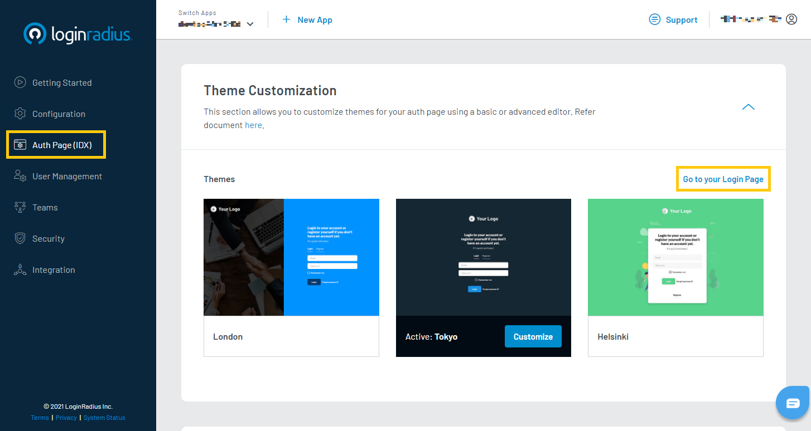
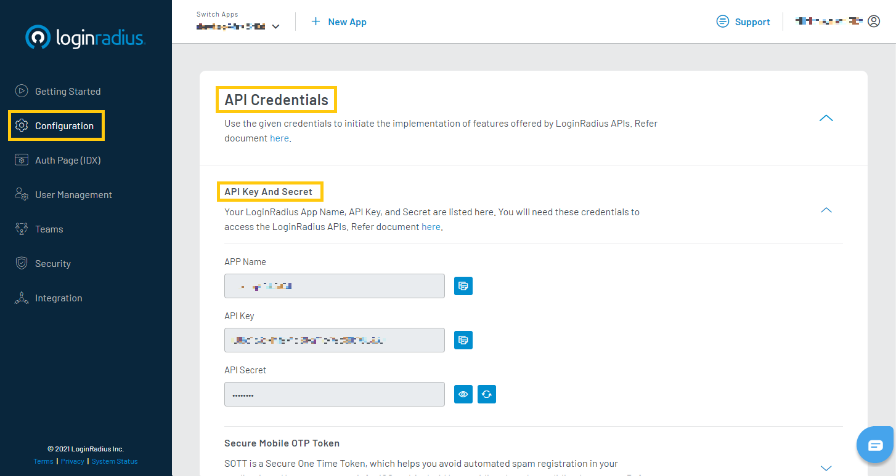

# Get Started - ASP&#46;NET Web Forms

The purpose of this tutorial is to help you with implementing LoginRadius user registration, log in and log out functionalities as well as a basic profile page in your ASP.NET Web Forms application.

> This tutorial assumes that you already have an ASP&#46;NET development environment set up with a minimum version of 4.0 or later.

---------------------------------------------------

When you signed up for a LoginRadius account, an app was created for you. This app is linked to a ready to use web page, known as the Auth Page (IDX). When you make changes to your configurations in the LoginRadius Dashboard, your changes will automatically be reflected on your Auth Page (IDX). You can utilize this web page for your authentication requirements in your Web Forms application.

> [Create an account](https://accounts.loginradius.com/auth.aspx?return_url=https://dashboard.loginradius.com/login&action=register) to get started if you don't have one yet!

## Choose Theme

In your LoginRadius Dashboard, navigate to the **Auth Page (IDX)** section located in the left navigation bar. There you can select a design theme for your login page, or further customize the content displayed:

To preview your theme and content, click the **Go to your Login Page** link as highlighted on the above screen. There are various features already implemented on your Auth Page, such as Email and Password Login, User Registration, Forgot Password, and Remember Password.

## Get Credentials

Before using any of the APIs that LoginRadius provides, you will need to retrieve your **App Name**, **API Key**, and **API Secret** from your LoginRadius Dashboard.

In your LoginRadius Dashboard, navigate to **[Configuration > API Credentials](https://dashboard.loginradius.com/configuration)**, and click the **API Key And Secret** subsection to retrieve your API Credentials.

## SDK Installation

## Configuration

## Obtain Access Token

## Retrieve User Data using Access Token

## Domain Whitelisting

For security reasons, LoginRadius will only process API calls coming from domains included in your app's whitelist. Local domains (http://localhost and http://127.0.0.1) are already whitelisted by default. 

To add your domain to your app's whitelist, navigate to **[Configuration > Domain Whitelisting](https://dashboard.loginradius.com/configuration)**

To use your own domain, in your LoginRadius Dashboard, navigate to **[Configuration > Domain Whitelisting](https://dashboard.loginradius.com/configuration)** and add your domain name:

# Recommended Next Steps

How to manage email templates for verification and forgot password

How to personalize interfaces and branding of login pages

How to configure SMTP settings for sending emails to consumers

How to implement Social Login options like Facebook, Google

How to implement Phone Login

How to implement Passwordless Login

# ASP&#46;NET SDK Reference

< Link to ASP&#46;NET SDK doc >

# API Reference

< Link to API docs >
