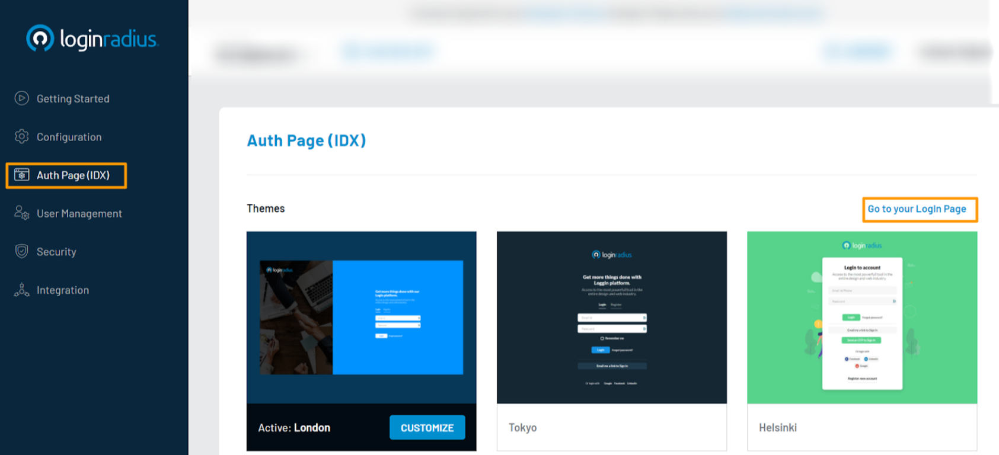
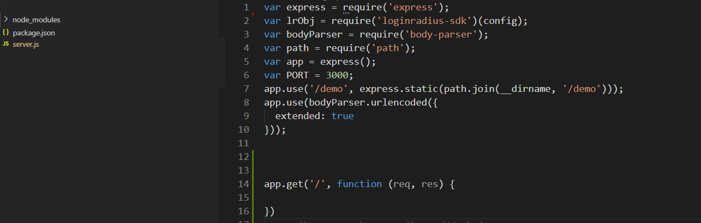

# Get Started - Node.js

The tutorial lets you implement user registration, login, profile, and log out to your Node.js based application. 


> You must have Node.js installed, and the minimum supported version is 10.0.0

Watch the video to get started, or refer to the section below for the text-based guide.


<figure class="video_container">
<iframe width="560" height="315" src="https://www.youtube.com/embed/efM46qNSaeg" frameborder="0" allow="accelerometer; autoplay; clipboard-write; encrypted-media; gyroscope; picture-in-picture" allowfullscreen></iframe></figure>

---------------------------------------------------

Signing up for LoginRadius created an app for you, this app is linked to a ready to use web page - Auth Page (IDX). Auth Page (IDX) lets you see the execution of configuration made in LoginRadius Dashboard, and you can utilize this webpage for authentication requirements on your Node.js application.


> [Create an account](https://accounts.loginradius.com/auth.aspx?return_url=https://dashboard.loginradius.com/login&action=register) to get started if you don't have one yet!


## Choose Theme

In your LoginRadius Dashboard, navigate to the Auth Page (IDX) and select a theme of your choice. It will be the design theme of your login page:




To check your login page's/ auth page's theme, click **Go to your Login Page** link as highlighted on the above screen. There are various features already implemented on your Auth Page like Email and Password login, User registration, forgot password, and remember password. 


## Get Credentials

Signing up for LoginRadius created an app for you; you need to get **App Name**, **API Key**, and **API Secret** to configure and start implementation.

In your LoginRadius Dashboard, navigate to **[Configuration > API Credentials](https://dashboard.loginradius.com/configuration)** and get your API credentials.


## Node JS Implementation

Here we are using the express framework to create Node.js API.

## SDK Installation

Download the Node.js SDK from here, or you can install it using npm by running the following command in the command line:

`npm install loginradius-sdk`

Upon installation, you can see LoginRadius Node.js SDK under node module, and the SDK folder structure looks like the following:



## Configuration

Initialize configuration object in the index file:
```
 var config = {
      apiDomain: 'https://api.loginradius.com',
      apiKey: '{{ Your API Key }}',
      apiSecret: '{{ Your API Secret }}',
      siteName: '{{ Your App Name }}',
      proxy:{
        host:'',
        port:'',
        user:'',
        password:''
     }
  }
```

Replace the placeholders in the config object with your LoginRadius credentials **API Key, API Secret, and App Name** that you found in the Get Credentials step.

Pass the proxy configurations if you want to set HTTP Server Proxy Configuration through your Node.js SDK. Host and port are required to set HTTP Server Proxy configuration, while username and password are optional.

Require the `loginradius-sdk` package and pass the config object:

`var lrv2 = require('loginradius-sdk')(config);`


##  Obtain Access Token

Access tokens are used to retrieve profile data and handle other user functionality. A client passes the access token to the server, and the server uses this token to decide whether the client is authorized to access the resource or not.


On successful authentication on the Auth Page (IDX), the default script of LoginRadius sends an access token in the query string as a token parameter with the return_url ( specified in the action URL).

Below is the access URL for Login action:


`https://<LoginRadius APP Name>.hub.loginradius.com/auth.aspx?action=login&return_url=<Return URL>`

Upon registration or login, the user is redirected to the specified return URL with a token appended. The following is an example:

`<Return URL>?token=745******-3e8e-****-b3**2-9c0******1e.`

Check out our [Auth Page (IDX)](https://www.loginradius.com/docs/developer/concepts/idx-overview/) for more information about available actions and key benefits.

## Retrieve User Data using Access Token

Once the authentication is done using Auth Page, the return_url will access the Node.js backend API with query parameter (access token). You can use this token to fetch the user profile:

```
router.get('/userProfile', function(req, res) {
    var fields = null; //Optional

    lrv2.authenticationApi.getProfileByAccessToken(req.query.token, fields).then((response) => {
        res.json(response);   
       }).catch((error) => {
        res.json({'ErrorMessage':error.message});   
       });
  });
});
```
##  Domain Whitelisting

LoginRadius processes the API calls that are received from the whitelisted domains. Local domains (http://localhost and http://127.0.0.1) are whitelisted by default. 

To use your own domain, in your LoginRadius Dashboard, navigate to **[Configuration > Domain Whitelisting](https://dashboard.loginradius.com/configuration)** and add your domain name:

<image will be added here>


##  Explore Node.js Demo

Check out our Node.js demo to know how you can implement various LoginRadius features using SDK and its functions.

**[GitHub Demo Link](https://github.com/LoginRadius/login-page-demos/blob/master/node-idx-demo)**   |   **[Download Demo](https://gitlab.com/loginradius/product/pioneer/hostedpagebackup/-/archive/dev/hostedpagebackup-dev.zip)**   


# Recommended Next Steps

How to manage email templates for verification and forgot password

How to personalize interfaces and branding of login pages

How to configure SMTP settings for sending emails to consumers

How to implement Social Login options like Facebook, Google

How to implement Phone Login

How to implement Passwordless Login


# Node.js SDK Reference

< Link to Node.js SKD doc >


# API Reference

< Link to APIs doc >
