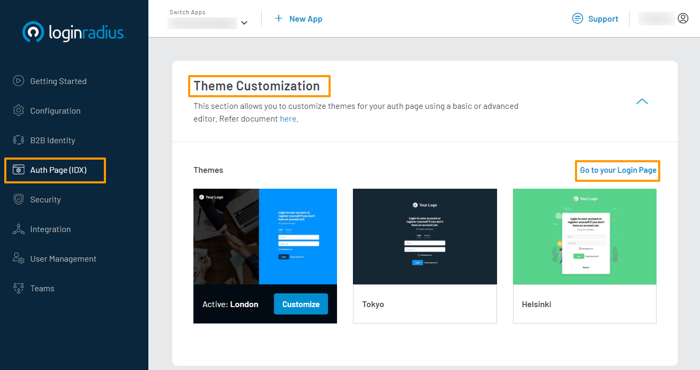
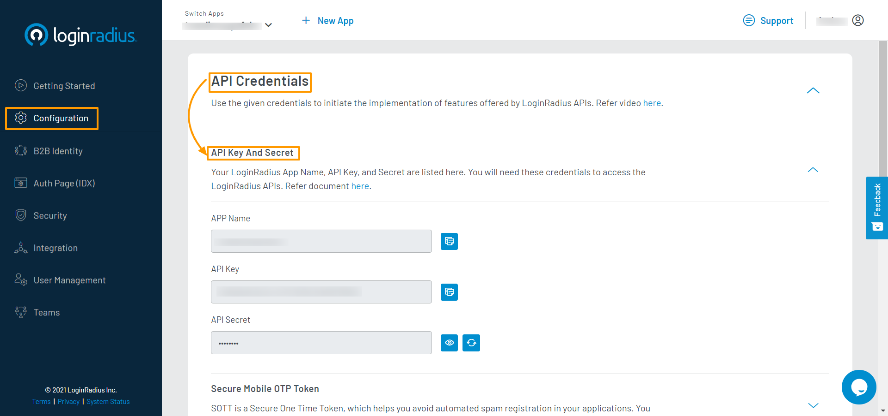
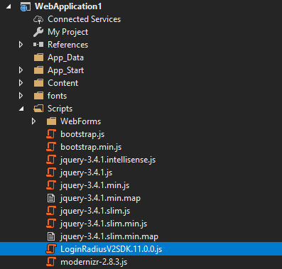
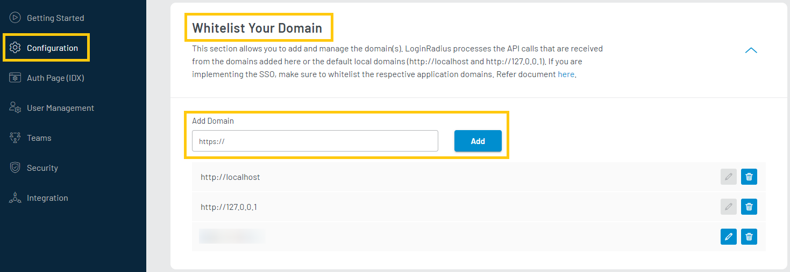

# Get Started - ASP&#46;NET Web Forms

The purpose of this tutorial is to help you with implementing LoginRadius user registration, log in and log out functionalities in your ASP.NET Web Forms application.

---------------------------------------------------

When you signed up for a LoginRadius account, an app was created for you. This app is linked to a ready to use web page, known as the [Auth Page (IDX)](https://www.loginradius.com/docs/developer/concepts/idx-overview/). When you make changes to your configurations in the LoginRadius Dashboard, your changes will automatically be reflected on your Auth Page (IDX). You can utilize this web page for your authentication requirements in your Web Forms application.

> [Create an account](https://accounts.loginradius.com/auth.aspx?return_url=https://dashboard.loginradius.com/login&action=register) to get started if you don't have one yet!

## Choose Theme

In your LoginRadius Dashboard, navigate to the **Auth Page (IDX)** section located in the left navigation bar and click the **Theme Customization** section. There you can select a design theme for your login page, or further customize the content displayed:



To preview your theme and content, click the **Go to your Login Page** link as highlighted on the above screen. There are various features already implemented on your Auth Page, such as Email and Password Login, User Registration, Forgot Password, and Remember Password.

## Get Credentials

Before using any of the APIs or methods that LoginRadius provides, you will need to retrieve your **App Name**, **API Key**, and **API Secret**.

In your LoginRadius Dashboard, navigate to **[Configuration > API Credentials](https://dashboard.loginradius.com/configuration)**, and click the **API Key And Secret** subsection to retrieve your API Credentials.



## SDK Installation

In this tutorial, we will use JavaScript to make API calls to LoginRadius. Download the LoginRadius HTML5 SDK from **[Github](https://github.com/LoginRadius/HTML5-SDK)** and include the JavaScript file on your web page. In this example, we've saved the SDK script file to our project's `Scripts` folder like such:



We include the script in our web page with the following:

```html
<script src="/Scripts/LoginRadiusV2SDK.11.0.0.js" type="text/javascript"></script>
```

## Configuration

Under your SDK script declaration, you will need to initialize the SDK:

```html
<script>
  var sdkOptions = {
      "apiKey": "{{YOUR API KEY}}"
  };

  LoginRadiusSDK.initSDK(sdkOptions);
</script>
```

Replace the following placeholder in the above configuration object:
- `{{YOUR API KEY}}` : **API Key** obtained in the Get Credentials step.step.

## Registration or Login

In this tutorial, we will use the Auth Page (IDX) for authentication. Thus, your links or buttons to Register or Login should navigate the user to the following URLs:

> Registration and Login functionality is already implemented on your Auth Page (IDX). Thus, you don't need to implement them separately.

**Registration Page URL:**

`https://<LoginRadius App Name>.hub.loginradius.com/auth.aspx?action=register&return_url=<Return URL>`

**Login Page URL:**

`https://<LoginRadius App Name>.hub.loginradius.com/auth.aspx?action=login&return_url=<Return URL>`

**Where:**

- LoginRadius App Name is the name of your app as mentioned in the Get Credentials step.
- Return URL is where you want to redirect users upon successful registration or login.

> Return URL would be where in your application you would like to handle the returned access token.

## Obtain Access Token

On successful authentication on the Auth Page (IDX), the default script of LoginRadius sends an access token in the query string as a token parameter with the Return URL.

The following is an example of the access token in the query string with the Return URL:

`<Return URL>?token=745******-3e8e-****-b3**2-9c0******1e.`

You can use this access token to retrieve profile data and handle other user functionality.

> Similar to Registration and Login actions, the Auth Page (IDX) supports more actions. Refer to [this document](https://www.loginradius.com/docs/developer/concepts/idx-overview/) for more information.

## Retrieve User Data using Access Token

Once authentication is complete using the Auth Page (IDX), the browser will be redirected to the Return URL provided. This should be your application's web page where you would like to receive the access token. On this page, you can retrieve the access token from your URL and use it to fetch the user profile.

For example: To get the user profile, add the following script tag to your web page:

```html
<script>
  var url = new URL(window.location.href);
  var accessToken = url.searchParams.get("token");

  if (accessToken !== null) {
    LoginRadiusSDK.authenticationApi.getProfileByAccessToken(accessToken, null, function (error, data) {
        if (error) {
            console.log(error);
            return;
        }

        console.log(data);
    });
  }
</script>
```

From here, you can use JQuery or vanilla JavaScript to populate your webpage with the retrieved user profile.

## Domain Whitelisting

For security reasons, LoginRadius will only process API calls coming from domains included in your app's whitelist. Local domains (http://localhost and http://127.0.0.1) are already whitelisted by default. 

To whitelist your domain, in your LoginRadius Dashboard navigate to **[Configuration > Domain Whitelisting](https://dashboard.loginradius.com/configuration)** and add your domain name:



# Recommended Next Steps

How to manage email templates for verification and forgot password

How to personalize interfaces and branding of login pages

How to configure SMTP settings for sending emails to consumers

How to implement Social Login options like Facebook, Google

How to implement Phone Login

How to implement Passwordless Login

# ASP&#46;NET SDK Reference

< Link to ASP&#46;NET SDK doc >

# API Reference

< Link to API docs >
