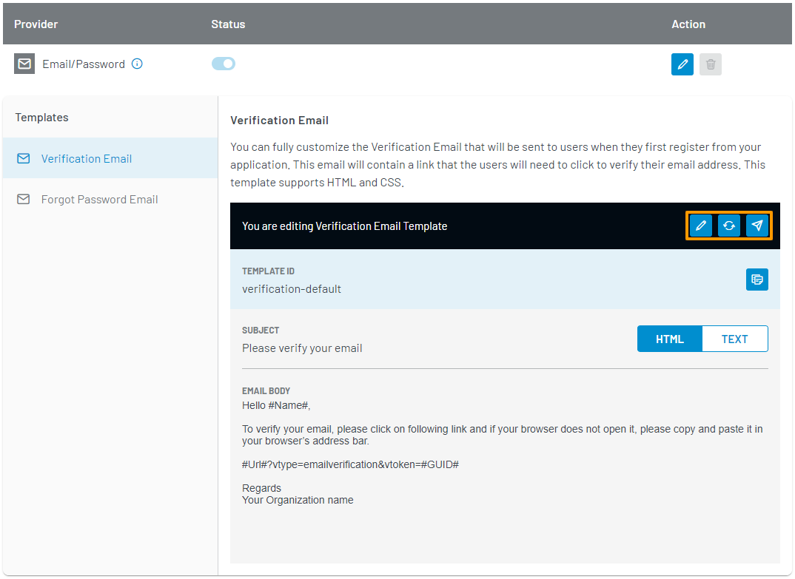

# Manage Email and Password Login

The LoginRadius Identity Platform provides Email and Password as the default registration and login option. This guide explains how to configure the content of emails that LoginRadius sends to your consumers using the LoginRadius Dashboard.

Watch the video or refer to the section below for the text-based guide.

---

<figure class="video_container">
<iframe width="560" height="315" src="https://www.youtube.com/watch?v=kHbXGqUNv-E" frameborder="0" allow="accelerometer; autoplay; clipboard-write; encrypted-media; gyroscope; picture-in-picture" allowfullscreen></iframe></figure>

---

## Configuration

### Step 1

Log in to your [LoginRadius Dashboard](https://dashboard.loginradius.com/dashboard) account. From the left navigation panel, click **Configuration** and then navigate to the **Add A Login Method** section.

### Step 2

Click the down caret, or anywhere within the section to expand it. The **Add a Login Method** screen will appear:

In the above screen, you will see that the Email/Password option is enabled by default for your application.

### Step 3

Click the **Edit** icon given next to the Email/Password provider, as highlighted in the screen below:

When certain events related to the Email/Password Login Method occur, LoginRadius will send an email to your consumer. The following are the types of email templates that will be used, along with the event that will send it: 

#### Verification Email

The Verification Email is sent to your consumer when they first register on your application. This email contains a link that will need to be clicked in order to verify their email address.

#### Forgot Password Email

The Forgot Password Email is sent to your consumer when they request to reset their password. This email contains a link that will need to be clicked in order to reset their password.

### Step 4

With an email template type selected, you can perform the following actions:

* Edit template content.
* Reset the template to its default content.
* Send a test email using the configured template. You can only send a test email if the required email configuration has been done as explained in [SMTP Configuration]().

These actions are available in the action bar highlighted in the image below:

### Step 5

When editing a template, you can update the following:

* **SUBJECT**: The subject line of the template.
* **HTML BODY**: The HTML version of the template. This content will appear in clients that support HTML content in emails. The [Placeholder](#placeholder-tags) and [Section](#section-tags) tags can be used in the HTML Body.
* **TEXT BODY**: The plain text version of the template. This content will appear in clients that support only plain text content in emails.

In your template, you can make use of predefined tags to define where LoginRadius data will appear in your email.

#### Placeholder Tags

* **#Name#**:
* **#GUID#**:
* **#Url#**:
* **#Providers#**:
* **#Email#**:
* **#FirstName#**:
* **#LastName#**:
* **#IpAddress#**:
* **#UserAgent#**:

#### Section Tags

* **#FPass**:
* **#FProv**:

To save your changes, click the **Save** button.

## Recommended Next Steps
