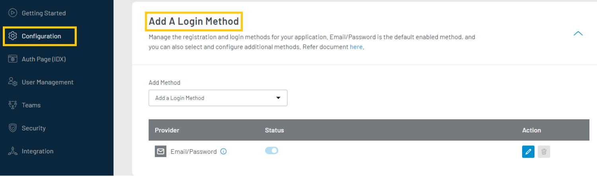
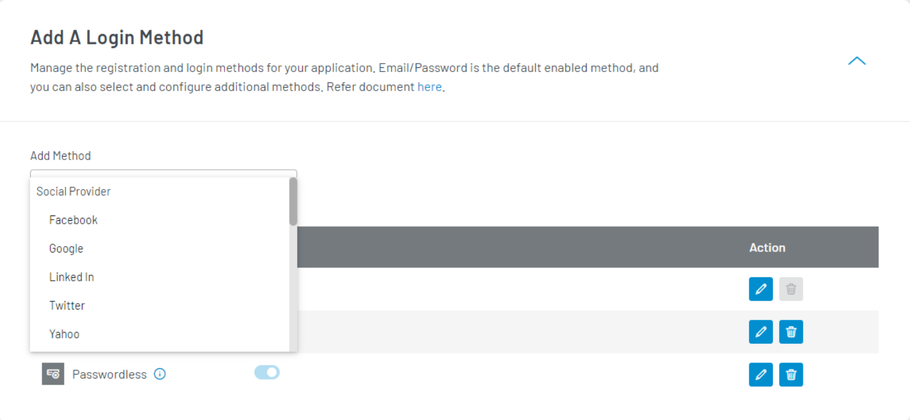
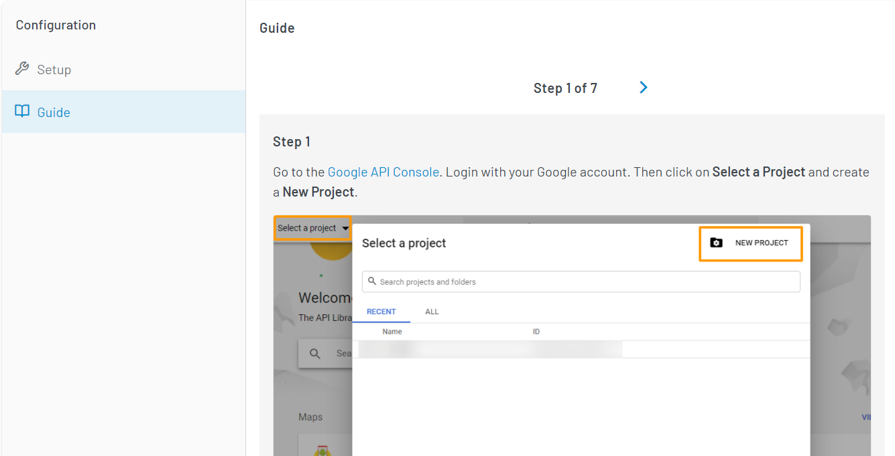
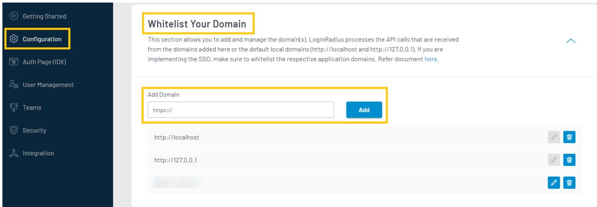
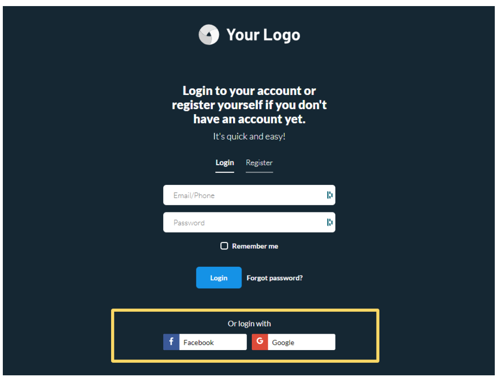

#Implement Social Login

You can implement Social Login for a quick and convenient approach for consumer registration and login. This guide explains how to add and configure the desired Social Login providers on your application using LoginRadius Dashboard.
Watch this video for the step by step information or refer to the section below for the text-based guide.

Watch the video to get started, or refer to the section below for the text-based guide.

<figure class="video_container">
<iframe width="560" height="315" src="https://www.youtube.com/embed/gd5Ig1S4P_U" frameborder="0" allow="accelerometer; autoplay; clipboard-write; encrypted-media; gyroscope; picture-in-picture" allowfullscreen></iframe></figure>

---

##Configuration

###Step 1 : Login Method Section
Login to your LoginRadius Dashboard account, from the left navigation panel, click **Configuration** and then navigate to the Add a **Login Method** section.

  

###Step 2 : Add a Login Method
Click the down arrow and the **Add a Login Method** section will expand.

###Step 3 : Select Social Login Method
Click the **Add Method** drop-down and select your desired social provider from the available providers’ list as displayed in the following screen:

  

It will open the steps section to set up the respective social provider app. 
The list of supported social providers varies based on your plan. Check out supported social providers for your plan at the bottom of the document.

###Step 4: Configure Social Login Method
Follow the step by step guide displayed on the LoginRadius Dashboard screen for configuration. 
For example, the following screen displays the configuration steps for configuring Google as social login option:

  

Perform each step and click the Next button (given in top right of the above screen) to go to the next step.
The steps for configuring each social provider will be different and displayed after selecting the respective social provider.

  

Upon completing the configuration steps of the selected Social ID Provider, you will get the credentials. Enter the obtained credentials in the **Configure App** section (given on the left of the above screen) and click the **Save** button.

  

###Step 5: Whitelist Domain

Now we have to whitelist our domain to allow api access.

To whitelist your domain, in your LoginRadius Dashboard, navigate to **[Configuration > Domain Whitelisting](https://dashboard.loginradius.com/configuration)** and add your domain name:

  
> Local domains (http://localhost and http://127.0.0.1) are whitelisted by default.

###Step 6: Check Auth Page (IDX)
Open your **Auth Page (IDX)** (https://</your-app-name/>.hub.loginradius.com/auth.aspx ) and it will display the social icon for the configured social provider:
  

###Supported Social Providers

The table below lists the social providers that LoginRadius supports for the Free, Developer, and Developer PremiumPlan.

|PLAN |	FACEBOOK |	GOOGLE |	TWITTER |	LINKEDIN |	GITHUB
:|:---:|:---:|:---:|:---:|:---:|:---:|:
|Free |	Yes |	Yes |	Yes |	No | No
|Developer	| Yes	| Yes	| Yes	| Yes	| Yes
|Developer Premium	| Supportes| 20+ | Social| ID | Providers| 			