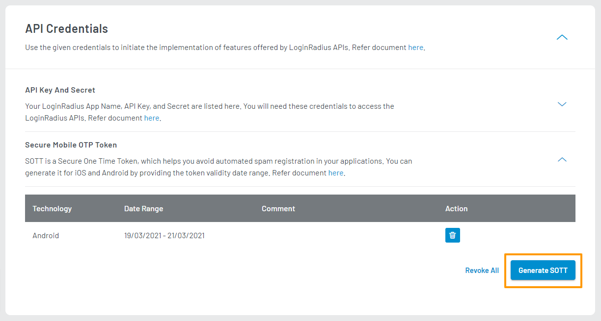
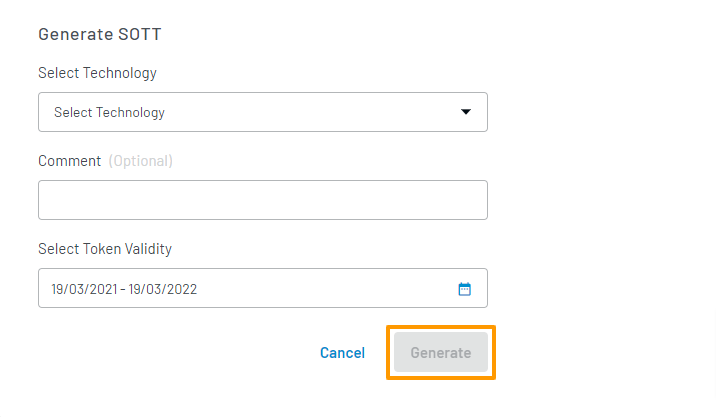

To generate SOTTs in your dashboard, log in to your <a href="https://dashboard.loginradius.com/dashboard" target="_blank">LoginRadius Dashboard</a> account. Select your app, then from the left navigation panel, click **Configuration** and then navigate to the **API Credentials** section.

Click the **Secure Mobile OTP Token** sub-section, and the **Generate SOTT** screen will appear:

If you have already generated a SOTT, you can generate additional tokens by clicking the **Generate SOTT** button available at the bottom right of the screen as highlighted below:

Enter the required details in each respective field in the form provided, and click the **Generate** button to generate your SOTT.

> **Note:** We recommend that you dynamically generate SOTTs, as static SOTTs will usually have be valid for long periods of time.
