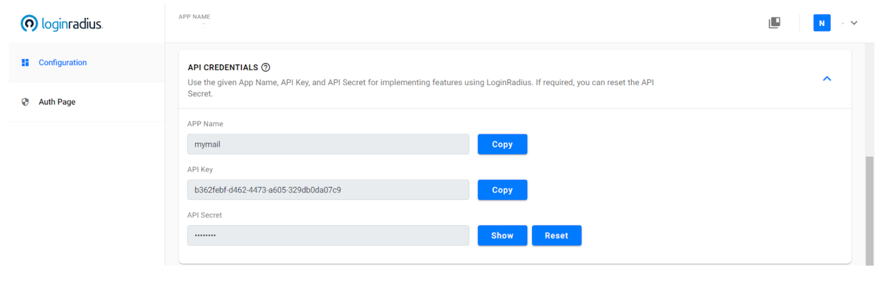

## Q: How to retrieve API key and secret?

Log in to the LoginRadius Dashboard and navigate to the API Credentials section.
The following displays the API Credentials screen:

  

The API key and secret are used to interact with LoginRadius' APIs.

You can copy the App Name and App Key by clicking the respective **Copy** button.
## Q: How to view the API Secret?

Click the Show button given next to the API Secret field. The API secret is not displayed by default for security reasons.

## Q: How to reset the API Secret?

Log in to the LoginRadius Dashboard and navigate to the API Credentials section.
The following displays the API Credentials screen:

  

