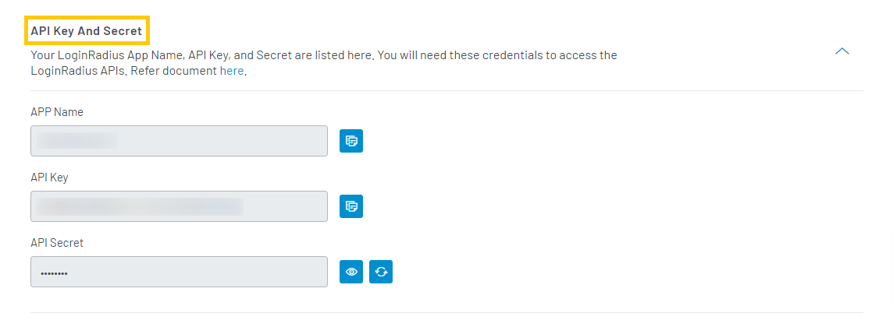
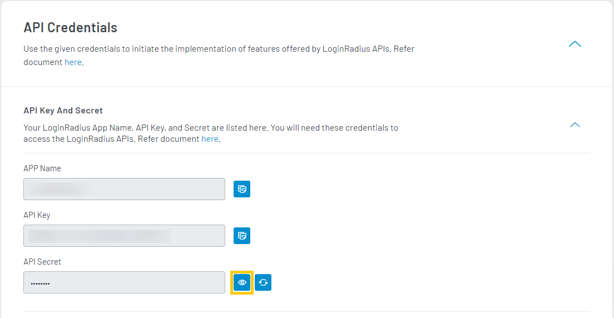

## Q: How to retrieve API key and secret?

Login to your [LoginRadius Dashboard](https://dashboard.loginradius.com/dashboard) account, from the left navigation panel, click the **Configuration** and then navigate to the **API Credentials** section. 

Click the down arrow or anywhere within the section and the **API Credentials** screen will appear:

  

 

Click the **API Key And Secret** to get your unique credentials as displayed in the following screen:

  

 

The API key and secret are used to interact with LoginRadius' APIs. You can copy the APP Name and API Key by clicking the respective **Copy** button.

## Q: How to view the API Secret?

Click the **eye** button given next to the API Secret field. The API secret is not displayed by default for security reasons.

  

 

## Q: How to reset the API Secret?

Login to your [LoginRadius Dashboard](https://dashboard.loginradius.com/dashboard) account, from the left navigation panel, click the **Configuration** and then navigate to the **API Credentials** section. 

Click the **API Key And Secret** or anywhere within the section and the below screen will appear:

  

 

You can reset the API Secret by clicking the respective **reset** button.

