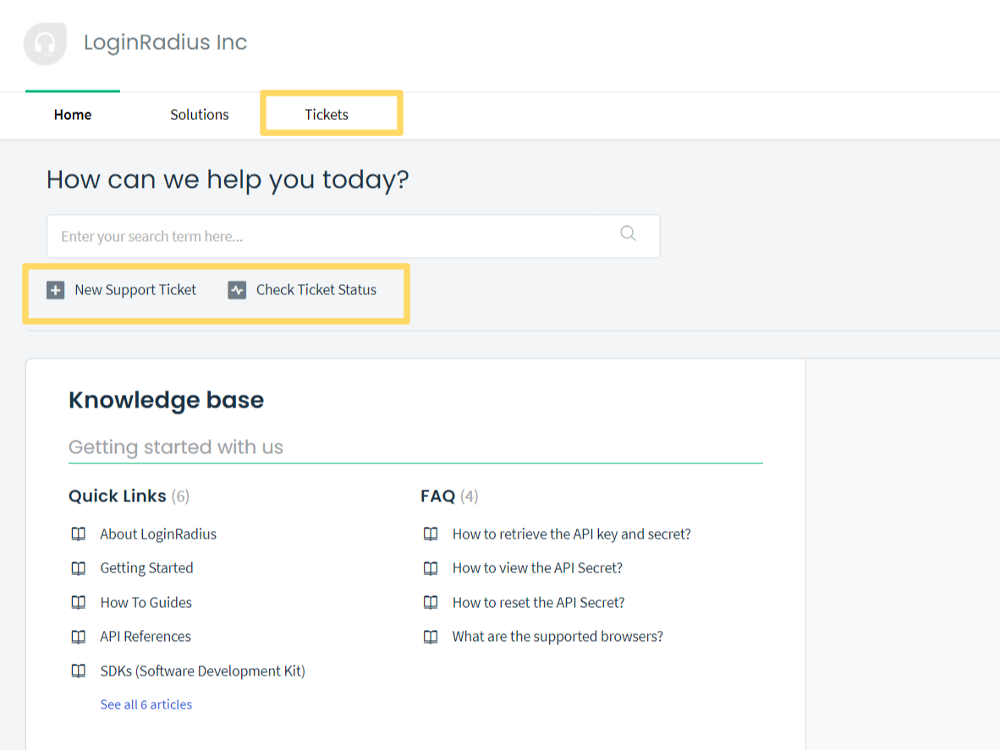

# FAQ

Contact our support team for any questions you might have.

## Frequently Asked Questions

Find answers to any questions you might have about pricing and other aspects of our dashboard.

LoginRadius support team is available 24/7, and you can reach them through the:

*  [Email Support](#what-is-the-email-id-for-raising-a-support-query)
*  <a href="https://loginradiusassist.freshdesk.com/support/home" target="_blank">Raise Support Ticket</a>
*  [Live Chat](#how-do-i-contact-loginradius-support)
*  <a href="https://www.loginradius.com/docs/developer/" target="_blank">Support Document</a>

### How to Retrieve API key and secret?

* Login to your <a href="https://dashboard.loginradius.com/dashboard" target="_blank">LoginRadius Dashboard</a> account, select your app, then from the left navigation panel, click **Configuration** and then navigate to the **API Credentials** section.
* Click the down arrow and the **API Credentials** screen will appear.
* Click the **API Key And Secret** to get your unique credentials as displayed in the following screen:

  
  
* The API key and secret are used to interact with LoginRadius' APIs. You can copy the **APP Name** and **API Key** by clicking the respective **Copy** button.

### How to view the API Secret?

* Click the **eye** button given next to the API Secret field. The API secret is not displayed by default for security reasons.

  

### How to reset the API Secret?

* Login to your <a href="https://dashboard.loginradius.com/dashboard" target="_blank">LoginRadius Dashboard</a> account, select your app, then from the left navigation panel, click **Configuration** and then navigate to the **API Credentials** section.
* Click the **API Key And Secret** and the below screen will appear.
* Click the **reset** button given next to the API Secret field as displayed below:

  

### How to access the LoginRadius Support section?

* To access the LoginRadius Support section, login to your <a href="https://dashboard.loginradius.com/dashboard" target="_blank">LoginRadius Dashboard</a> account, from the top header panel, click **Support** as displayed in the below screen.

  

* Apart from this, you can also check out the **Report An Issue** section available at the bottom of getting started page as displayed in the below screen:

  

### How to upgrade the plan for your LoginRadius App?

* Click the account icon from the right-top of your <a href="https://dashboard.loginradius.com/dashboard" target="_blank">LoginRadius Dashboard</a> screen and select the **Manage Apps** option: 

  

The Manage App screen will appear.

* Hover over the app tile for which you want to upgrade the plan, click the **App Actions** and then select the **Update Subscription** option: 

  

* Select a desired plan from the **Plan** drop-down and click the **Update** button.

  

### How do I contact LoginRadius Support?

* For quick, general, or verification-type questions, you can chat with a LoginRadius Support Team member by clicking the blue chat icon on the dashboard’s bottom right.

  

* Otherwise, submit a <a href="https://loginradiusassist.freshdesk.com/customer/login" target="_blank">Support Ticket</a>, located under the **Support** tab in the header panel. In the support ticket, please include any relevant code snippets and screenshots that can help our Support Team better understand your concern.

   

### How does LoginRadius handle support tickets?

Once a support ticket is submitted, you will receive a confirmation email about ticket creation. A LoginRadius technician is then assigned based on the request urgency level, and you will receive updates on the ticket via email once the technician starts working on it.

### Do you provide support in our time zone?

Yes. LoginRadius provides 24/7 support, the LoginRadius Support Team will always be available to help you regardless of your time zone.

### How do I create/review support tickets?

* Click **Support Tickets** under the **Support** tab on your LoginRadius Dashboard, you will be redirected to support tickets, and the below screen will appear:

   

* **New Support Ticket**: You can create a new support ticket.

* **Check Ticket Status**: Check the status of the existing ticket you submitted earlier.

### What is the Email ID for raising a support query?

* Reach out to us at **help@loginradius.com**

### How do I retrieve the provider access token?

With the extended profile data set, which you can view on the <a href="https://www.loginradius.com/datapoints/" target="_blank">LoginRadius datapoints page</a>, you can retrieve the access token that is generated by the social provider. You have access to the provider-generated access token through the data point "**Provider Access Credential**". You can use this token with direct API requests using the specific social providers' APIs.

### What is the token lifetime for Facebook, Google and Twitter?

**Facebook**: By default, the lifetime for the Facebook API token is 2 hours.

**Google**: The lifetime for the Google API token never expires either, though it may stop working for one of the following reasons:

*   The user has revoked access.
*   The token has not been used for six months.
*   The user account has exceeded a certain number of token requests (15 to 20 per user account).

**Twitter**: The lifetime for the Twitter API token never expires unless someone rejects your app in their account

### How do I resolve the "Invalid Scopes" error when logging in with Facebook?

Upon login with Facebook, the error message shown below is sometimes displayed to developer or admin users:

This is caused by the Facebook API v 2.0 release, which has deprecated certain scopes. LoginRadius has handled all of these changes within our system.

### What to do if Facebook is not returning all of the requested data or posting status updates is not working?

If you have correctly configured your LoginRadius account to request the correct permissions for extended profile data and Post messaging(push notifications), and it is working for other providers but the correct dataset and posting features do not seem to be available on Facebook, then you have most likely not verified your Facebook app. Facebook mandates an app review and approval process for apps requesting access to extended data points and features like posting messages to a user's wall.

### Supported Browsers

This is the list of browsers that are supported by LoginRadius, including the different browser variants that are also supported.

* Web Browsers

| NAME OF BROWSER             | SUPPORTED | VERSION                  |
|-----------------------------|-----------|--------------------------|
| Safari                      | Yes       | All including Latest one |
| Mozilla FireFox             | Yes       | All including Latest one |
| Google Chrome               | Yes       | All including Latest one |
| Microsoft Internet Explorer | Yes       | 9,10 and 11              |
| Opera                       | Yes       | All including Latest one |
| UC Browser                  | Yes       | All including Latest one |
| Yandex                      | Yes       | All including Latest one |
| Microsoft Edge              | Yes       | All including Latest one |

* IOS Browsers

| NAME OF BROWSER | SUPPORTED | VERSION                  |
|-----------------|-----------|--------------------------|
| Google Chrome   | Yes       | All including Latest one |
| Safari          | Yes       | All including Latest one |
| UC Browser      | Yes       | All including Latest one |
| Puffin          | Yes       | All including Latest one |

* Windows Phone Browsers

| NAME OF BROWSER | SUPPORTED | VERSION                  |
|-----------------|-----------|--------------------------|
| UC Browser      | Yes       | All including Latest one |
| IE Browser      | Yes       | All including Latest one |

* Android Browsers

| NAME OF BROWSER         | SUPPORTED | VERSION                  |
|-------------------------|-----------|--------------------------|
| UC Browser              | Yes       | All including Latest one |
| Google Chrome           | Yes       | All including Latest one |
| Dolphin                 | Yes       | All including Latest one |
| Android Default Browser | Yes       | All including Latest one |

## Pricing, Billing and Licensing

Ask about products, implementation, use cases, and more— we are ready to help!

<a href="https://www.loginradius.com/contact-sales/" target="_blank">Get In Touch</a>

## Technical Support

Have questions or issues with our product?

<a href="https://loginradiusassist.freshdesk.com/customer/" target="_blank">"Support for Developer Plans</a>

## Careers

Want to work with us? We are always looking for talented people.

<a href="https://www.loginradius.com/careers/" target="_blank">Explore Our Jobs</a>
