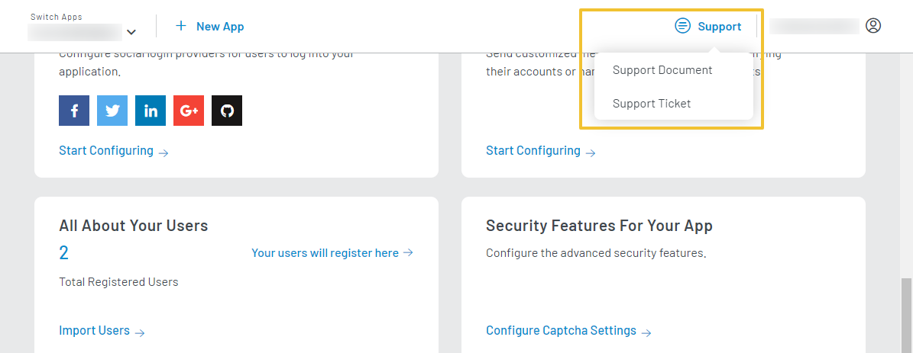

LoginRadius support team is available 24/7, and you can reach them through the:

- Email Support 
- Raise Support ticket
- Live Chat
- Support documentation

[How to access the LoginRadius Support section?](#how-to-access-the-loginradius-support-section)

[How do I contact LoginRadius Support?](#how-do-i-contact-loginradius-support)

[How does LoginRadius handle support tickets?](#how-does-loginradius-handle-support-tickets)

[Do you provide support in our time zone?](#do-you-provide-support-in-our-time-zone)

[How do I create/review support tickets?](#how-do-i-createreview-support-tickets)

## How to access the LoginRadius Support section?
To access the LoginRadius Support section, login to your [LoginRadius Dashboard](https://dashboard.loginradius.com/dashboard) account, from the top header panel, click the **SUPPORT** as displayed in the below screen.

  

 

Apart from this, you can also check out the **Report An Issue** section available at the bottom of getting started page as displayed in the below screen:

  

 

## How do I contact LoginRadius Support?
For quick, general, or verification-type questions, you can chat with a LoginRadius Support Team member by clicking on the blue chat icon on the dashboard’s bottom right.

  

 

Otherwise, submit a [Support Ticket](https://loginradiusassist.freshdesk.com/customer/login), located under the **Support** tab in the header panel. In the support ticket, please include any relevant code snippets and screenshots that can help our Support Team better understand your concern.

  

 

## How does LoginRadius handle support tickets?
Once a support ticket is submitted, you will receive a confirmation email about ticket creation. A LoginRadius technician is then assigned based on the request urgency level, and you will receive updates on the ticket via email once the technician starts working on it.

## Do you provide support in our time zone?
Yes. LoginRadius provides 24/7 support, the LoginRadius Support Team will always be available to help you regardless of your time zone.

## How do I create/review support tickets?
Click **Support Tickets** under the **Support** tab on your LoginRadius Dashboard, you will be redirected to support tickets, and the below screen will appear: 

  

 

- **New Support Ticket**: You can create a new support ticket.
- **Check Ticket Status**: Check the status of the existing ticket you submitted earlier.

## What is the Email ID for raising a support query?
Reach out to us at **help@loginradius.com**