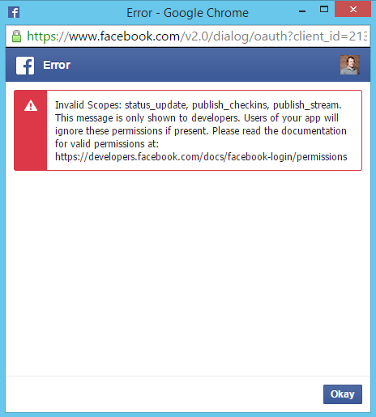

## Q: How do I retrieve the provider access token?

With the extended profile data set, which you can view on the [LoginRadius datapoints page](https://www.loginradius.com/datapoints/), you can retrieve the access token that is generated by the social provider. You have access to the provider-generated access token through the data point "**Provider Access Credential**". You can use this token with direct API requests using the specific social providers' APIs.

## Q: What is the token lifetime for Facebook, Google and Twitter?

**Facebook**: By default, the lifetime for the Facebook API token is 2 hours.

**Google**: The lifetime for the Google API token never expires either, though it may stop working for one of the following reasons:

 - The user has revoked access.
 - The token has not been used for six months.
 - The user account has exceeded a certain number of token requests (15 to 20 per user account).

**Twitter**: The lifetime for the Twitter API token never expires unless someone rejects your app in their account

## Q: How do I resolve the "Invalid Scopes" error when logging in with Facebook?

On login with Facebook, the error message shown below is sometimes displayed to developer or admin users:

  

This is caused by the Facebook API v 2.0 release, which has deprecated certain scopes. LoginRadius has handled all of these changes within our system.

## Q: What do I do if Facebook is not returning all of the requested data or posting status updates is not working?

If you have correctly configured your LoginRadius account to request the correct permissions for extended profile data and Post messaging(push notifications), and it is working for other providers but the correct dataset and posting features do not seem to be available on Facebook, then you have most likely not verified your Facebook app. Facebook mandates an app review and approval process for apps requesting access to extended data points and features like posting messages to a user's wall.