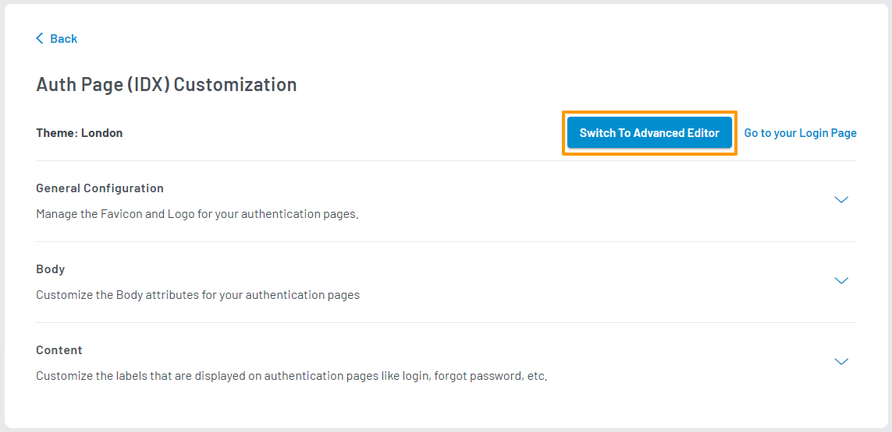
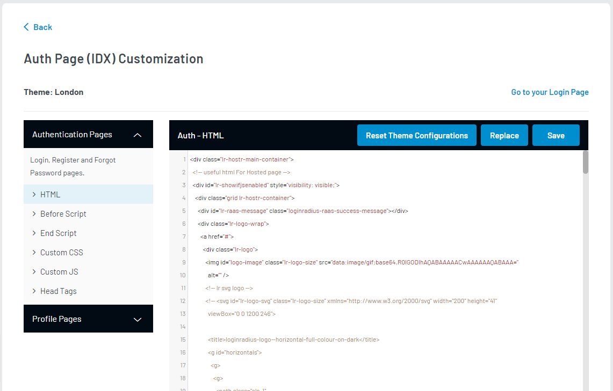
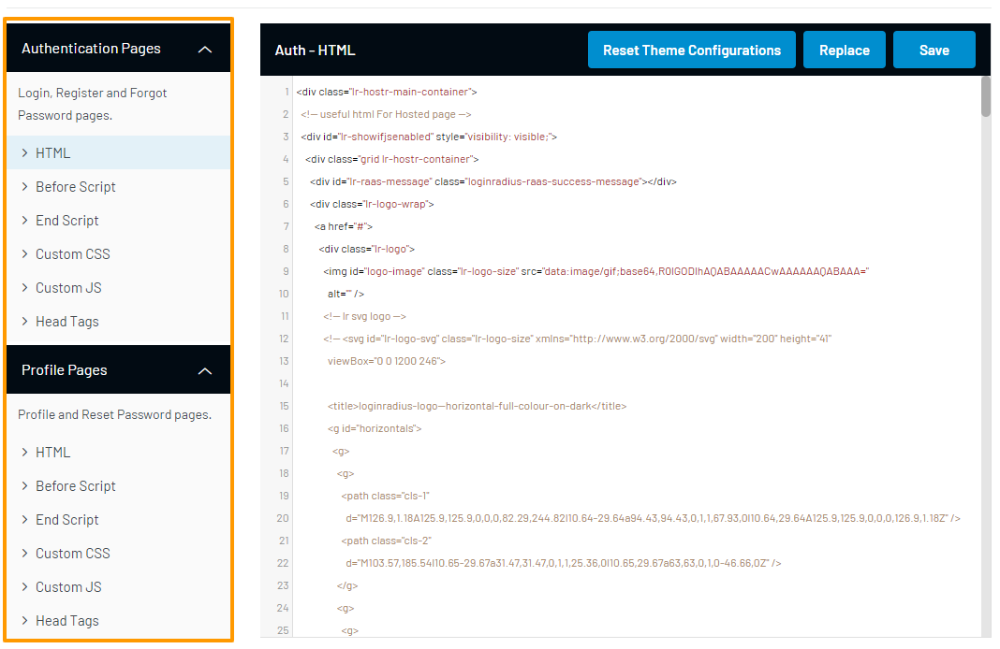
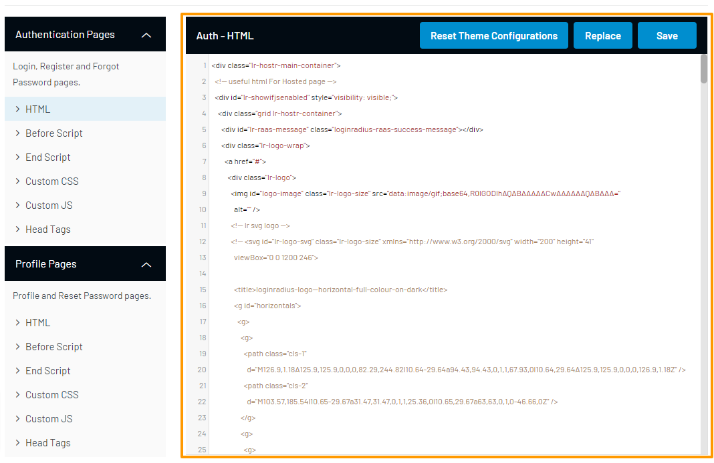
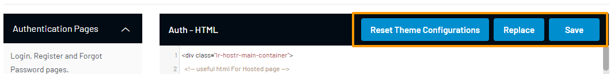

Premium

# Advanced Editor

The Advanced Editor allows you to manually edit the HTML, Scripts, and CSS that make up your LoginRadius Auth Page (IDX).

## Access Auth Page (IDX) Advanced Editor

1. Log in to your <a href="https://dashboard.loginradius.com/dashboard" target="_blank">LoginRadius Dashboard</a> account. Select your app, then from the left navigation panel, click **Auth Page (IDX)** and then navigate to the **Theme Customization** section.

2. Click the down caret, and the **Theme Customization** screen will appear.

3. On your selected theme, click the **Customize** button as highlighted below:

   

4. On the resulting **Auth Page (IDX) Customization** screen, click the **Switch To Advanced Editor** button as highlighted below to activate the Advanced Editor:

   

   Advanced editing options will be enabled as below:

   

## Use Advanced Editor

Your Auth Page (IDX) consists of two main pages - **Authentication** and **Profile**. You can access the components that make up the page by expanding the relevant sections on the left sidebar:

To edit a component, click the relevant component inside either the **Authentication Pages** or **Profile Pages** section. The components **HTML**, **Before Script**, and **End Script** consist of a single file, while the other components **Custom CSS**, **Custom JS**, and **Head Tags** allow you to add additional files.

Edit the content of your component in the editor window as highlighted below:

When editing a component, an action bar is available located at the top-right of your editor window:

You can perform the following actions:

  * **Reset Theme Configurations**: Reset your Auth Page (IDX). Your theme and configurations will be reset to default.

  * **Add New**: Only available for components that allow for multiple files. You can upload a new file or reference an existing URL of a file.

  * **Delete**: Only available for components that allow for multiple files. This will delete your file completely. Once deleted, your file cannot be recovered.

  * **Replace**: Only available for components consisting of a single file. This will replace the current file completely with either a new file or an existing URL of a file.

  * **Save**: This will save your changes to the current file.

The various forms that are present on your pages are managed using an imported LoginRadius script `LoginRadiusV2.js`. This particular script is not editable, but is responsible for injecting the following forms for each of your main pages:

* **Authentication**:
  * Registration Form
  * Login Form
  * Social Login Form
  * Forgot Password Form

* **Profile**:
  * Profile Editor
  * Social Account Linking
  * Change Password Form

### HTML

The complete HTML layout of the page is located here and can be edited freely. The location in your markup where the default interfaces (mentioned above) will appear is controlled by specific HTML elements identified by their IDs.

For example, the HTML element `

` will be populated with the Login Form as configured by your account when the page's scripts are loaded.

Below is a table of default interfaces and their corresponding containers:

| Interface | Default Container ID | Related Section |
|:---|:---:|---:|
| Registration Form | registration-container | Authentication |
| Login Form | login-container | Authentication |
| Social Login Form | sociallogin-container | Authentication |
| Forgot Password Form | forgotpassword-container | Authentication |
| Profile Editor | profile-editor-container | Profile |
| Social Account Linking | lr-linked-social and lr-not-linked-social | Profile |
| Change Password Form | change-password | Profile |

### Before Script

The main scripts that control your page are located here.

### End Script

An additional script location for your page. The scripts declared here will be located at the bottom of your page.

### Custom CSS

The stylesheets used for your page are located here. You can edit the existing stylesheets, or add your own.

### Custom JS

Any additional JavaScript files that you would like to import for your page can be added here.

### Head Tags

The head tags for your page are located here. HTML elements added here will appear inside your page's `<head></head>` element.

[Go Back to Home Page](/)
