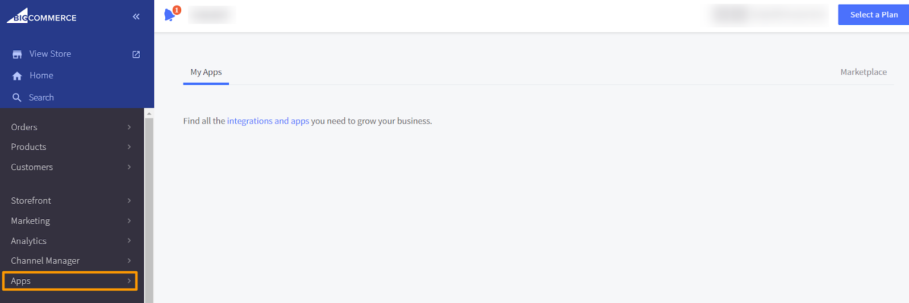
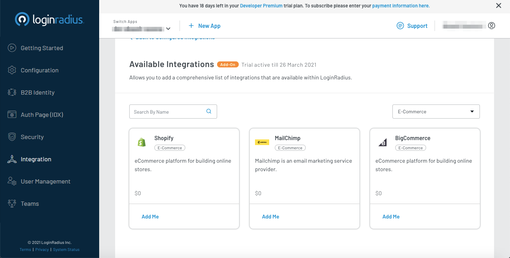

# Big Commerce

This document provides instructions for installing the LoginRadius Customer Identity and Access Management Plugin for Bigcommerce. This document also covers deploying the LoginRadius template code to your Stencil theme.

## BigCommerce Configuration

1.) Log into your BigCommerce admin panel


2.) Click on "Apps"



3.) Click on Marketplace


4.) Search for "LoginRadius"


5.) Click on the LoginRadius app and click "Install"


6.) Select the newly installed LoginRadius App on the left-hand column

7.) Input your LoginRadius API Key and Secret and click on "Validate and Install".


This will install the LoginRadius App into your BigCommerce environment. If you receive any errors or have not previously spoken with the LoginRadius Support team to configure your BigCommerce integration reach out via the LoginRadius support channels to get access to the BigCommerce integration.


## BigCommerce Setup

1.) To create API credentials, click on the “Advanced Settings” left menu and from the “Advanced Settings” click on the “API Account” then create API Account.


2.) Provide any name for the API Account and do the following configuration and save the changes


* Change Content, Checkout Content, and Customers to modify

* Change Customer Login to login

* Change other all to read-only

3.) It will provide the API credentials and also generated credentials auto-downloaded.


4.) The highlighted test is your store name and these credentials are used to set up the SSO in the Loginradius Dashboard


## LoginRadius Account Configuration

To support the BigCommerce SSO flows you will need to handle the following:

Set First and Last Name to Required in your LoginRadius. 

**Step 1:** Log in to your [Darwin Dashboard](https://dev-dashboard.lrinternal.com/) account, and navigate to [Integration](https://dev-dashboard.lrinternal.com/integration)

The following screen appear :


**Step 2:** Click **Add** option for adding a new BigCommerce app. The following configuration options will appear: 



**Step 3:** Either search for BigCommerce in the search bar or go to the **Select Category** dropdown and selected **E-Commerce**. Locate **BigCommerce** and click on **Add me**. Select Enable.


**Step 4:** After this configuration the app is available in **Available Integrations**. There, click on **Configure Me** under BigCommerce.


Click on **Let's configure** and set the following values:

**4.1:** PLATFORM: Select BigCommerce
**4.2:** STORE NAME: Input your store name
This should be a string in the API PATH when your BigCommerce ACCESS TOKEN, CLIENT ID, and CLIENT SECRET was generated. E.g. - if your API PATH is `https://api.bigcommerce.com/stores/pqshk245fh/v3/`, then your storeName value should be `pqshk245fh`
**4.3:** STORE URL: Set this to your BigCommerce Store URL. E.g.: `http://<BIGCOMMERCE Store NAME>.mybigcommerce.com`

**4.4:** STORE LOGIN URL: Set this to your BigCommerce Store Login URL. E.g.: `https://<BIGCOMMERCE Store NAME>.mybigcommerce.com/login/token/`

**4.5:** ACCESS TOKEN: Enter a valid BigCommerce Access Token for an API Account, see this doc on [creating API Accounts](https://support.bigcommerce.com/s/article/Store-API-Accounts)

**4.6:** SCOPES: Enter a list of scopes you would like to have authorized for the users separated by spaces. E.g.: `store_v2_customers store_v2_customers_login store_v2_default store_v2_information_read_only users_basic_information`

**4.7:** ClIENT ID: Enter the client ID that was generated along with the access token in step 4.5

**4.8:** ClIENT SECRET: Enter the client ID that was generated along with the access token in step 4.5

**4.9:** MAPPING: Map any fields you would like to be passed into BigCommerce. E.g.: `first_name: FirstName`, `last_name: LastName`, `email: Email[0].Value.`

## Stencil Theme Setup
It is recommended that you backup your theme before making any modifications in case you would like to revert the changes at some point.

1.) Install the Stencil plugin and the other dependencies, for detailed information, refer to this [document](https://developer.bigcommerce.com/stencil-docs/installing-stencil-cli/installing-stencil).

2.) Obtain the Store API credentials and download a copy of your existing Stencil theme to your local drive. Please refer to [this document](https://developer.bigcommerce.com/stencil-docs/installing-stencil-cli/live-previewing-a-theme)

3.) Download and unzip the [LoginRadius BigCommerce-Stencil-Package](https://github.com/LoginRadius/bigcommerce-identity-plugin)

## Modifying your Stencil Theme

1. Copy the contents of the "assets" folder from the LoginRadius theme into your theme's assets folder

2. Copy the contents of the "components" folder from the LoginRadius theme into your theme's templates ->components folder.

3. Open the config.js in your theme->assets->loginradius->assets->js and and update the LoginRadius options object with the following:

 3. storeName- Add your BigCommerce Site Name
 * This should be a string in the API PATH when your BigCommerce ACCESS TOKEN, CLIENT ID, and CLIENT SECRET was generated. E.g. - if your API PATH is `https://api.bigcommerce.com/stores/pqshk245fh/v3/`  , then your storeName value should be `pqshk245fh`
 3. option.apiKey- Add your LoginRadius API Key

 3. option.appName- Add your LoginRadius App Name
 3. option.sott- Add a valid LoginRadius Sott
 3. option.verificationUrl- You can leave this default unless you want to direct users to a specific location to validate the emails. This is required if you are using the Email add/remove the panel. You can add additional parameters to this options object if you want to include additional LoginRadius features or logic based on the parameters list here.

4. Include the reference files for LoginRadius in your header section by including the following code in your theme->templates->components->common->header.html just before the closing tag
```
{{> components/loginradius/LRreferences }}
```

5. If you are using Single Sign-On also include the tag

```
{{> components/loginradius/LRsso }}
```

6. Go in the theme and Open the create-account.html file in your theme->templates->pages>auth->create-account.html and replace the existing complete create-account form code with:
 
 ```
 {{inject 'passwordRequirements' settings.password_requirements}}
 {{#partial "page"}}
 {{> components/common/breadcrumbs breadcrumbs=breadcrumbs}}
 <h1 class="page-heading">{{lang 'create_account.heading' }}</h1>

 <div class="account account--fixed">
 {{> components/loginradius/register }} 
 </div>
 {{/partial}}
 {{> layout/base}}

 ```

7. Open the login.html file in your theme->templates->pages>auth->login.html and replace the existing Login Form interface 'div' code with

```
{{> components/loginradius/auth }}
```


This will display the pre-styled User authentication features which include handling of Login, Social Login, Registration, Forgot Password, and Reset Password.

8. If you are using SSO you will need to handle the Logout functionality by opening the navigation.html file in your theme->templates->components->common and change the logout link to

```
<a class="navUser-action" onclick="lrLogout(); return false;" href="#">{{lang 'common.logout'}}</a>
```

9. If you are using the Optimized one-page checkout you will need to include the following Component on your checkout.html page file in your theme->templates->pages after the partial page handlebars:

```
{{#partial "page"}}

 {{> components/loginradius/LoginRadiusOptimizedCheckout }}
 
 ```
Note: To see the live preview of the changes you have made to your stencil theme refer to this [document](https://developer.bigcommerce.com/stencil-docs/installing-stencil-cli/live-previewing-a-theme#serving-a-live-preview).

## Bundling and Uploading the Theme

To upload the Modified contents to the big commerce store, first bundle the updated theme and push it to the big commerce store. Follow the given document for more insights on how to bundle the big commerce theme - https://developer.bigcommerce.com/stencil-docs/deploying-a-theme/bundling-and-pushing.

## Additional Theme options

The above steps will allow you to get quickly setup and all of the interfaces can be directly customized using the CSS, js, and HTML that comes in the Stencil Package. We have also included some more basic functions to display the interfaces that you can use to customize the look and feel or to embed specific interfaces directly on your preexisting forms.

The following options are available to render specific interfaces:

1. `{{> components/loginradius/auth }}` - Displays the full LoginRadius interface.
2. `{{> components/loginradius/login }}` - Displays the Traditional Login interface.
3. `{{> components/loginradius/social }}` - Displays the Social Login interface.
4. `{{> components/loginradius/register }}` - Displays the Traditional Registration interface.
5. `{{> components/loginradius/verify }}` - Includes the code to handle the email verification process.
6. `{{> components/loginradius/forgot }}` - Displays the interfaces for Forgot password and Reset Password.
7. `{{> components/loginradius/accountdetails }}` - Displays the full Loginradius Accoount management interface.
8. `{{> components/loginradius/changepassword }}` - Displays the change Password interface.
9. `{{> components/loginradius/emailmanage }}` - Displays the Add/Remove email address interfaces.
10. `{{> components/loginradius/profileeditor }}` - Displays the update profile data interface.
11. `{{> components/loginradius/LoginRadiusOptimizedCheckout }}` - Overrides the deault optimzed checkout page functionality.

## Storage of BigCommerce customer_id

BigCommerce uses the field "customer_id" to identify unique users for your store. In LoginRadius cloud, this is stored in the ExternalId s field of your customer profile:

```
"ExternalIds": [
 {
 "Source": "BigCommerce-mystore",
 "SourceId": "6"
 }
 ]
```

The LoginRadius mapping of BigCommerce customer_id to ExternalIds also supports the configuration of multiple BigCommerce stores:

```
"ExternalIds": [
 {
 "Source": "BigCommerce-myfirststore",
 "SourceId": "6"
 },
 {
 "Source": "BigCommerce-mysecondstore",
 "SourceId": "21"
 }
 ]
``` 
## Additional Considerations

1. If you are including the email manage component or account details component on your account details page, You will need to provide a standard email verification page that all email verifications will be redirected to. This page should be accessible by logged-in and logged-out users and should include the verify component.

2. If you are using a customizable Checkout Page you can directly include the auth component and apply custom styling to bring this in line with your Checkout page branding.

3. If you want to display user profile details such as a user's first name or other data stored in LoginRadius directly from the LoginRadius session you can utilize the LoginRadius HTML SDK to retrieve this data clientside and display it as required (See the documentation for [HTML/js SDK](#)) but please take care, if you are using V2JS then no need to use HTML SDK (See the documentation for [LoginRadius V2JS](#)).

4. If you are migrating users from an existing BigCommerce site and need to preserve the user's passwords. Please reach out to the LoginRadius Support team for details on how to configure this.

## Uninstall Process
If you have installed the LoginRadius BigCommerce App on your BigCommerce Site and have customized the Stencil Theme with the below steps please make sure you revert the following items:

1. Remove the Scripts, CSS, and Content included in "Stencil Theme Setup" Section
2. Remove the LoginRadius component files from the "components"
3. Revert any Customizations made to the theme->templates->pages>auth->login.html
4. Revert any Customizations made to theme->templates->components->common->header.html
5. Revert any Customizations made to embedded links and any other pages that you have added a LoginRadius Panel.


[Go Back to Home Page](https://lr-developer-docs.netlify.app)