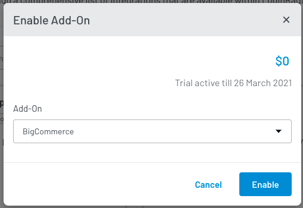
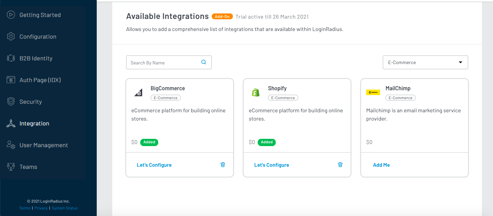

<span class="devloper-premium plan-tag">Developer Pro</span>
<span class="devloper-premium plan-tag">Add on</span>

# BigCommerce

This document provides instructions for installing the LoginRadius CIAM Plugin for Bigcommerce. This document also covers deploying the LoginRadius template code to your Stencil theme.

## BigCommerce Configuration

1. Log into your BigCommerce admin panel.

2. Select **Apps > Marketplace** option from the left navigation and click the BigCommerce.com/Apps button:

   

3. Search for **LoginRadius** and the LoginRadius App will appear. Click **Get This App** button given next to it:

   

4. Once the app is added, click the **Install** button given next to the app:

   

5. Select the newly installed LoginRadius App on the left navigation (Apps > My Apps).

6. Input your <a href="https://www.loginradius.com/docs/developer/faq/#how-to-retrieve-api-key-and-secret" target="blank">LoginRadius API Key and API Secret</a> and click the **Validate & Install** button.

   

This will install the LoginRadius App into your BigCommerce environment. If you receive any errors, contact [LoginRadius Support Team](https://loginradiusassist.freshdesk.com/support/home).

## BigCommerce Setup

1. To create API credentials, click the **Advanced Settings > API Account** from the left navigation and then click the **Create API Account** button as highlighted in the screen below:

   

2. Provide a name for the API Account, do the following configuration and save the changes:

   

   - Change Content, Checkout Content, and Customers options to **modify**.

   - Change Customer Login to **login**.

   - Change other all to **read-only**.

3. It will provide the API credentials and also generated credentials auto-downloaded as txt file.

   

4. The highlighted text is your store name, and these credentials are used to set up the SSO in the Loginradius Dashboard.

   

## LoginRadius Account Configuration

To support the BigCommerce SSO flows, you will need to handle the following:

1. Log in to your [LoginRadius Dashboard](https://dashboard.loginradius.com/) account, select your app and then navigate to the [Integration](https://dashboard.loginradius.com/integration) section.

   The following screen will appear:

   

2. Click the **Add** button for adding a new BigCommerce app. The configuration options will appear.

3. Either search for **BigCommerce** in the search bar or go to the **Select Category** dropdown and select **E-Commerce** category. Locate **BigCommerce** and click the **Try It For Free** option.

   

   From the below pop-up, click the **Enable** button:

   

4. After this configuration, the app is available in **Available Integrations**. There, click the **Let's configure** option under the BigCommerce box.

   

   The following screen will appear:

   

5. Enter or select the following values:

   - Store Name: Enter your store name. This should be a string in the API PATH when your BigCommerce ACCESS TOKEN, CLIENT ID, and CLIENT SECRET was generated. E.g. - if your API PATH is `https://api.bigcommerce.com/stores/pqshk245fh/v3/`, then your store name value should be `pqshk245fh`

   - Store URL: Set this to your BigCommerce Store URL. Example: `https://ecommbrand.mybigcommerce.com/`
   Where `ecommbrand` is your store. Refer to the image below to get yours:
      
      
        
      
   - Store Login URL: Set this to your BigCommerce Store Login URL. Example: `https://ecommbrand.mybigcommerce.com/login/token/`

   Where `ecommbrand` is your store.Refer to the image above to get yours.

   - Access Token: Enter a valid BigCommerce Access Token for an API Account, see this doc on [Creating API Accounts](https://support.bigcommerce.com/s/article/Store-API-Accounts)

   - Scopes: Enter a list of scopes you would like to have authorized for the users separated by spaces. E.g.: `store_v2_customers store_v2_customers_login store_v2_default store_v2_information_read_only users_basic_information`

   - Client Id: Enter the Client Id that was generated along with the access token.

   - Client Secret: Enter the Client Secret that was generated along with the access token.

   - Mapping: Map the following required fields to pass the respective values into BigCommerce.

     | Key        | Value     |                              |
     | ---------- | --------- | ---------------------------- |
     | first_name | FirstName |                              |
     | last_name  | LastName  |                              |
     | email      | Other     | Enter value `Email[0].Value` |

     > **Note:** These mapped fields are required for BigCommerce integration and you should use Key Values in the format given above. Similalry, you can map additional desired fields. 
     >
     > You must add all mapped fields to your <a href="https://www.loginradius.com/docs/developer/guide/custom-registration" target="blank">registration schema</a> as mandatory.
    

## Stencil Theme Setup

It is recommended that you backup your theme before making any modifications if you would like to revert the changes at some point.

1. Install the Stencil plugin and the other dependencies. For detailed information, refer to this [document](https://developer.bigcommerce.com/stencil-docs/installing-stencil-cli/installing-stencil).

2. Obtain the Store API credentials and download a copy of your existing Stencil theme to your local drive. Refer to [this document](https://developer.bigcommerce.com/stencil-docs/installing-stencil-cli/live-previewing-a-theme)

3. Download and unzip the [LoginRadius BigCommerce-Stencil-Package](https://github.com/LoginRadius/bigcommerce-identity-plugin)

### Modifying Your Stencil Theme

1. Copy the contents of the **assets** folder from the LoginRadius theme into your theme's assets folder.

2. Copy the contents of the **components** folder from the LoginRadius theme into your theme's **templates > components** folder.

3. Open the `config.js` in your **theme > assets > loginradius >assets > js** and update the LoginRadius options object with the following:

   - `storeName`: Add your BigCommerce Site Name. This should be a string in the API PATH when your BigCommerce ACCESS TOKEN, CLIENT ID, and CLIENT SECRET was generated. E.g. - if your API PATH is `https://api.bigcommerce.com/stores/pqshk245fh/v3/` , then your store name value should be `pqshk245fh`

   - `option.apiKey`: Add your <a href="https://www.loginradius.com/docs/developer/faq/#how-to-retrieve-api-key-and-secret" target="blank">LoginRadius API Key</a>.
   - `option.appName`: Add your <a href="https://www.loginradius.com/docs/developer/faq/#how-to-retrieve-api-key-and-secret" target="blank">LoginRadius App Name</a>
   - `option.sott`: Add a valid LoginRadius [Sott](https://www.loginradius.com/docs/developer/concepts/sott).
   - `option.verificationUrl`: You can leave this default unless you want to direct users to a specific location to validate the emails. This is required if you are using the Email add/remove the panel. You can add additional parameters to this options object if you want to include additional LoginRadius features or logic based on the parameters list here.
   - `option.askEmailForUnverifiedProfileAlways`: You can leave this `true` if you want consumers to verify their email id. Change it to `false` for consumers to proceed without email verification.

   - Add the following schema next to the `var LRObject= new LoginRadiusV2(option);`

     ```
     LRObject.registrationFormSchema = [
         {
         "Checked": true,
         "DataSource": null,
         "Parent": null,
         "ParentDataSource": null,
         "display": "First Name",
         "name": "firstname",
         "options": null,
         "permission": "w",
         "rules": "required",
         "type": "string"
         },
         {
         "Checked": true,
         "DataSource": null,
         "Parent": null,
         "ParentDataSource": null,
         "display": "Last Name",
         "name": "lastname",
         "options": null,
         "permission": "w",
         "rules": "required",
         "type": "string"
         },
         {
         "Checked": true,
         "DataSource": null,
         "Parent": null,
         "ParentDataSource": null,
         "display": "Email Id",
         "name": "emailid",
         "options": null,
         "permission": "w",
         "rules": "valid_email",
         "type": "string"
         },
         {
         "Checked": true,
         "DataSource": null,
         "Parent": null,
         "ParentDataSource": null,
         "display": "Password",
         "name": "password",
         "options": null,
         "permission": "w",
         "rules": "min_length[6]|max_length[32]|required",
         "type": "password"
         }
      ]
     ```

4. Include the reference files for LoginRadius in your header section by including the following code in your **theme > templates > components > common > header.html** just before the closing tag:

```

{{> components/loginradius/LRreferences }}

```

5. If you are using Single Sign-On, include the tag:

```

{{> components/loginradius/LRsso }}

```

6. Go to the theme and open the `create-account.html` file in your **theme > templates > pages > auth > create-account.html** and replace the existing complete create-account form code with:

```

{{inject 'passwordRequirements' settings.password_requirements}}
{{#partial "page"}}
{{> components/common/breadcrumbs breadcrumbs=breadcrumbs}}

 <h1 class="page-heading">{{lang 'create_account.heading' }}</h1>

 <div class="account account--fixed">
 {{> components/loginradius/register }} 
 </div>
 {{/partial}}
 {{> layout/base}}

```

7. Open the `login.html` file in your **theme >templates > pages > auth > login.html** and replace the existing Login Form interface 'div' code with

```

{{> components/loginradius/auth }}

```


This will display the pre-styled User authentication features which include handling of Login, Social Login, Registration, Forgot Password, and Reset Password.

8. If you are using SSO you will need to handle the Logout functionality by opening the `navigation.html` file in your **theme > templates > components > common** and change the logout link to:

```

<a class="navUser-action" onclick="lrLogout(); return false;" href="#">{{lang 'common.logout'}}</a>

```

9. If you are using the optimized one-page checkout, you will need to include the following component on your `checkout.html` page file in your **theme > templates > pages** after the partial page handlebars:

```

{{#partial "page"}}

{{> components/loginradius/LoginRadiusOptimizedCheckout }}

```
> **Note:** To see the live preview of the changes you have made to your stencil theme, refer to this [document](https://developer.bigcommerce.com/stencil-docs/installing-stencil-cli/live-previewing-a-theme#serving-a-live-preview).

### Bundling and Uploading Theme

To upload the modified contents to the big commerce store, first bundle the updated theme and push it to the big commerce store.

Follow the given document for more insights on how to bundle the big commerce theme - https://developer.bigcommerce.com/stencil-docs/deploying-a-theme/bundling-and-pushing.

### Additional Theme Options

The above steps will allow you to set up quickly, and all of the interfaces can be directly customized using the CSS, js, and HTML that comes in the Stencil Package. We have also included some more basic functions to display the interfaces that you can use to customize the look and feel or to embed specific interfaces directly on your preexisting forms.

The following options are available to render specific interfaces:

1. `{{> components/loginradius/auth }}` - Displays the full LoginRadius interface.
2. `{{> components/loginradius/login }}` - Displays the Email/Password Login interface.
3. `{{> components/loginradius/social }}` - Displays the Social Login interface.
4. `{{> components/loginradius/register }}` - Displays the Email/Password Registration interface.
5. `{{> components/loginradius/verify }}` - Includes the code to handle the email verification process.
6. `{{> components/loginradius/forgot }}` - Displays the interfaces for Forgot password and Reset Password.
7. `{{> components/loginradius/accountdetails }}` - Displays the full Loginradius Accoount management interface.
8. `{{> components/loginradius/changepassword }}` - Displays the change Password interface.
9. `{{> components/loginradius/emailmanage }}` - Displays the Add/Remove email address interfaces.
10. `{{> components/loginradius/profileeditor }}` - Displays the update profile data interface.
11. `{{> components/loginradius/LoginRadiusOptimizedCheckout }}` - Overrides the deault optimzed checkout page functionality.

### Passwordless Login Setup

Refer to <a href="https://www.loginradius.com/docs/developer/guide/bigcommerce-passwordless" target="blank"> this document</a> for configuring Passwordless Login options for your BigCommerce store using Stencil theme. 

## Blueprint Theme Setup

The following sections presume you have a standard BigCommerce Blueprint custom template (Classic Next) configured on your WebDav, If you need assistance in setting this up contact the LoginRadius support team.

It is recommended that you backup your theme before making any modifications in case you would like to revert the changes at some point.

1. Open **WebDav** Access to your BigCommerce Site.

2. Unzip the **LoginRadius BigCommerce-blueprint-Package**

3. Copy the following folders to the specified locations in your **webdav/template** folder

  * **assets/js**- Copy the loginradius folder to your **webdav/template/js** folder

  * **assets/images**- Copy the loginradius folder to your **webdav/template/images** folder

  * **assets/css**- Copy the loginradius folder to your **webdav/template/Styles** folder

4. Copy the contents of the **panels** folder to the **webdav/Panels** Folder

### Modifying your BluePrint Theme

1. Open the `config.js` in the provided `BlueprintThemeFile\assets\js\loginradius` and update the LoginRadius options object with the following:

   * `storeName` - Add your BigCommerce Site Name. This should be a string in the API PATH when your BigCommerce ACCESS TOKEN, CLIENT ID, and CLIENT SECRET was generated. E.g. - if your API PATH is `https://api.bigcommerce.com/stores/pqshk245fh/v3/`, then your storeName value should be `pqshk245fh`

   * `option.apiKey` - Add your <a href="https://www.loginradius.com/docs/developer/faq/#how-to-retrieve-api-key-and-secret" target="blank">LoginRadius API Key</a>

   * `option.appName` - Add your <a href="https://www.loginradius.com/docs/developer/faq/#how-to-retrieve-api-key-and-secret" target="blank">LoginRadius App Name</a>

   * `option.sott` - Add a valid LoginRadius [Sott](https://www.loginradius.com/docs/developer/concepts/sott)

   * `option.verificationUrl` - You can leave this default unless you want to direct customers to a specific location to validate the emails. This is required if you are using the Email add/remove panel. You can add additional parameters to this options object if you want to include additional LoginRadius features or logic based on the parameters list <a href="https://www.loginradius.com/docs/developer/references/javascript-library/getting-started" target="_blank">here</a>.

2. Include the reference files for LoginRadius in your header section by including the following code in your `webdav/Panels/header.html` or `webdav/Panels/HTMLHead.html` just before the closing `</header>` tag

```

%%Panel.lrreferences%%

```

3. If you are using Single Sign-On also include the tag after the lrreferences tag

```

%%Panel.lrsso%%

```

4. Open the `LoginForm.html` file in your `webdav/Panels/LoginForm.html` and replace the existing Login page code with

```

%%Panel.lrauth%%

```

This will display the pre-styled customer authentication features which include handling of Login, Social Login, Registration, Forgot Password, and Reset Password.

5. Logout is handled automatically in the `lrsso.html` panel. If you have custom logout links on any of your pages you can add the following on click action to them to tie into the normal LoginRadius Logout procedures.

```

lrLogout(); return false;

```

6. You will need to update any of the dynamically created checkout page links if you are using the streamlined cart flow.

   * Search your template files for `%%GLOBAL_CheckoutLink%%`

   * Add the following onclick handler to these links: `onclick="assignCheckout(this)"`

>**Note:** Guest checkout is not supported by BigCommerce for Customized Login Providers

### Additional Theme options

The above steps will allow you to get quickly setup and all of the interfaces can be directly customized using the CSS, js, and HTML that comes in the BluePrint Package. We have also included some more basic functions to display the interfaces that you can use to customize the look and feel or to embed specific interfaces directly on your preexisting forms.

The following options are available to render specific interfaces:

1. `%%Panel.lrauth%%` - Displays the full LoginRadius interface.
2. `%%Panel.lrlogin%%` - Displays the Traditional Login interface.
3. `%%Panel.lrsocial%%` - Displays the Social Login interface.
4. `%%Panel.lrregister%%` - Displays the Traditional Registration interface.
5. `%%Panel.lrverify%%` - Includes the code to handle the email verification process.
6. `%%Panel.lrforgot%%` - Displays the interfaces for Forgot password and Reset Password
7. `%%Panel.lraccountdetails%%` - Displays all of the Profile editing forms
8. `%%Panel.lrchangepassword%%` - Displays the Change Password Form
9. `%%Panel.lremailmanage%%` - Displays the add and remove Email Forms
10. `%%Panel.lrprofileeditor%%` - Displays the Profile Editor Form


## Storage of BigCommerce customer_id

BigCommerce uses the field `customer_id` to identify unique users for your store. In LoginRadius cloud, this is stored in the ExternalIds field of your consumer profile:

```

"ExternalIds": [
{
"Source": "BigCommerce-mystore",
"SourceId": "6"
}
]

```

The LoginRadius mapping of BigCommerce `customer_id` to ExternalIds also supports the configuration of multiple BigCommerce stores:

```

"ExternalIds": [
{
"Source": "BigCommerce-myfirststore",
"SourceId": "6"
},
{
"Source": "BigCommerce-mysecondstore",
"SourceId": "21"
}
]

```
## Additional Considerations

1. If you are including the email manage component or account details component on your account details page, You will need to provide a standard email verification page that all email verifications will be redirected to. This page should be accessible by logged-in and logged-out users and should include the verify component.

2. If you are using a customizable Checkout Page, you can directly include the auth component and apply custom styling to bring this in line with your Checkout page branding.

3. If you want to display user profile details such as a user's first name or other data stored in LoginRadius directly from the LoginRadius session, you can utilize the LoginRadius HTML SDK to retrieve this data clientside and display it as required (See the documentation for [HTML/js SDK](/references/sdk/html5-sdk/) but please take care, if you are using V2JS then no need to use HTML SDK (See the documentation for [LoginRadius V2JS](/references/javascript-library/getting-started/).

4. If you are migrating users from an existing BigCommerce site and need to preserve the user's passwords. Reach out to the [LoginRadius Support Team](https://loginradiusassist.freshdesk.com/support/home) for details on how to configure this.

## Uninstall Process
If you have installed the LoginRadius BigCommerce App on your BigCommerce Site and have customized the Stencil Theme with the below steps, make sure you revert the following items:

1. Remove the Scripts, CSS, and Content included in **Stencil Theme Setup** Section.
2. Remove the LoginRadius component files from the **components**.
3. Revert any Customizations made to the **theme > templates > pages > auth > login.html**.
4. Revert any Customizations made to **theme > templates > components > common > header.html**.
5. Revert any Customizations made to embedded links and any other pages that you have added a LoginRadius Panel.


[Go Back to Home Page](/)
