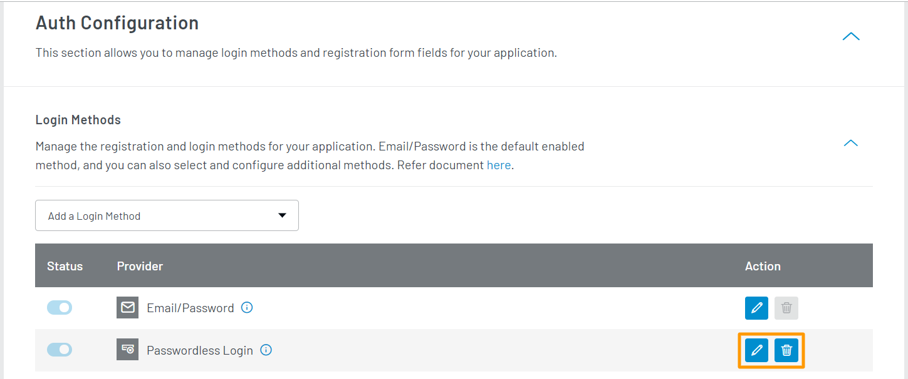

<span class="devloper-premium plan-tag">Developer Pro</span>
<span class="devloper-premium plan-tag">Add on</span>

# Passwordless Login with BigCommerce Stencil Theme
This document explains how to enable password login method for your BigCommerce store using Stencil theme.

## LoginRadius Dashboard Configurations

Log in to your [LoginRadius Dashboard](https://dashboard.loginradius.com/) account. Select your app, navigate to the **Configuration > Auth Configuration > Login Method** and enable **Passwordless Login** method.



> **Note:** Refer to <a href="https://www.loginradius.com/docs/developer/guide/passwordless-login" target="blank">this document</a> to know more about managing the Passwordless Login.

## Stencil Theme Code Configurations

1. Open the **LoginRadiusInterface.js** file in your Stencil theme, which is located at **theme > assets > loginradius >assets > js** and find the **definelogin** function.

2. In the **definelogin** function, add the below if condition in success:

   ```
   if (response.IsPosted) {
				LRBCUX.interface.showMessage("An email has been sent to the provided email address", 5000);
				document.getElementById("fade").style.display = 'none';

			}
   ```

3. Put the existing code of onSuccess in else part. The updated `definelogin` function would look like the following:

   ```
   if (response.IsPosted) {
				LRBCUX.interface.showMessage("An email has been sent to the provided email address", 5000);
				document.getElementById("fade").style.display = 'none';

			} else {
				var url = $LRBC.util.getURL(response.access_token, option.apiKey, '', storeName);


				LRBCUX.interface.showMessage("Login Successful, you will be redirected momentarily", 5000);

				$LRBC.util.jsonpCall(url, function (tokendata) {

					if (tokendata.loginUrl != null) {
						$LRBC.util.sendusertosite(tokendata.loginUrl);
					} else {
						LRBCUX.interface.showMessage("Something went wrong during login please try again", 5000);
						document.getElementById("fade").style.display = 'none';
					}
				});
			}
    ```

4. Find the `defineregister` function in the same **LoginRadiusInterface.js** file.

5. Add the following if condition to the `defineregister ` function:
   
   ```
	if (response != null && response.Profile != null) {
				LRBCUX.interface.showMessage("Registered successfully, please sign in", 5000);
				document.getElementById("fade").style.display = 'none';
			}
   ```
   
   The updated `defineregister` function would look like the following:

   ```
   LRBCUX.interface.defineregister = function () {
   var registration_options = {}

	  registration_options.onSuccess = function (response) {
              // On Success
		if (response != null && response.IsPosted != null && response.IsPosted == true)
			LRBCUX.interface.showMessage("An email has been sent to your account, please click on the link to verify your Email", 5000);
			document.getElementById("fade").style.display = 'none';

		if (response != null && response.Profile != null) {
			LRBCUX.interface.showMessage("Registered successfully, please sign in", 5000);
			document.getElementById("fade").style.display = 'none';
			}
		};

	registration_options.onError = function (errors) {

		document.getElementById("fade").style.display = 'none';
		if (errors.length && errors[0].Description != null)
			LRBCUX.interface.showMessage(errors[0].Description, 5000);
	};

	registration_options.container = "register-div";

	LRObject.init("registration", registration_options);

    };	

    ```

Passwordless Login options has been enabled for your BigCommerce store.

> **Note:** To see the live preview of the changes you have made to your stencil theme, refer to this [document](https://developer.bigcommerce.com/stencil-docs/installing-stencil-cli/live-previewing-a-theme#serving-a-live-preview).

