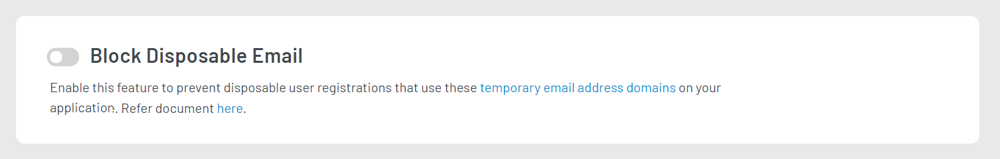

# Block Disposable Email
The Block Disposable Email feature allows you to preventing disposable registrations on your application, providing only authentic user logins.

## LoginRadius Configuration

1.  Login to your  [LoginRadius Dashboard](https://dashboard.loginradius.com/dashboard)  account, from the left navigation panel, click  **Security**  and then navigate to the  **Block Disposable Email**  section.

2. Toggle the **Block Disposable Email** option.
   
