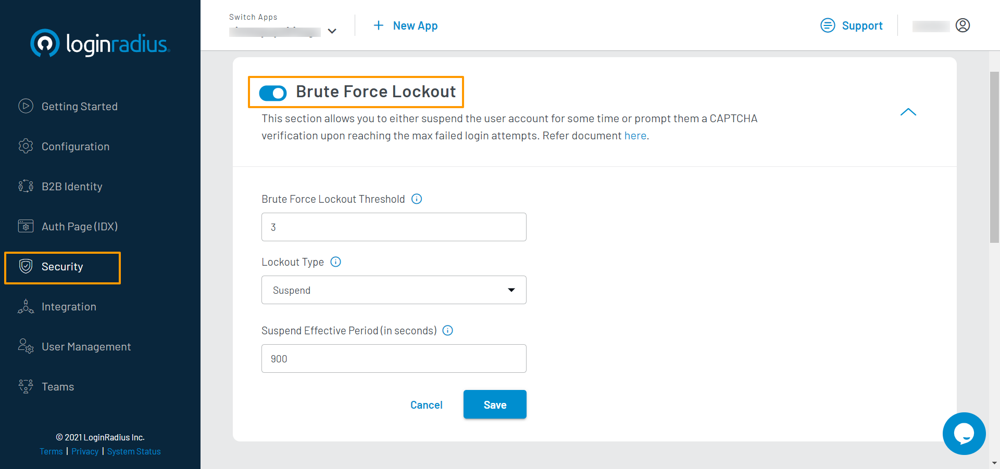
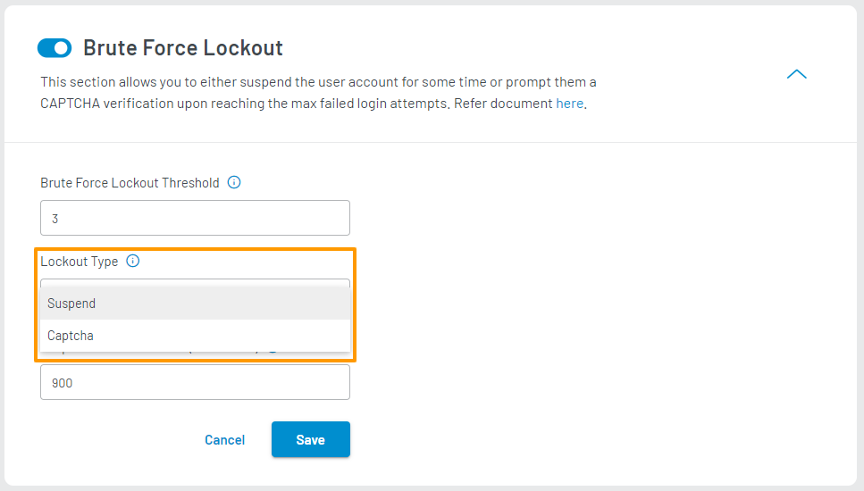

Developer
Developer Pro

# Bruteforce Lockout

The Brute Force Lockout feature allows you to restrict account access based on failed login attempts. Once the limit of failed login attempts is reached, the customer will either get suspended for the configured period or prompted to complete an additional security step to log in.

## LoginRadius Configuration

1. Log in to your <a href="https://dashboard.loginradius.com/dashboard" target="_blank">LoginRadius Dashboard</a> account, select your app, then from the left navigation panel, click the **Security** section and then navigate to the **Brute Force Lockout** section.

2. Click the down arrow, the Brute Force Lockout screen will appear:

   

3. Enter or select the following configuration details:

   - **Brute Force Lockout Threshold:** Set the desired maximum number of failed login attempts.

   - **Lockout Type:** Select the lockout type you wish to trigger when the threshold limit is reached. The following screen displays the available lockout type options:

     

     - **Suspend:** Select this option to prevent the customer from logging in for a specified amount of time (Suspend Effective Period), once the account is suspended.

     - **Captcha** Select this option to display Captcha options when the threshold reaches. 
       > **Note:** Captcha should be pre-configured to use this option. Refer to [Captcha document](/guide/captcha) to see how to configure Captcha.

   - **Suspend Effective Period:** This option appears, if **Suspend** option is selected as **Lockout Type**. Enter the effective period for which the account is suspended. Default suspend effective period is 900 seconds.

[Go Back to Home Page](/)
