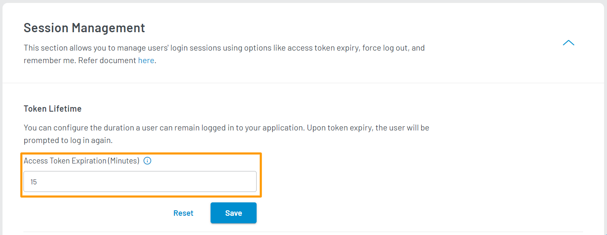

# Change Session Lifetime

Session Management allows you to control and manage your consumer’s login session. This feature is available through the **Token Lifetime** option inside the Session Management section. **Token lifetime** is the amount of time a consumer is logged in to your application until it expires and prompts the consumer to log back in. 

This time can be managed by the following steps:

## Step 1: Access Session Management

1. Login to your [LoginRadius Dashboard](https://dashboard.loginradius.com/dashboard) account. From the left navigation panel, click **Security** and then navigate to the **Session Management** section. 

2. Click the down arrow and the **Session Management** screen will appear.

   

## Step 2: Configure Token Lifetime

1. Enter the desired token lifetime in the **Access Token Expiration** text box.

   

   Here you can set the token expiration time and extend the token validity if it has been accessed/used before the expiration time.

   > The default token lifetime is 15 min and configurable from 15 min to 24 hours.

   **Use Case**: A token having the expiration at 7.00 will be extended to the configured expiration time if your consumer logged in before the expiry (i.e., 7.00).

2. Click the **Save** button.
