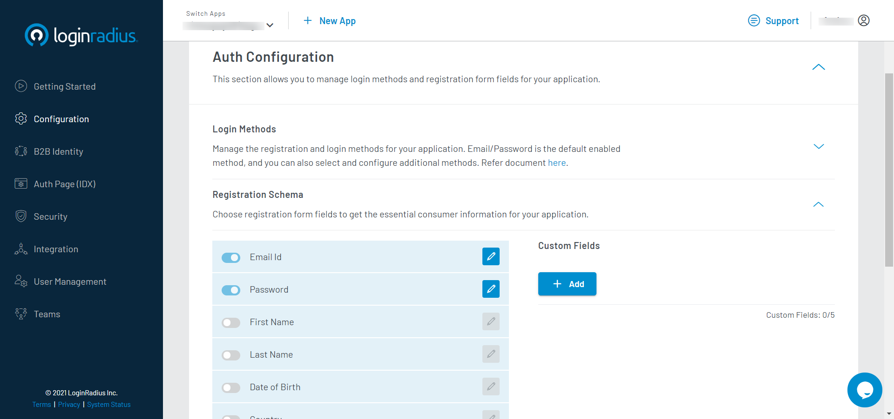

Developer
Developer Pro

# Customize Registration Form Fields

Registration form fields allow you to configure how the consumer can register to your application.You can choose which fields are required while registering and also set those fields to be optional or mandatory.

## Configuration

### Step 1: Choose Registration Form Field

1. Login to your <a href="https://dashboard.loginradius.com/" target="_blank">LoginRadius Dashboard</a> account, from the left navigation panel, click **Configuration** and then navigate to the **Registration Schema** section.

2. Select form fields from the list that you want as information from the consumer when they register.

### Step 2: Configure Form Fields

1. Click the **Edit** option next to form fields to configure.

2. Add the Field name that will be displayed on auth page when the consumer registers.

3. Select whether the Field is mandatory or optional when the consumer registers to your application.

> NOTE: Email and Password are mandatory form fields during the registration process.

> NOTE: If a Social Login Provider is added as a Login Method then the consumer can login without Registration Form Fields using the Social Provider.  

### Step 3: Custom Fields

1. Add or Delete a new Custom Field to Registration Form Fields by clicking the **Add** or **Delete** buttons in the **Custom Fields** section respectively.

2. If a new Custom Field is added, configure the newly added Form Field by following Step 2. 

3. Add your own set of validation rules in the **validation string** section.

* <a href="https://www.loginradius.com/docs/developer/references/javascript-library/customizing-your-registration-schema" target="_blank">Configure Custom registration using JS</a>

The Custom Fields added will be displayed during registration.

### Step 4: Auth page

The Auth Page for a Registration Form Field eg. Firstname is shown below:

