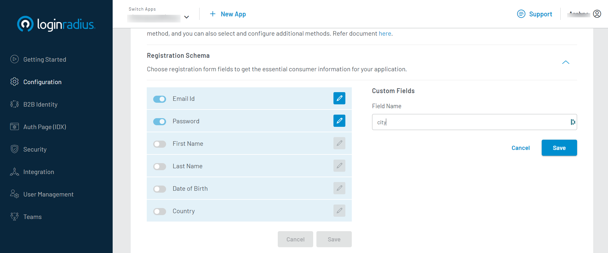
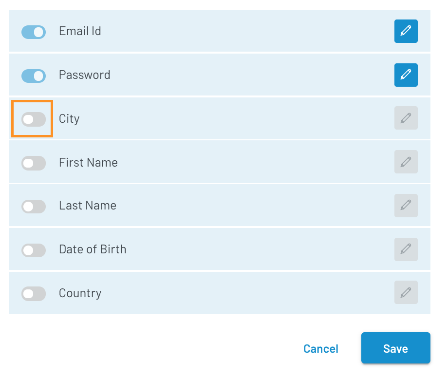
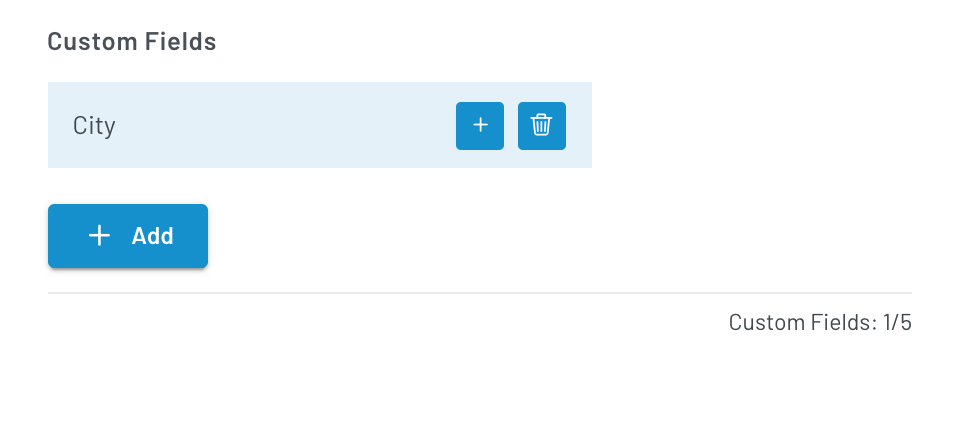

Developer
Developer Pro

# Customize Registration Form Fields

The LoginRadius Identity Platform provides the Registration Schema to enable you to configure the information required from the consumers during registration.

This guide explains how to select fields from a predefined list or create fields based on the requirements in LoginRadius Dashboard.

## Step 1: Navigate to Registration Schema

1. Login to your <a href="https://dashboard.loginradius.com" target="_blank"> LoginRadius Dashboard</a> account; from the left navigation panel, click the **Configuration** option. 

2. Click within the **Configuration** section and then navigate to the **Registration Schema** section. The following screen will appear: 
   
   

## Step 2: Manage Registration Form Fields

You can add registration form fields by selecting from the existing list or creating a custom field based on the requirement.

   

>Note: If you have Social Login enabled and included additional mandatory registration form fields from the registration schema, the consumer will need to fill in the respective details even in case of using social login.

### a. Select from the list

1. Choose a field from the predefined list, enable the toggle button given next to it.
 
2. Click the **Edit** icon next to the field to:

    a. Mark the field **Optional** or **Mandatory**

    b. Change the field's name 

  The options will appear as displayed below: 

3. Click the **Save** button after configuring the field(s).

>Note: You cannot disable the Email and Password fields, as Email/Password Login is the default authentication method. For more information, refer to <a href="https://www.loginradius.com/docs/developer/guide/emailpassword-login" target="_blank">this document</a>.

### b. Create a custom field

1. Click the **Add** button from the **Custom Fields** section to add a custom field, as highlighted on the screen below: 

   

2. Enter the Field Name and then click the Save button to add the field to the **Custom Fields** section list. (e.g City)

   

    >Note: You can add a maximum of 5 Custom Fields.

3. Click the **`+`** icon given next to the field to include it in the registration form. And then click the **Save** button.

   

4. Click the **Edit** icon given next to the field to:

    a. Mark it **Optional** or **Mandatory**

    b. Update the field name

    c. Select field type

    d. Define **validation rules**. Refer to Configure Custom registration using JS 
    document for more details.

  Click the **Save** button to save the changes.

>Note: You can remove a Custom Field from the Registration Schema by           
>a. Disable the respective toggle button, click **Save** and the disabled field will appear in the Custom Fields section. (e.g City is the added custom field here)

   

>b. Click the **Delete** icon given next to it in the Custom Fields section and confirm the action.

   

## Step 3: Auth Page

The Auth Page(IDX) will display the enabled or added fields in the Register tab.  For example, the following displays the added **First Name** field: 

   

Alternatively, you can configure the registration form fields using JS. Refer to <a href="https://www.loginradius.com/docs/developer/references/javascript-library/customizing-your-registration-schema/" target="_blank">this document</a> for more information.

