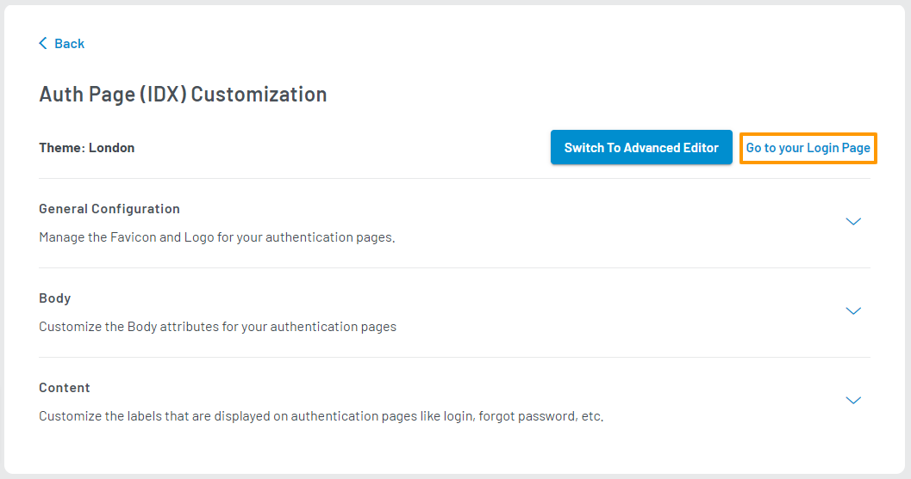
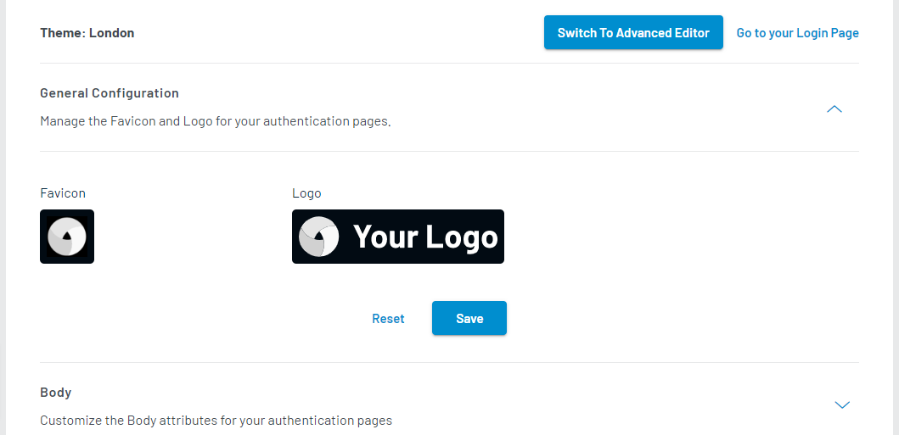
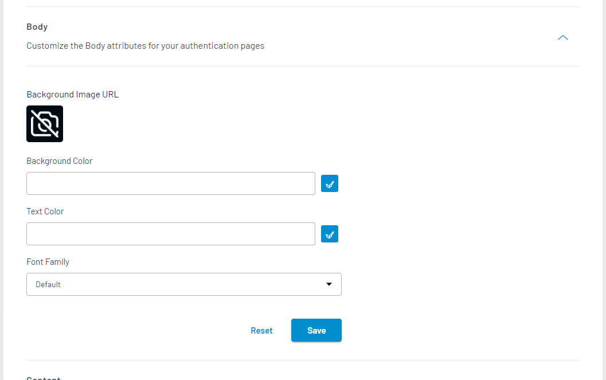
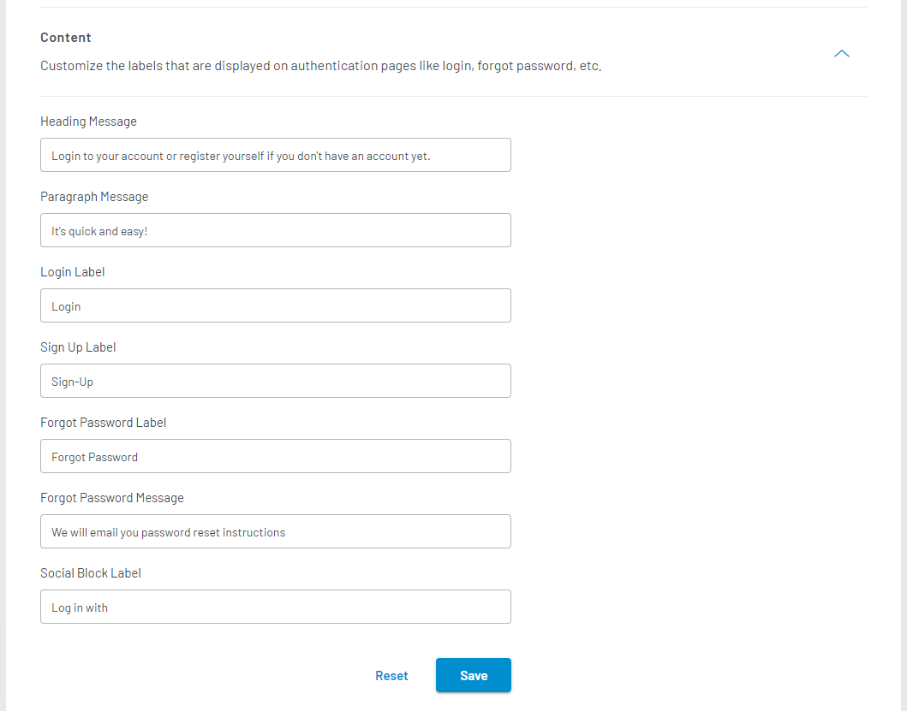
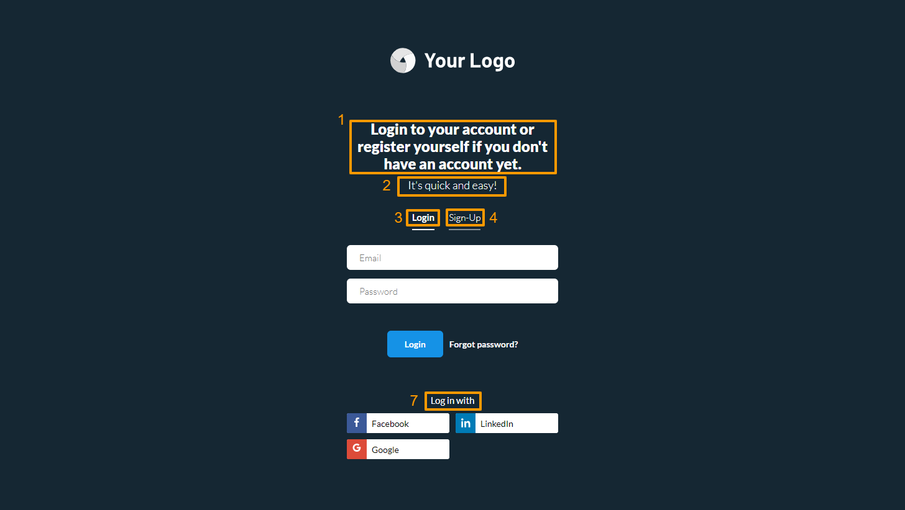
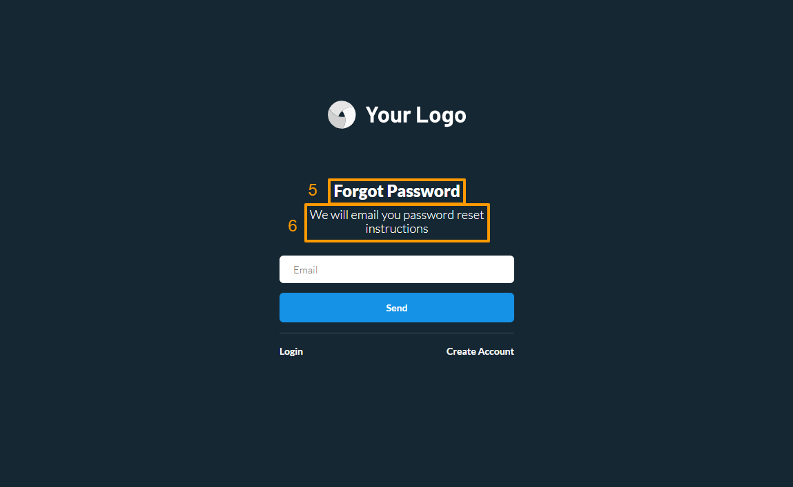

# Customize Auth Page (IDX)

The LoginRadius Auth Page (IDX) is a ready-to-use web page that can be utilized for your authentication requirements. The URL of the page is unique to your app. When you make changes to your configurations in the LoginRadius Dashboard, your changes will automatically be reflected on your Auth Page (IDX).

Watch this video's step-by-step information, or refer to the section below for the text-based guide.

---

<figure class="video_container">
  <iframe width="560" height="315" src="https://www.youtube.com/embed/0AO9xR18wxs" frameborder="0" allow="accelerometer; autoplay; clipboard-write; encrypted-media; gyroscope; picture-in-picture" allowfullscreen></iframe>
</figure>

---

## Access Auth Page (IDX) Customization

1. Log in to your <a href="https://dashboard.loginradius.com/dashboard" target="_blank">LoginRadius Dashboard</a> account. Select your app, then from the left navigation panel, click **Auth Page (IDX)** and then navigate to the **Theme Customization** section.

2. Click the down caret, and the **Theme Customization** screen will appear:

   

   To preview your login page's theme, click the **Go to your Login Page** link as highlighted on the above screen. 

## Theme Selection

To activate a theme, hover over any inactive theme image and click on the **Activate** button:

> Note: Activating a new theme will replace your existing theme and its customized content with default values.

These themes will reflect in your registration, login, reset password, and profile page.

## Theme Customization

After you have selected a theme, you can further customize its content as per your requirements. To customize your theme, hover over your active theme image and click on the **Customize** button:

The theme customization screen will show as below:

> Note: You can immediately view your changes to Auth Page (IDX) after saving your configurations. Click the **Go to your Login Page** button as highlighted on the above screen to navigate to your Auth Page (IDX).

There are three sections available for you to customize your Auth Page (IDX)'s content:

### General Configuration

Click the **General Configuration** section to expand its customization options. You can manage your Auth Page (IDX)'s favicon and logo here:

  * **Favicon**: Either upload or enter the URL for your favicon resource. It is recommended that your favicon have a minimum to maximum dimension of 16x16 to 48x48 pixels, respectively. If you are uploading your resource, only *ico files are supported, and its file size should not exceed 2 MB.

  * **Logo**: Either upload or enter the URL for your logo resource. It is recommended that your logo have a maximum width of 200 pixels. If you are uploading your resource, only *png files are supported, and its file size should not exceed 2 MB.

Click the **Save** button to save your changes.

### Body

Click the **Body** section to expand its customization options. You can manage your Auth Page (IDX)'s body attributes, such as font family, text color, and background color here:

  

  * **Background Image URL**: Either upload or enter the URL for the image resource to be used as your page's background. If you are uploading your resource, *jpg, *png, and *svg files are supported, and its file size should not exceed 2 MB. It is recommended that your image match the following dimensions for each theme:

    * London Theme: 550x768
    * Tokyo Theme: 1366x768
    * Helsinki Theme: 580x548

  * **Background Color**: Set the background color of your page.

  * **Text Color**: Set the text color of your page.

  * **Font Family**: Set the font style/family that will be used for text content on your page.

### Content

> Note: You must have a **Developer** plan subscription or higher to access the **Content** section.

Click the **Content** section to expand its customization options. You can manage your Auth Page (IDX)'s text content, such as heading and paragraph messages here:

  

  * **Heading Message**: (1) Set the main heading of your page.

  * **Paragraph Message**: (2) Set the subheading of your page.

  * **Login Label**: (3) Set the login label of your page.

  * **Sign Up Label**: (4) Set the sign-up label of your page.

  * **Forgot Password Label**: (5) Set the heading for the Forgot Password section of your page.

  * **Forgot Password Message**: (6) Set the sub-heading for the Forgot password section of your page.

  * **Social Block Label**: (7) Set the social login label of your page.

Each content field and its corresponding text on your Auth Page (IDX) is illustrated below:

## Further Customization

You can manually edit the HTML and JavaScript code used for your Auth Page (IDX) or use your own for further customizations. These options are only available in the **Advanced Editor**. Refer to the <a href="/guide/auth-page-advanced-editor" target="_blank" >Advanced Editor</a> document for more information.

[Go Back to Home Page](/)