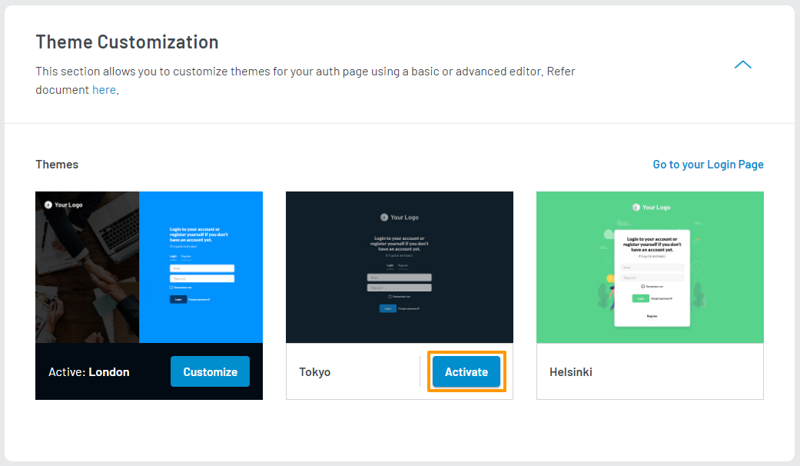

1. Log in to your <a href="https://dashboard.loginradius.com/dashboard" target="_blank">LoginRadius Dashboard</a> account. Select your app, then from the left navigation panel, click **Auth Page (IDX)** and then navigate to the **Theme Customization** section.

2. Click the down caret, and the **Theme Customization** screen will appear:

   

   To preview your login page's theme, click the **Go to your Login Page** link as highlighted on the above screen. 

3. To activate a theme, hover over any inactive theme image and click on the **Activate** button as shown below:

> Note: Activating a new theme will replace your existing theme and its customized content with default values.

   

   These themes will reflect in your registration, login, reset password, and profile page.   