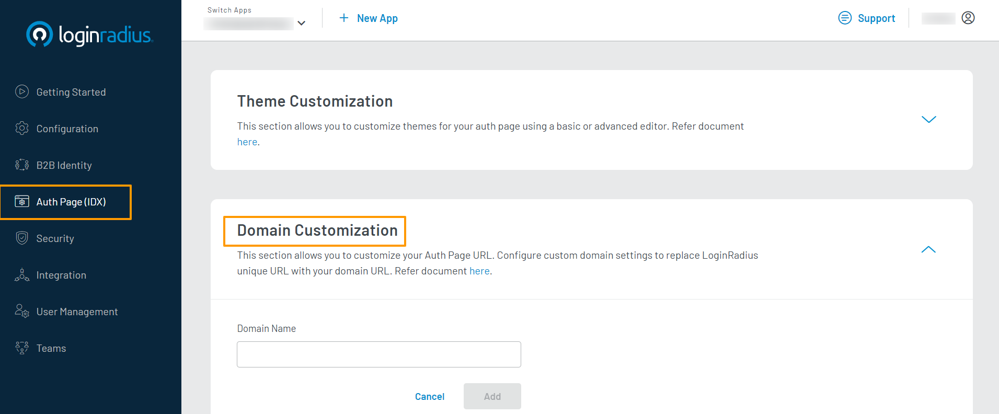
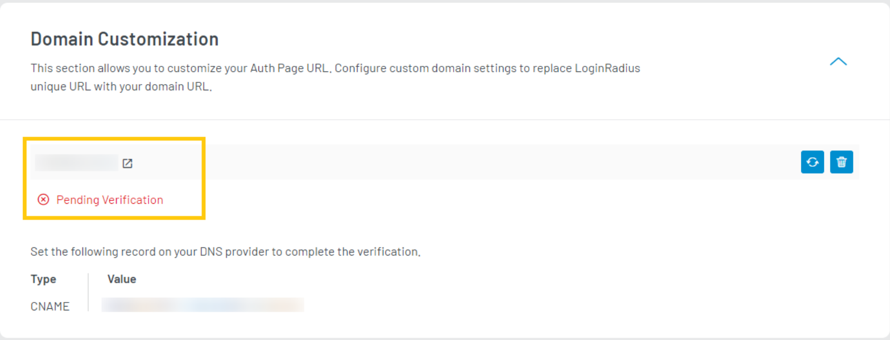
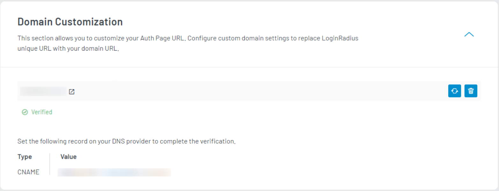

## Domain Customization

Domain customization allows you to use your domain Instead of redirecting your users to the LoginRadius domain. It will enable you to maintain consistency and gives a frictionless experience to your users.

## Configuration

### Step 1: Register Your Domain

To use a custom domain, you need to register your domain and map it with your LoginRadius Domain.if you have already can skip this step.

For example: Your LoginRadius domain is `https://<your-app-name>.hub.loginradius.com/auth.aspx`, upon mapping your domain, users will see your custom domain `https://<your-domain>.com/auth.aspx`during authentication.

### Step 2: Open Auth Page (IDX) Section in Dashboard

To access the **Domain Customization**, login to your [LoginRadius Dashboard](https://dashboard.loginradius.com/dashboard) account, from the left navigation panel, click the **Auth Page (IDX)** and then navigate to the **Domain Customization** section. 

Click the down arrow and the **Domain Customization** screen will appear:

### Step 3: Configure Custom Domain

Enter your domain in the **Domain Name** field and click the **Add** button, the below screen will appear:

  

> Note: After adding the domain, make sure to add the given records (Type and Value) to your DNS provider.

Once LoginRadius verifies your domain, its status will be changed to **verified**. The Auth Page (IDX) will start using your domain `https://<your-domain>.com/auth.aspx` instead of `https://<your-app-name>.hub.loginradius.com/auth.aspx`

  

**Note**: The domain verification might take up to 12 hours.