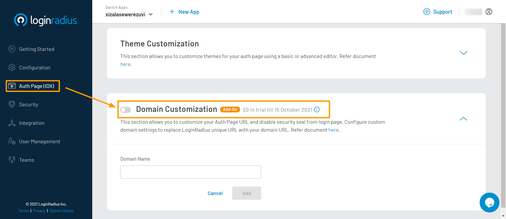
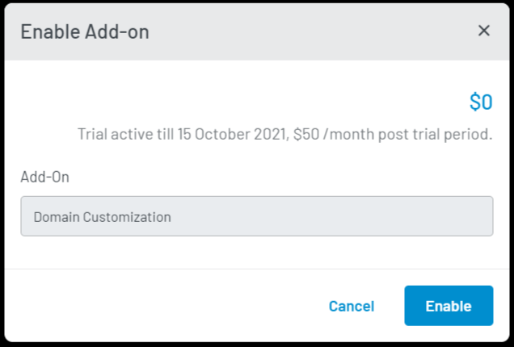
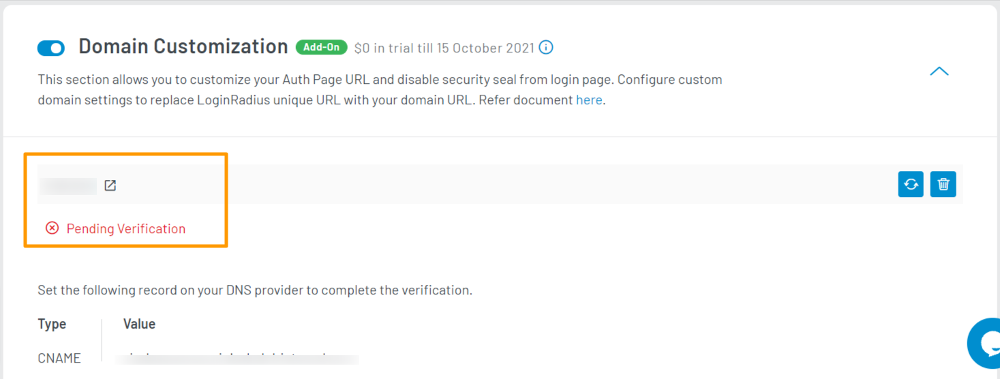
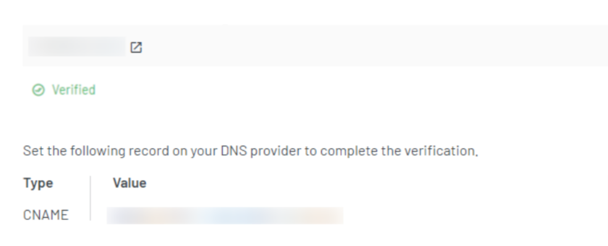

Premium

# Setup Custom Domain

Domain customization allows you to use your domain instead of redirecting your consumers to the LoginRadius domain. It will help you maintain consistency and give a frictionless experience to your consumers.

 Also, enabling this feature removes the security seal of LoginRadius i.e.  Powered by LoginRadius will no longer be visible on your Auth Page (IDX).

## Configuration

### Step 1: Register Your Domain

To use a custom domain, you need to register your domain and map it with your LoginRadius Domain. If it's done already, you can skip this step.

For example: Your LoginRadius domain is `https://<your-app-name>.hub.loginradius.com/auth.aspx`, upon mapping your domain, consumers will see your custom domain `https://<your-domain>.com/auth.aspx` during authentication.

### Step 2: Access Domain Customization Section

- To access the **Domain Customization**, log in to your <a href="https://dashboard.loginradius.com/dashboard" target="_blank">LoginRadius Dashboard</a> account. Select your app, then from the left navigation panel, click the **Auth Page (IDX)** and then navigate to the **Domain Customization** section. 

- Click the down arrow and the **Domain Customization** screen will appear:

  

- Click the toggle button next to **Domain Customization** and the following pop-up will appear:

  

- Click the **Enable** button to enable the **Domain Customization** feature. You will be prompted to add payment details, if not already provided.

### Step 3: Configure Custom Domain

Enter your domain in the **Domain Name** field and click the **Add** button, the below screen will appear:

> Note: After adding the domain, make sure to add the given records (Type and Value) to your DNS provider.

Once LoginRadius verifies your domain, its status will be changed to **verified**. The Auth Page (IDX) will start using your domain `https://<your-domain>.com/auth.aspx` instead of `https://<your-app-name>.hub.loginradius.com/auth.aspx`

> **Note**: The domain verification might take up to 12 hours.

[Go Back to Home Page](/)
