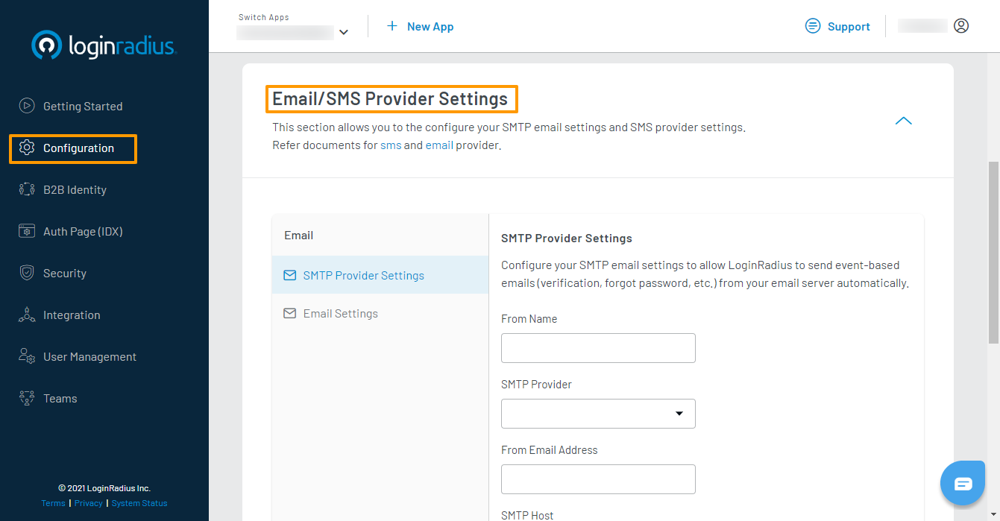

# Customize Email and SMS Settings

This guide explains how to customize behaviors for sending event-based emails and SMSes for your application.

## Access Email or SMS Settings Sections

1. Log in to your [LoginRadius Dashboard](https://dashboard.loginradius.com/dashboard) account. From the left navigation panel, click **Configuration** and then navigate to the **Email/SMS Provider Settings** section.

2. Click the down caret, and the **Email/SMS Provider Settings** screen will appear:

   

3. You can access either the **Email Settings** or **SMS Settings** sub-section by clicking on the respective tab located in the section's sidebar.

### Email Settings

You can edit your application's email settings by clicking the **Email Settings** tab. The settings screen will show as below:

  

You can configure the following settings:

  * **Request Limit**: The number of times your consumer can trigger an email during the Request Disabled Period before the particular email request feature is disabled.

  * **Request Disabled Period (Minutes)**: The amount of time (in minutes) that a given email request feature will remain disabled once the Request Limit is exceeded.

  * **Email Token Validity (Minutes)**: The amount of time (in minutes) of which the link contained in a triggered email will remain valid.

For example, given the configurations set in the image above for the forgot password event: Your consumer can request a forgot password email 3 times over 24 hours (1440 minutes). Once this limit is exceeded, they will not be able to request a forgot password email until 24 hours have elapsed since the first request. The forgot password link contained in the email will remain valid for 7 days (10080 minutes).

Click the **Reset** button to reset all email configurations to default values. 

Click the **Save** button to save your changes.

### SMS Settings

You can edit your application's SMS settings by clicking on the **SMS Settings** tab. The settings screen will show as below:

You can configure the following settings:

  * **OTP Length**: The length of the One-Time Passcode that will be sent in SMS verification requests.

  * **OTP Type**: The type of OTP that will be used in the SMS verification requests sent to your consumer. There are several options available, including Numeric and Alphanumeric.

  * **Request Limit**: The number of times your consumer can trigger an SMS during the Request Disabled Period before the particular SMS request feature is disabled.

  * **Request Disabled Period (Minutes)**: The amount of time (in minutes) that a given SMS request feature will remain disabled once the Request Limit is exceeded.

  * **OTP Validity (Seconds)**: The amount of time (in seconds) of which the OTP contained in a triggered SMS will remain valid.

For example, given the configurations set in the image above for the passwordless login by OTP event: Your consumer can request a passwordless login verification SMS 10 times over 5 minutes. The SMS will contain a 6 character OTP, consisting of numerical characters only. Once this limit is exceeded, they will not be able to request a passwordless login verification SMS until 5 minutes have elapsed since the first request. The OTP contained in the SMS will remain valid for 30 seconds.

Click the **Reset** button to reset all email configurations to default values. 

Click the **Save** button to save your changes.

[Go Back to Home Page](/)
