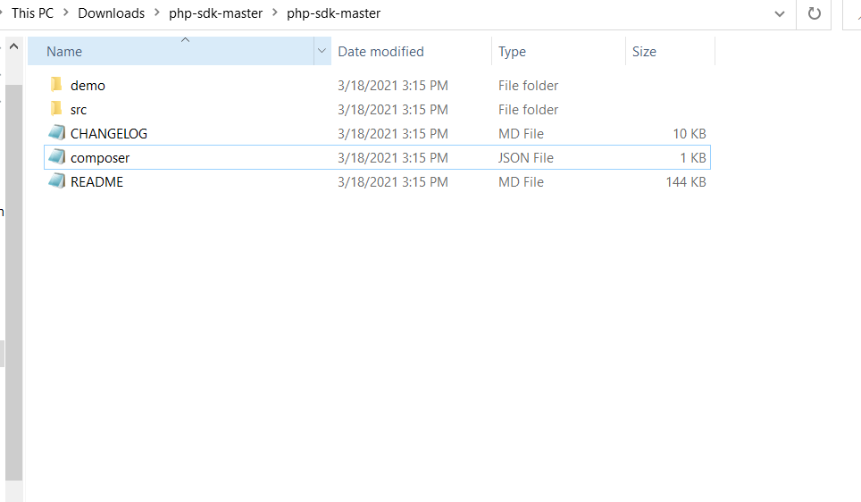
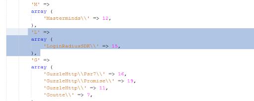
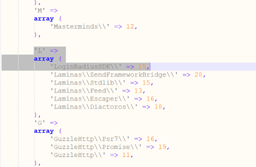
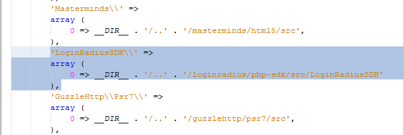
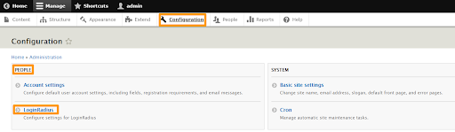
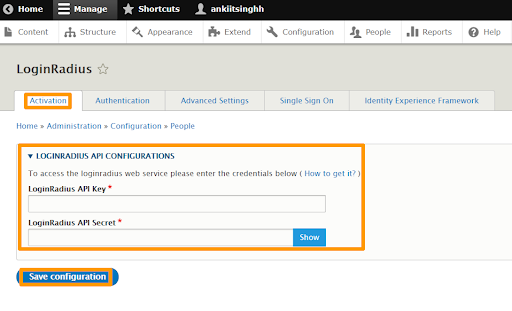
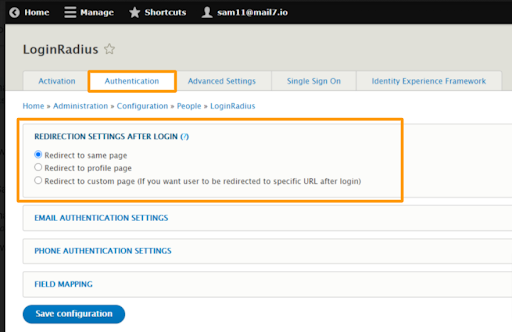
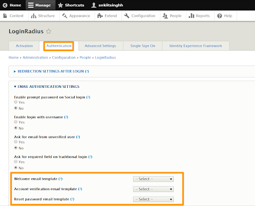
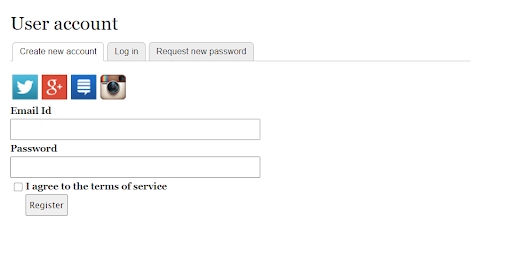
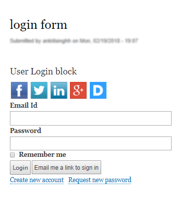

# Get Started - Drupal

The tutorial lets you implement LoginRadius user registration, login, profile, and log out in your Drupal application.

> **Note:** [Create an account](https://accounts.loginradius.com/auth.aspx?return_url=https://dashboard.loginradius.com/login&action=register) to get started if you don't have one yet!

## Get Credentials

Before using LoginRadius Drupal Plugin, you need to get your App Name, API Key, and API Secret.

In your LoginRadius Dashboard, navigate to **[Configuration > API Credentials](https://dashboard.loginradius.com/configuration)** and click the **API Key And Secret** subsection to retrieve your API Credentials.

## Install Drupal Plugin

> **Note:** Having both V1 and V2 LoginRadius Drupal v8.x and v9.x plugins running may cause conflicts. Make sure to only enable one plugin at a time.

You can install LoginRadius  Drupal Plugin [manually](#install-manually) or via [web interface](#install-via-web-interface) as explained in the sections below.

### Install Manually

1. Download the [Drupal v8.x](https://github.com/LoginRadius/drupal-identity-module/blob/master/drupal-8/package/customer_identity_and_access_management.tar) or [Drupal v9.x](https://github.com/LoginRadius/drupal-identity-module/blob/master/drupal-9/package/customer_identity_and_access_management.tar) Customer Identity module.

2. Unarchive the module and upload the module folder to your Drupal installation's modules directory.

3. Login to the Drupal Admin Panel.

4. Click the **Extend** tab and you'll see the **CIAM LoginRadius** module in the modules list in your site's admin account. **Do not enable** the module immediately, the required LoginRadius PHP SDK library needs to be installed.

5. The PHP SDK needs to be updated before enabling the **CIAM LoginRadius** module. This can be done in the following ways: [Manually](#manual-steps-to -install-php-sdk) or [Through Composer](#install-via-composer).

6. Enable the **Customer Identity Modules** and click the **Save Configuration**.

### Install via Web Interface

1. Download the [Drupal v8.x](https://github.com/LoginRadius/drupal-identity-module/blob/master/drupal-8/package/customer_identity_and_access_management.tar) or [Drupal v9.x](https://github.com/LoginRadius/drupal-identity-module/blob/master/drupal-9/package/customer_identity_and_access_management.tar) Customer Identity module.

2. Login to the Drupal Admin Panel.

3. Click the **Extend** tab, and then select**Install new module**.

4. Browse for the **LoginRadius zip/tar file** and click the **Install** button.

5. Click the **Extend** tab and you'll see the **CIAM LoginRadius** module in the modules list in your site's admin account. **Do not enable** the module immediately, the required LoginRadius PHP SDK library needs to be installed.

6. The PHP SDK needs to be updated before enabling the **CIAM LoginRadius** module. This can be done in the following ways: [Manually](#manually) or [Via Composer](#via-composer).

7. Enable the Customer Identity Modules and click the **Save Configuration**.

> **Note:** Make sure you should clear the website's cache. For more information on clearing the cache, [click here](https://www.drupal.org/node/326504).
For more details related to installation instructions, [click here](https://www.drupal.org/docs/extending-drupal/installing-modules).

## Install LoginRadius PHP SDK

### Manually

You should be using PHP SDK available at [Github](https://github.com/LoginRadius/php-sdk).
The following are the instructions to upload PHP SDK manually:
1. Go to the root directory of your drupal installation.

2. Open the folder /vendor/ and create a new folder named **loginradius**. 

3. Under **loginradius** folder create another folder named **php-sdk**.

4. Open the downloaded SDK folder and copy the entire content of the **php-sdk-master** downloaded from GitHub, you can exclude the **demo** folder. The following displays the **php-sdk-master** folder: 

   

5. Paste the copied data inside the folder /vendor/loginradius/php-sdk.

6. Add the 'LoginRadiusSDK\\' => array(\$vendorDir . '/loginradius/php-sdk/src') path in the /vendor/composer/autoload_namespaces.php file.

7. If you have an `autoload_psr4.php` file, add the  'LoginRadiusSDK\\' => array(\$vendorDir . '/loginradius/php-sdk/src/LoginRadiusSDK') path to /vendor/composer/autoload_psr4.php file.

8. If you have `autoload_static.php` file, follow the below step for Drupal v8.x and v9.x respectively:

   **For Drupal v8.x**

   Add the following code in the /vendor/composer/autoload_static.php file:

   'L' => array ( 'LoginRadiusSDK\\' => 15, ),

    

   **For Drupal v9.x**

   Add the following code in the Array as shown in the below screen:

   'LoginRadiusSDK\\' => 15,

    

   **For both Drupal v8.x and v9.x** Add the following code as shown in the below screen:

   'LoginRadiusSDK\\' => array ( 0 => __DIR__. '/..' . '/loginradius/php-sdk/src/LoginRadiusSDK', ),

    

### Via Composer

Refer to the following steps to install the LoginRadius PHP SDK with Composer:

> **Note:** If the composer is already installed then jump to Step 3.

Step 1: Download and enable the **Composer Manager** module.

Step 2: Initialize **Composer Manager**. 

There are two ways of initializing Composer Manager.

**Option A** Initialize Composer Manager using the init.php script:

* Go to composer_manager/scripts directory.
* Change the file permission of `init.php` with the command `chmod 700 init.php`.
* Execute the `init. script` with a command `./init.php`.

**Option B** Initialize Composer Manager using Drush

If you are using Drush, you can initialize Composer Manager by drush composer-manager-init. If you don't know how to use Drush, use option A

Step 3: Download LoginRadius PHP SDK with Composer.

Now that we finally have Composer Manager initialized, we are ready to download the LoginRadius PHP SDK library with Composer.

* Go to the root directory of your Drupal installation and run the following command to install the standalone LoginRadius PHP SDK:

composer require loginradius/php-sdk:11.0.0

> **Note:** If you want to update all required libraries then use the following command: composer drupal-update.

Composer is now aware that the **LoginRadius PHP SDK** is required. It will first add this dependency to the /core/composer.json file, which contains all external dependencies of your site. Then, it will automatically download the latest versions of the required libraries. You can verify the result by checking that LoginRadius PHP SDK is downloaded to /vendor/loginradius/php-sdk directory.

## Activation and Configuration

The complete functionality of this module requires your **LoginRadius API Key** and **Secret** obtained in the get credentials(#get-credentials) step. 

* [Activation](#plugin-activation)
* [Authentication](#authentication)

### Plugin Activation

1. Click the **Configuration** tab in the top menu, click the **LoginRadius** under **People** section:

   

2. In the Activation tab, insert LoginRadius API Key, and API Secret as provided in your [LoginRadius Dashboard](#get-credentials).

   

3. Click the **Save configuration** button:

### Authentication

Navigate to the **Authentication** tab and there you can choose an option from the available  redirect settings (i.e. where the consumer will be redirected upon successful login)

You can select applicable email templates. The templates can be added/modified in **LoginRadius Dashboard(https://dashboard.loginradius.com/)**, which will be displayed in the drupal admin authentication page.

## Run and See Result

### Registration 

The CIAM plugin will generate the following registration form:

### Login Page

The CIAM plugin will generate the following login form:
 
 

## Domain Whitelisting

For security reasons, LoginRadius processes the API calls that are received from the whitelisted domains. Local domains (http://localhost and http://127.0.0.1) are whitelisted by default.

To whitelist your domain, in your LoginRadius Dashboard, navigate to **[Configuration > Domain Whitelisting](https://dashboard.loginradius.com/configuration)** and add your domain name:

