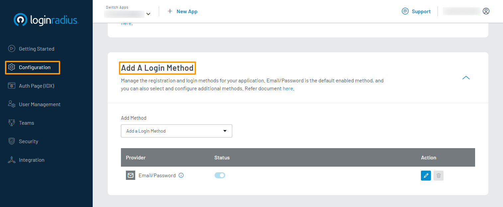
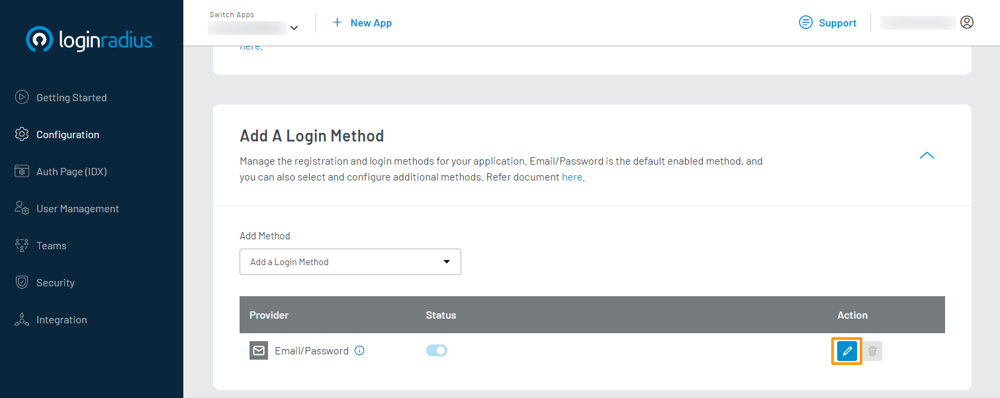

# Customize Email for Email/Password Login

The LoginRadius Identity Platform provides Email and Password as the default registration and login method. This guide explains how to configure the content of emails that LoginRadius sends to your consumers using the LoginRadius Dashboard.

Watch this video's step-by-step information, or refer to the section below for the text-based guide.

---

<figure class="video_container">
<iframe width="560" height="315" src="https://www.youtube.com/embed/kHbXGqUNv-E" frameborder="0" allow="accelerometer; autoplay; clipboard-write; encrypted-media; gyroscope; picture-in-picture" allowfullscreen></iframe></figure>

---

## Configuration

### Step 1: Choose Login Method

1. Log in to your [LoginRadius Dashboard](https://dashboard.loginradius.com/dashboard) account. From the left navigation panel, click **Configuration** and then navigate to the **Add A Login Method** section.

2. Click the down caret, and the **Add a Login Method** screen will appear:

In the above screen, you will see that the Email/Password method is enabled by default for your application.

### Step 2: Configure Email Templates

1. Click the **Edit** icon given next to the Email/Password provider, as highlighted in the screen below:

2. When certain events related to the Email/Password Login method occur, LoginRadius will send an email to your consumer. The following are the types of email templates that will be used, along with the event that will send it: 

* **Verification Email**: The Verification Email is sent to your consumer when they first register on your application. This email contains a link that will need to be clicked to verify their email address.

* **Forgot Password Email**: The Forgot Password Email is sent to your consumer when they request to reset their password. This email contains a link that will need to be clicked to reset their password.

3. With an email template type selected, you can perform the following actions:

* Edit template content.
* Reset the template to its default content.
* Send a test email using the configured template. You can only send a test email if the required email configuration has been done as explained in [SMTP Configuration]().

These actions are available in the action bar highlighted in the image below:

4. When editing a template, you can update the following:

* **SUBJECT**: The subject line of the template.
* **HTML BODY**: The HTML version of the template. This content will appear in clients that support HTML content in emails. You can use [Placeholder](#placeholder-tags) and [Section](#section-tags) tags in the HTML Body.
* **TEXT BODY**: The plain text version of the template. This content will appear in clients that support only plain text content in emails. You can use [Placeholder](#placeholder-tags) and [Section](#section-tags) tags in the Text Body.

In your templates, you can use predefined tags to define where LoginRadius data will appear in your email. 

To save your changes, click the **Save** button.

## Placeholder Tags

These tags are used to define where LoginRadius retrieved data will appear in your email.

* **#Name#**: The consumer's name as defined in your registration form.
* **#GUID#**: The token used by LoginRadius to identify the consumer's email verification/forgot password request. You should typically append it to the query parameter `vtoken`.
* **#Url#**:  The URL used to receive email verification and forgot password requests. This will be the URL of your IDX Auth Page by default. You can modify this by passing an alternate URL in the relevant API endpoints.
* **#Providers#**: The name of the social provider (if any) using which the consumer logged in.
* **#Email#**: The consumer's email address used to register their account.
* **#FirstName#**: The consumer's first name as defined in your registration form.
* **#LastName#**: The consumer's last name as defined in your registration form.
* **#IpAddress#**: The IP address of the consumer.
* **#UserAgent#**: The browser information of the consumer.

## Section Tags

These tags are specific to the **Forgot Password** email template. The text defined inside each tag will appear in forgot password emails depending on the consumer's login method.

* **#FPass \<Content\> FPass#**: This tag defines a section that will appear in cases where the consumer has signed up using a traditional Email and Password. You should typically use this section with the **#Url#** and **#GUID#** placeholder tags to display a link for the consumer to reset their password.

* **#FProv \<Content\> FProv#**: This tag defines a section that will appear in cases where the consumer has signed up using a social provider. You should typically use this section with the **#Providers#** placeholder tag to inform the consumer about the social provider they used for registration.
