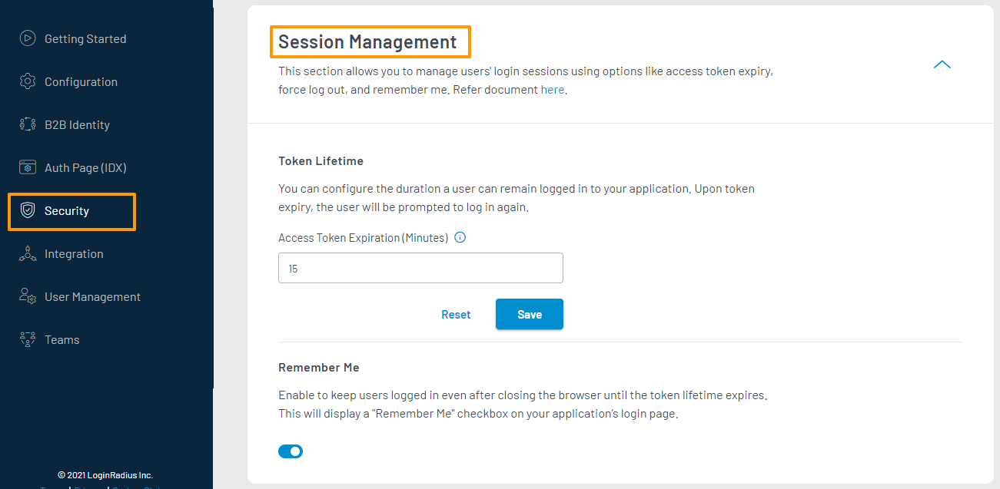
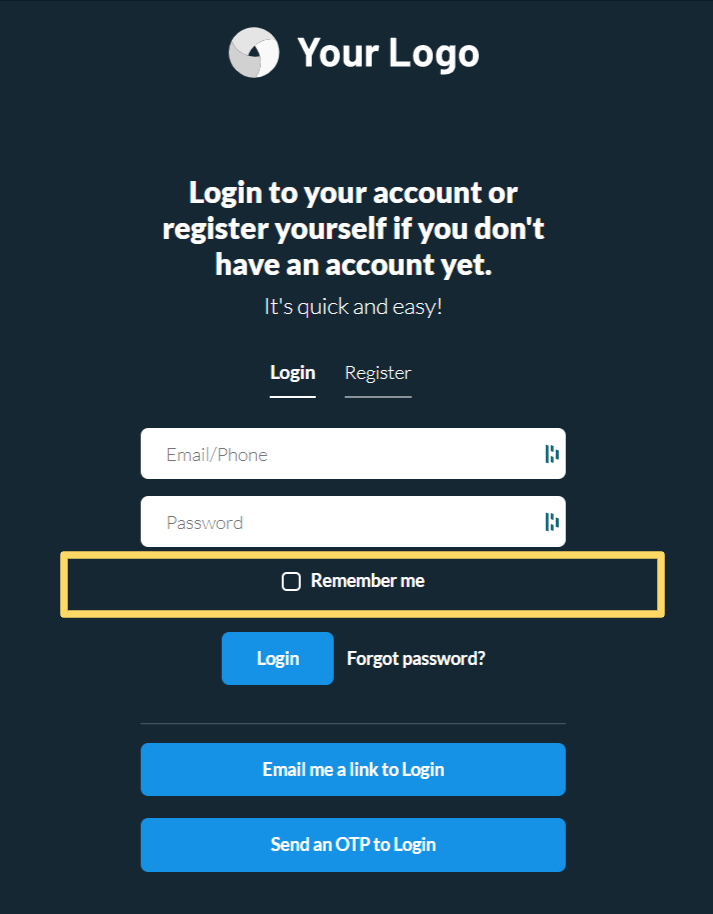

#Enable Force Logout
 
Force Logout enables you to expire all active sessions of the consumer account on Password Reset or Change, except the session in which the password has been reset/changed. This guide explains how to enable force logout for your consumers.

## Step 1: Access Force Logout Section

1. Login to your [LoginRadius Dashboard](https://dashboard.loginradius.com/dashboard) account. Select your app, then from the left navigation panel, click **Security** and then navigate to the **Session Management** section. 

2. Click the down arrow, and the **Session Management** screen will appear.

   

## Step 2: Configure Force Logout

Enable the **Force Logout** option. 

The Force Logout feature is now enabled, and upon resetting the password, the consumer will be logged out from other active login sessions.

## Remember Me (Additional) 

You can enable the **Remember Me** option to keep your consumers logged in until the access token expires, even after the browser is closed.

By enabling this option, a **Remember Me** checkbox will show up on your Auth Page(IDX) `<your-app-name>.hub.loginradius.com/auth.aspx` as highlighted in the below screen.

> Note: Remember me token expiry duration will be the same as token lifetime.

[Go Back to Home Page](/)

