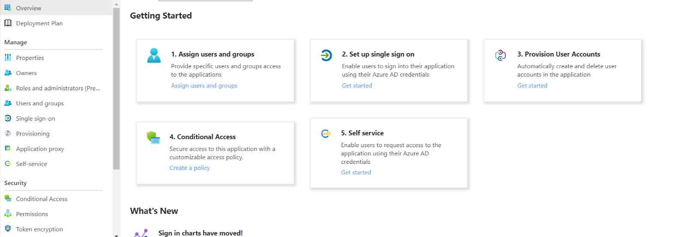
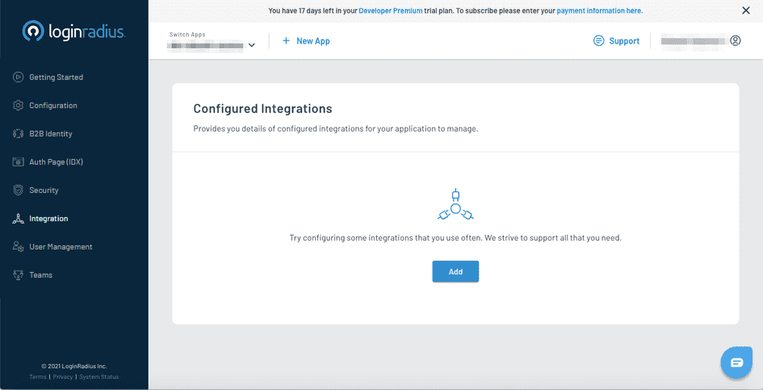
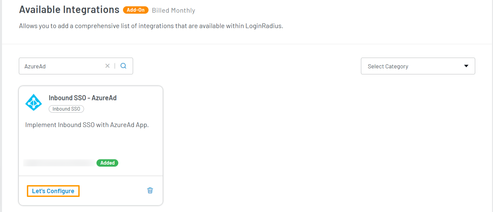
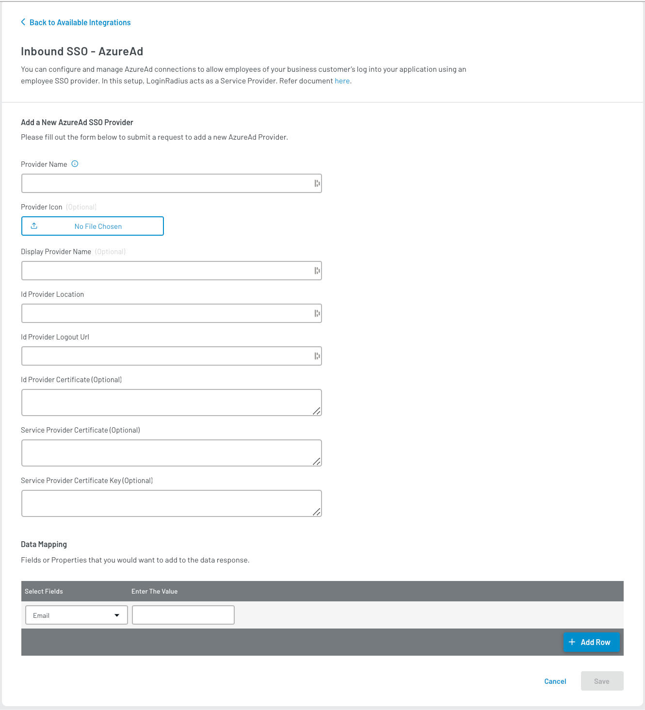
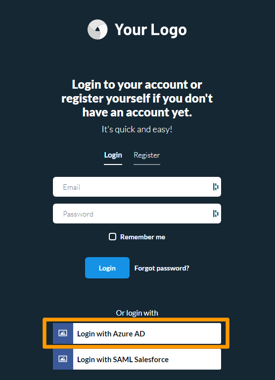

Developer Pro
Add on

# Inbound SSO SAML - Azure AD

This document provides instructions to add a custom Identity provider (Azure AD) using Inbound SAML - SSO. As a result, it will allow your consumers to log in to your application with their Azure AD account using SSO.

## Azure AD Configuration

1. Log into the <a href="http://portal.azure.com/" target="_blank">Azure portal</a> with your developer account.

2. Click the **View** button from the **Manage Azure Active Directory** card.

3. In the left navigation pane, click the **Enterprise Applications**, the below screen will appear:

   

4. Click the **+ New application** and then click the **+ Create your own application**, as highlighted below:

   

5. Enter the name of your app and click the **Create** button. Upon app creation, you will be redirected to your application page.

6. Click the **Set up single sign on** card from the below screen:

   

7. Click the SAML as a single sign-on method, and the below screen will appear:

   

8. Click the Edit icon given next to the **Basic SAML Configuration** and enter below SAML configuration:

    a) Identifier (Entity ID): `https://<LoginRadius App Name>.hub.loginradius.com/`

    b) Reply URL (Assertion Consumer Service URL): `https://<LoginRadius App Name>.hub.loginradius.com/saml/serviceprovider/AdfsACS.aspx`

    c) Sign on URL: `https://<LoginRadius App Name>.hub.loginradius.com/auth.aspx`

9. Save the configuration

## LoginRadius Account Configuration

To support the Inbound SSO - SAML, you will need to handle the following:

1. Log into your <a href="https://dashboard.loginradius.com/dashboard" target="_blank">LoginRadius Dashboard</a> account, select your app and then navigate to the **Integration** section.

   The following screen will appear:

   

2. Click the **Add** button for adding a new Inbound SSO SAML app. The configuration options will appear.

3. Search for **Azure** in the search bar, locate and add **Inbound SSO-AzureAd**. Click the **Try It For Free** option and then **Enable** button from the appeared pop-up. The **Inbound SSO-AzureAD** app is added to the Available Integrations.

4. Click the **Let's Configure** option:

   

   The following screen will appear:

   

4. Enter or select the following values:

   * Enter the Provider Name.

   * Enter the Display Provider Name.

   * Upload the Provider Icon.

   * Enter the Id Provider Location: `https://login.microsoftonline.com/22d****eeaa60/saml2`

   * Enter the Id Provider Logout URL: `https://login.microsoftonline.com/22*****bfd7-62dda0eeaa60/saml2`

   * Enter the Id Provider Certificate from the Azure app. You can download the <a href="https://docs.microsoft.com/en-us/azure/active-directory/manage-apps/manage-certificates-for-federated-single-sign-on" target="_blank">IDP Certificate</a> from Azure.

   * Enter the Service Provider Certificate and SP Private Key that you have generated while doing [Azure AD Configuration](#azure-ad-configuration).

   * Data Mapping: Add the fields you want to map along with Email.

    | Key | Value | |
    |----|----|-----|
    |Email | `http://schemas.xmlsoap.org/ws/2005/05/identity/claims/name` |

5. Click the **Save** button to save the configuration.

You have successfully configured **Azure AD** IDP using Inbound SSO-AzureAD. Open Auth Page(IDX) of your app, and the **Login with Azure AD** option will appear:

