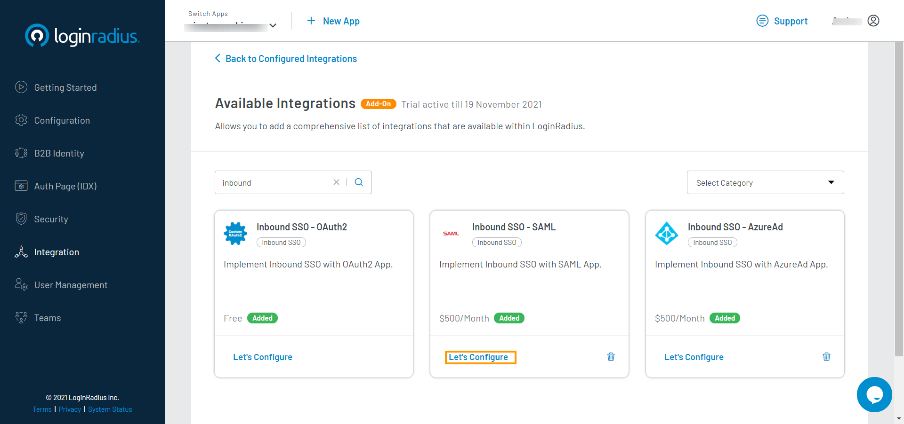

<span class="devloper-premium plan-tag">Developer Pro</span>
<span class="devloper-premium plan-tag">Add on</span>

# Inbound SSO SAML - Salesforce

This document provides instructions to add a custom Identity provider (Salesforce) using Inbound SAML - SSO. As a result, it will allow your consumers to log in to your application with their Salesforce account using SSO.  

## Salesforce Configuration

1.  Log into <a href="https://login.salesforce.com/" target="_blank">Salesforce</a> with your developer account.

2.  In the left navigation pane, search `Identity provider` and enable Identity provider setup.

3.  From the drop-down list of the account (in the top-right corner), select setup.

4.  Now, in the left navigation pane, search `App Manager`(a) and click **App Manager** (b) from the Apps list to open it.

5.  Click the `New Connected App`(c) from the top-right corner.

    

    The following screen will appear:

    

6.  Give a name to Connect App. 

7.  Enter start URL: `https://<LoginRadius AppName>.hub.loginradius.com/auth.aspx`

8.  Select the **Enable SAML** and the further options will appear on the screen.

9.  Enter Entity ID: `https://<LoginRadius AppName>.hub.loginradius.com/`

10. Select the Subject Type: eg. `User ID`

11. Select the Name ID Format: `urn:oasis:names:tc:SAML:1.1:nameid-format:unspecified`

12. Add Issuer: `https://<LoginRadius AppName>.hub.loginradius.com/`

13. Select default or create and add IDP Certificate.

14. Add SP Certificate and Key
   a) Generate the SP Certificate key from the following command
        i. ```openssl genrsa -out private.key 2048```
   b) Generate certificate form the private key
        i. ```openssl req -new -x509 -key private.key -out certificate.cert -days 365 -subj /CN=<loginradius-app-name>.hub.loginradius.com```

15. Save the configuration


## LoginRadius Account Configuration

To support the Inbound SSO - SAML, you will need to handle the following:
1. Log into your <a href="https://dashboard.loginradius.com/" target="_blank">LoginRadius Dashboard</a> account, select your app and then navigate to the <a href="https://dashboard.loginradius.com/integration" target="_blank">Integration</a> section.

   The following screen will appear:

   


2. Click the **Add** button for adding a new **Inbound SSO SAML app**. The configuration options will appear.

3. Search for **Inbound SSO SAML** in the search bar, locate Inbound SSO SAML and click the **Let’s Configure** option.

   

   The following screen will appear:

   

4. Enter or select the following values:

* Enter the Provider Name.

* Enter the Display Provider Name.
Select IDP Binding : `urn:oasis:names:tc:SAML:2.0:bindings:HTTP-POST`

* Enter the IDP Location: `https://<account>.salesforce.com/idp/endpoint/HttpPost`

* Enter the IDP Logout URL: `https://<account>.salesforce.com/services/auth/idp/saml2/logout`

* Enter the IDP Certificate from the Salesforce connect app. You can download the<a href="https://help.salesforce.com/articleView?id=sf.identity_provider_enable.htm&type=5" target="_blank"> IDP Certificate</a> from the salesforce.

* Enter the SP Certificate and SP Private Key that you have generated while doing [Salesforce Configuration](#salesforce-configuration).

* Enter the Relay state param, i.e: RelayState.

* Data Mapping: Add the fields you want to map along with Email.

    | Key | Value | |
    |----|----|-----|
    |Email | email |


5. Click the **Save** button to save the configuration.
You have successfully configured **Salesforce** IDP using Inbound SSO SAML. Open Auth Page(IDX) of your app and the **Login with SAML Salesforce option will appear:**


