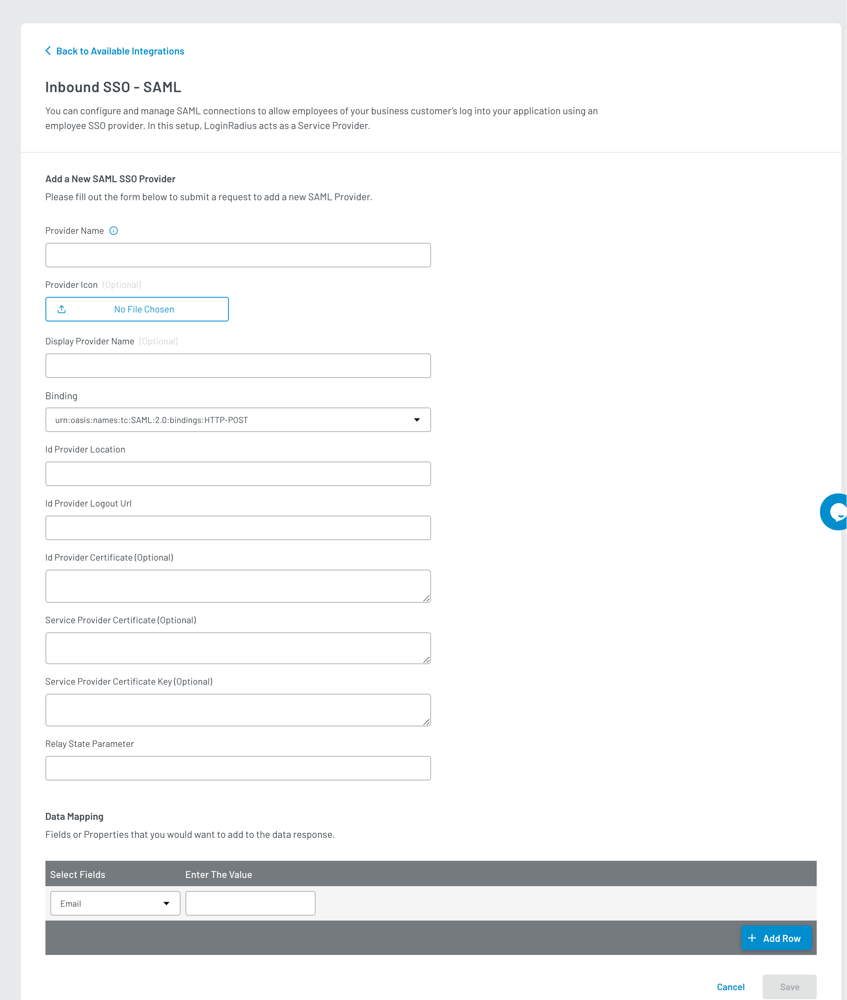

Premium

# Inbound SSO SAML

This document provides instructions to add a custom Identity provider using Inbound SAML - SSO. As a result, it will allow your consumers to log in to your application with their identity provider account using SSO.

>**Note:** The desired identity provider must support SAML protocol for this implementation.

## Identity Provider Configuration

1. Log in to the Identity Provider portal with your developer account.

2. Create an app to set up SSO or navigate to the **SAML Configuration** section to configure the details.

3. Configure the following details in your identity provider:

   a. Identifier (Entity ID): `https://<LoginRadius App Name>.hub.loginradius.com/`

   b. Reply URL (Assertion Consumer Service URL): `https://<LoginRadius App Name>.hub.loginradius.com/saml/serviceprovider/AdfsACS.aspx`

   c. Sign on URL: `https://<LoginRadius App Name>.hub.loginradius.com/auth.aspx`

4. Save the configuration.

>**Note:** Generate SP Certificate and SP Private Key, and save the IDP Location and IDP Logout URL information to use in the step below.

## LoginRadius Account (SP) Configuration

To support the Inbound SSO - SAML, you will need to handle the following:

1. Log into your <a href="https://dashboard.loginradius.com/dashboard" target="_blank">LoginRadius Dashboard</a> account, select your app and then navigate to the **Integration** section.

   The following screen will appear:

   

2. Click the **Add** button for adding a new Inbound SSO SAML app. The configuration options will appear.

3. Search for **Inbound SSO SAML** in the search bar, locate **Inbound SSO SAML** and click the **Add me** option. The following pop-up will appear, click the **Enable** button.

   

4. From the **Available Integrations** screen, click the **Let’s Configure** under the Inbound SSO SAML box. The following screen will appear:

   

5. Enter or select the following details to configure your SAML app:

   a. Enter the Provider Name.

   b. Enter the Display Provider Name.

   c. Select IDP Binding : `urn:oasis:names:tc:SAML:2.0:bindings:HTTP-POST`

   d. Enter the IDP Location. You will get this URL upon configuring the identity provider. 

   e. Enter the IDP Logout URL. You will get this URL upon configuring the identity provider.

   f. Enter the IDP Certificate from the Identity Provider app. 

   g. Enter the SP Certificate and SP Private Key that you have generated while doing [Identity Provider Configuration](#identity-provider-configuration)

   h. Enter the Relay state param, i.e.: RelayState.

   i. Data Mapping: Add the fields you want to map along with Email.

      | Key | Value | |
      |----|----|-----|
      |Email | `http://schemas.xmlsoap.org/ws/2005/05/identity/claims/name` |

   j. Click the **Save** button to save the configuration.

You have successfully configured IDP using Inbound SSO SAML. Open the Auth Page(IDX) of your app, and the Login with IDP option will appear.

