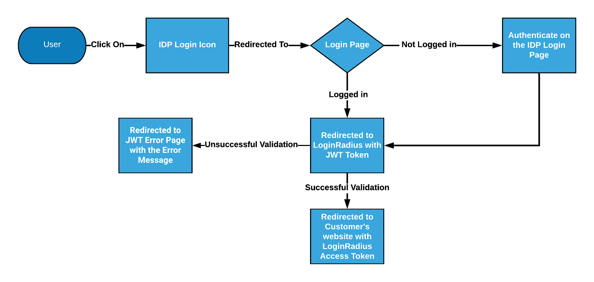
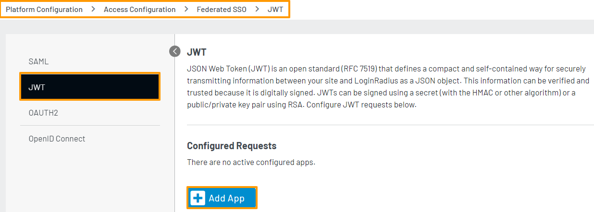

# JWT

JWT (JSON Web Token) is used to provide a standard way for two parties to communicate securely. JWT is commonly used for managing authorization.
There exists an open industry standard called RFC-7519 which defines how JWT should be structured and how to use it for exchanging information (called "claims") in form of JSON objects. This information can be verified and trusted as its digitally signed. 
LoginRadius supports the following encryption algorithms for the JWT flows:
* HS256
* HS384
* HS512
* RS256
* RS384
* RS512
* ES256
* ES384
* ES512
JWT (JSON Web Token) is a popular method of SSO, which is widely used by B2C applications, and through this system, you can allow your customers to log in to an application that supports JWT. LoginRadius acts as an Identity Provider; it means LoginRadius can authorize a third-party application that will act as a Service Provider.


## JWT Structure

The JWT will be encrypted with an algorithm configured in the LoginRadius Admin Console. The decrypted JWT contains the Header, Payload, and Secret/Private key. The following explains the information they contain:

* **Header:** It contains metadata about the type of token and the algorithms used to secure its contents.

```
{
"alg": "HS256",
"typ": "JWT"
}

```
* **Payload:** It contains the following fields where key1:value1, key 2:value2, etc. pairs are profile field mapping pairs configured in the JWT app in the LoginRadius Admin Console.

```
{
"iss": "https://<lrSiteName>.hub.loginradius.com/",
"sub": "{uid}",
"jti": "unique string",
 Key1: value1, 
 Key2: value2, 
"iat": 1573849217,
"nbf": 1573849217,
"exp": 1573849817
}

```
The payload can be fully customized to include data mapping for any LoginRadius normalized user profile fields. It can be configured directly from the LoginRadius Admin Console to control the data mapping as well as the encryption algorithm.

* **Secret/Public Key:** It should be the same value as you have configured in the JWT app in the LoginRadius Admin console.

> **Note:** LoginRadius provides custom attributes, so it is possible to customize the JWT response. The following is a sample attribute:

```
{
 "type": "basic",
 "title": "Login"
}

```

## JWT Login Guide

This guide will take you through the process of setup and implementation of the JWT SSO. It covers the following:

* Functional flow of JWT SSO
* Configuration you need to do in LoginRadius Admin Console
* Implementing JWT SSO with LoginRadius APIs

### Part 1 - JWT SSO Flow

The following flow chart shows how JWT flow works between IDP and SP, where IDP here is LoginRadius and SP is customer’s application: 



LoginRadius supports a delegated redirect SSO flow through which you can redirect your customer to [LoginRadius Identity Experience Framework](https://www.loginradius.com/docs/libraries/identity-experience-framework/overview/), where your customer can do account management actions.

Upon successful login or social login, the customer will be redirected to the return URL along with the JWT for this authentication session. Here is the step by step instruction for setting JWT SSO flow:

**Step 1:** First of all, configure a JWT app in your LoginRadius Admin Console. Refer to the JWT Admin Console Configuration section for how to configure JWT in the LoginRadius Admin Console.

**Step 2:** Whitelist the service provider URL in the LoginRadius Admin Console. Follow [this](#domain-whitelisting) for information on how to whitelist URLs in the LoginRadius Admin console.

**Step 3:** The following is the LoginRadius JWT SSO URL: `https://cloud-api.loginradius.com/sso/jwt/redirect/token?apikey=<LRapikey>&jwtapp=<jwtAppName>&return_url=<encode(service provider url)>`

**Step 4:** If a customer is not logged in on your service provider app then direct it to the LoginRadius JWT SSO URL `(https://cloud-api.loginradius.com/sso/jwt/redirect/token?apikey=&jwtapp=&return_url=)`

**Step 5:**The JWT SSO URL will redirect to your LoginRadius Identity Experience Framework hosted page `(https://<LRsitename>.hub.loginradius.com)`

If the customer is not logged into the hosted page, the customer will be asked to log in. After authentication, the customer will be redirected back to the return URL with the JWT as a query parameter.


### Part 2 - Admin Console Configuration

This section covers the required configurations that you need to perform in the LoginRadius Admin Console for JWT Login.

**Step 1:** Log in to your [Admin Console](https://dashboard.loginradius.com) account, and navigate to [Platform Configuration > Access Configuration > Federated SSO > JWT](https://adminconsole.loginradius.com/platform-configuration/access-configuration/federated-sso/jwt).

The following screen appear :



**Step 2:** Click **+ Add App** option for adding a new JWT app. The following configuration options will appear: 


Step 3: You need to provide or select the following values to add the APP.
AppName: A name that will be used by LoginRadius to identify the provider originating the request. If you have multiple JWT apps, the name should be unique for each. You can use any name, e.g., comapany_Jwt_app. This name will be used in LoginRadius to identify your app during API calls.
Secret Key: A secret key that would be used to sign the JWT and will later be used to verify the received JWT.
QueryStringParameter: The query parameter name in which LoginRadius sends JWT during JWT SSO flow. After authentication, the redirect URL will contain a JWT under this parameter name. The redirect URL will look like this: <redirecturi>?<parameter name from admin console>=JWTtoken
Algo: Algorithm to sign JWT. LoginRadius supports the following algorithms:
HS256
HS384
HS512
RS256
RS384
RS512
Mapping: Specify the Key-value pair of LoginRadius profile data points that you want to receive in the JWT payload.
Enter any value for the key column( left column), these values will be used as keys for claims in the payload.
Select the desired LoginRadius profile field name in the profile key (right column). The values for these fields from the customer's profile in LoginRadius will be returned to the JWT payload. Refer to the LoginRadius data points document for available profile fields. Keep in mind that for some of the profile fields, you will need to use dot notation to access them. For the Advanced field values in the customer profile, use the dot notation. For example, if the advanced field name is Position, enter Position.Positionsummary as the attribute value. If you don't find the field in the drop-down list, select Others and add the fields' value using dot notation.
Similarly, by clicking the Add Row button, you can map multiple attributes.


### Part 3 - JWT LoginRadius APIs

If you are directly implementing your Login forms or already have an access token or want to generate a JWT based on email/username/Phone number or a password, you can leverage the following APIs:

* [JWT Token](https://www.loginradius.com/docs/api/v2/single-sign-on/federated-sso/jwt-login/jwt-token/): This GET API is used to exchange access token with your JWT.
* [JWT Token by Email](https://www.loginradius.com/docs/api/v2/single-sign-on/federated-sso/jwt-login/jwt-token-by-email/): This API is used to get a JWT by Email and Password.
* [JWT Token by Username](https://www.loginradius.com/docs/api/v2/single-sign-on/federated-sso/jwt-login/jwt-token-by-username/): This API is used to get JWT by Username and password.
* [JWT Token by Phone](https://www.loginradius.com/docs/api/v2/single-sign-on/federated-sso/jwt-login/jwt-token-by-phone/): This API is used to get JWT by Phone and password.

The response from the above APIs will look like this:

```
{
 signature: <JWTresponse>
}
```
For more information on `<JWTresponse>`, refer to JWT Token Structure.

### Part 4 - JWT best practices

Before starting with best practices, it is important to note that many attacks on JWT are related to its way of implementation, instead of its design. This does not mean that they are less critical.

> **Note:** Signed JWTs sign both the header and the payload, while JWTs which are encrypted, they only encrypt the payload and the header is always in a readable format.

We've had a look at the basic structure and encryption of JWT now we can have a look at the following list of best practices:
* Signing key The signing key should always be kept secret as anyone having access to this key might validate the signature and can decrypt the payload.

* Sensitive data in Payload The signed tokens protected payload against tampering but the JWT payload is readable by anyone. You should not send sensitive data in the payload of a JWT unless it is encrypted.

* Number of Claims to Payload Add the bare minimum number of claims to the payload for the best performance and security.

* Use HTTPS You need SSL/HTTPS to encrypt the communication. Without SSL/HTTPS attackers can sniff the network traffic and obtain the JWT, hence your application is vulnerable to man-in-the-middle attacks.
* Validate All Claims
 * iss -The "iss" (issuer) claim identifies the principal that issued the JWT. The "iss" value is a case-sensitive string containing a StringOrURI value. The "iss" value should match to "https://.hub.loginradius.com/" to verify the JWT is issued by LoginRadius.
 * iat - The "iat" (issued at) claim identifies the time at which the JWT was issued. This claim can be used to determine the age of the JWT. This can be used to reject tokens that seem too old.
 * exp - The "exp" (expiration time) claim identifies the expiration time on or after which the JWT MUST NOT be accepted for processing. The processing of the "exp" claim requires that the current date/time MUST be before the expiration date/time listed in the "exp" claim. JWTs have embedded by-value tokens and thus we cannot revoke them very easily, once it is issued and delivered to the recipient. Because of that, you should provide them short expiration (minutes or hours) time.
 * aud - valid audience The aud (audience) claim identifies the recipients that the JWT is intended for. Each principal intended to process the JWT must identify itself with a value in the audience claim. If the principal processing the claim does not identify itself with a value in the aud claim when this claim is present, then the JWT must be rejected. The interpretation of audience values is generally application-specific. The Use of this claim is **OPTIONAL**.
* nbf: The expiration time is not the only time-based claim that can be utilized for JWTs verification. The nbf claim has a "not-before" time which means the token should be rejected if the current time value is before the time mentioned in the nbf claim.

> **Note:** While working with time-based claims keep in mind that server times can differ slightly between different machines. So to overcome this you should consider allowing a clock skew when checking the time-based values. These clock skew values can be of a few seconds, as this would rather indicate problems with the server.

* Use appropriate Algorithm and perform algorithm verification The JSON Web Algorithms already have a series of recommended and required algorithms, selecting the right one for the desired scenario depends upon the customers. Additionally, whenever a JWT needs to be validated, the algorithm must be explicitly selected in such a way that it does not provide attackers control.

It is recommended to use the Asymmetric algorithm when signing the JWT token. Asymmetric key signatures in JWT are produced by the sender with the private key and the receiver verify it via the public key. The receiver is provided only with the public key which happens **out_of_band** (i.e. through another means of communication than the one you use to exchange the secured data).


## Whitelist Domain

For security reasons, LoginRadius processes the API calls that are received from the whitelisted domains. Local domains (http://localhost and http://127.0.0.1) are whitelisted by default.

To whitelist your domain, in your LoginRadius Dashboard, navigate to **[Configuration > Domain Whitelisting](https://dashboard.loginradius.com/configuration)** and add your domain name:


