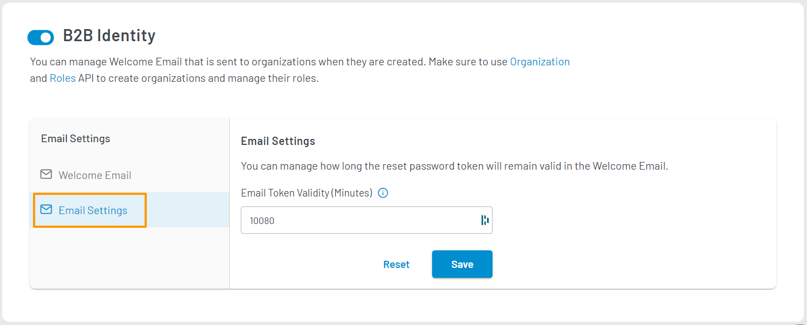

# Manage Organizations (B2B)

This guide explains how to manage organizations, their roles, welcome email and email setting for a B2B setup.
- You can manage Organizations using this <a href="https://www.loginradius.com/docs/developer/references/api/b2b-identity" target="_blank">APIs</a>.
- You can either add the <a href="https://www.loginradius.com/docs/developer/references/api/b2b-identity/#addupdate-roles" target="_blank">default roles</a> to your users or create new roles using this <a href="https://www.loginradius.com/docs/developer/references/api/roles-management/" target="_blank">APIs</a> and then assign those to organization's members.
- You can manage email settings and welcome emails for the organization as explained in the section below.

## Enable B2B Identity

By default B2B Identity feature will be disabled for your LoginRadius App. To enable the feature you need to toggle the switch in the **B2B Identity** section.

## Manage Email Setting

### Step 1: Configure Email Templates

1. **Welcome Email**: The Welcome Email is sent to your consumer when they first register on your application. This email contains 2 links one to reset the password and the second one to log in to the organization's account.

2. With an email template type selected, you can perform the following actions:

   * Edit template content.
   * Reset the template to its default content.
   * Send a test email using the configured template. You can only send a test email if the required email configuration has been done as explained in <a href="https://www.loginradius.com/docs/developer/guide/setup-your-smtp-provider" target="_blank">SMTP Configuration</a>.

   These actions are available in the action bar highlighted in the image below:

3. When editing a template, you can update the following:

   * **SUBJECT**: The subject line of the template.
   * **HTML BODY**: The HTML version of the template. This content will appear in clients that support HTML content in emails. You can use [Placeholder](#placeholder-tags) tags in the HTML Body.
   * **TEXT BODY**: The plain text version of the template. This content will appear in clients that support only plain text content in emails. You can use [Placeholder](#placeholder-tags) tags in the Text Body.

   In your templates, you can use predefined tags to define where LoginRadius data will appear in your email. 

4. To save your changes, click the **Save** button.

### Placeholder Tags

These tags are used to define where LoginRadius retrieved data will appear in your email.

* **#OrgName#**: The Organization name as defined while creating an organization.

* **#Name#**: The consumer's name as defined in your registration form.

* **#AppName#**: The Application name as defined while creating a LoginRadius App.

* **#resetPasswordUrl#**: This tag defines a URL that is generated by LoginRadius for resetting your consumer's account password.

* **#ResetToken#**: This tag defines a Token that is used to send along with the reset password URL.

* **#loginUrl#**: This tag defines a URL that sent to your consumer to login into your organization

### Step 2: Configure Email Settings

You can edit your application's email settings by clicking the **Email Settings** tab. The settings screen will show as below:

You can configure the following settings:

  * **Email Token Validity (Minutes)**: The amount of time (in minutes) of which the link contained in a triggered email will remain valid.

For example, given the configurations set in the image above for the welcome email event: The welcome email link contained in the email will remain valid for 7 days (10080 minutes).

Click the **Reset** button to reset all email configurations to default values. 

Click the **Save** button to save your changes.

### References

* <a href="https://www.loginradius.com/docs/developer/guide/custom-registration" target="_blank">Customize Registration Form Fields</a>

[Go Back to Home Page](/)