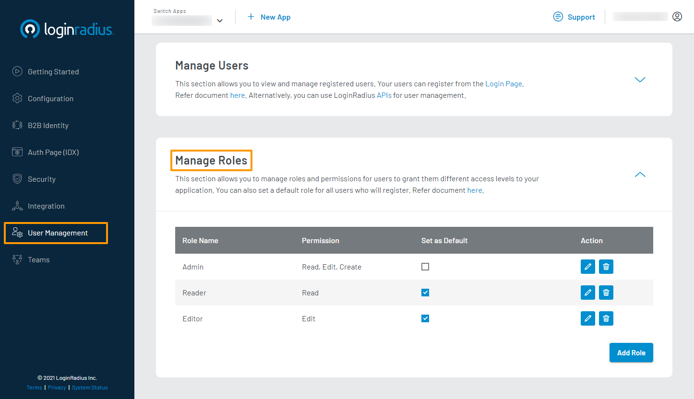

# Manage Roles

This guide explains how to manage roles and permissions for your registered users using the LoginRadius Dashboard.

> Note: You must have a **Developer Premium** plan subscription to access the **Manage Roles** section in the LoginRadius Dashboard.

## Access Manage Roles Section

1. Log in to your [LoginRadius Dashboard](https://dashboard.loginradius.com/dashboard) account. From the left navigation panel, click **User Management** and then navigate to the **Manage Roles** section.

2. Click the down caret, and the **Manage Roles** screen will appear:

   

   In your role management table, you will find the following details for each configured role:

   * **Role Name**: The name that identifies your configured role. A user can have multiple roles.

   * **Permission**: The permissions that make up your configured role. A role can have multiple permissions. These should be used to define the type of access you wish to grant.

   * **Set as Default**: The flag used to assign roles by default to new users registering on your application. By checking this box, the respective role will automatically be assigned to newly registered users.

   * **Action**: The options that you can perform on your configured role. You can either edit or delete the selected role.

## Add Role

1. To add a new role, click the **Add Role** button located as highlighted on the bottom right of the screen:

   

   The **Add Role** pop-up will appear.

2. Enter the required details in each respective field and click the **Add** button to add a new role.

   

   > Note: You can add multiple permissions for a role. Press **Enter** when editing **Permissions** to finalize the permission name and add more. Also, you need to define the scope and access of your application’s portions with the created roles and permissions.

## Edit Role

1. To edit an existing role, click the **Edit** button available in its respective **Action** column.

   

   The **Edit Role** pop-up will appear.

2. You can edit the permissions that make up a role, but not its name. Click the **Update** button to finish editing.

   

## Delete Role

1. To delete a role, click the **Delete** button available in its respective **Action** column.

   

   The **Delete Role** confirmation pop-up will appear. Click the **Confirm** button to delete the role.
