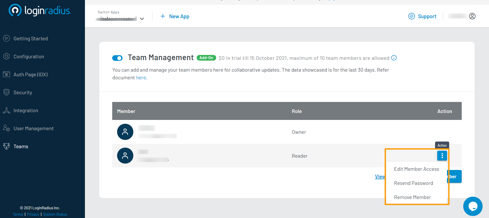

Premium

# Manage Team Members
This section helps view and manage your authorized Team Members who can manage your LoginRadius site.

Team Management screen has the following options:

* [Manage Team Member](#manage-team-member)
* [Add Team Member](#add-team-member)
* [Audit Logs](#activity-logs)

## Access Team Management Section

1. Log in to your <a href="https://dashboard.loginradius.com/dashboard" target="_blank">LoginRadius Dashboard</a> account.
2. Select your app, then from the left navigation panel, click **Teams**, and the **Team Management** screen will appear.

   

## Manage Team Member

This section displays the complete list of team members that have access to your LoginRadius site. List of management tasks that can be performed on your team members includes:

* **Edit Member Access**: You can manage access by editing their roles.
* **Resent Password Send**: You can send them a password reset email.
* **Remove Member**: You can remove them from the team members list, which results in deleting their accounts.

> You can access these options for a team member by clicking the vertical ellipsis (three dots) available next to a team member's name:
>
> 

## Add Team Member

From this section, you can add a new team member to your LoginRadius Site by providing the member's details and assigning the desired Role.

To add a new team member to your LoginRadius Site, click the **Add Member** button, and the following pop-up will appear.

You need to provide the following details:

1. **Full Name :** Enter the team member's full name.  

2. **Email Address(es):** Enter the team member’s email address.

3. **App(s):** Select the App for which you are adding team members. If you have multiple LoginRadius App(s), you can find the list in the dropdown.

4. **Role(s):** Select the team member’s Role.

    Available Role(s) are:

    * **Admin:** Allow Add/Update permissions
    * **Reader:** Allow Read only permissions

## Activity Logs

Activity Logs contain records of all recent account activities. You can view the records of your LoginRadius site.

To view all recent activity details in your account, click the **View Activity Logs** link from the Team Management screen, and the following screen will appear:

The activity logs details include:

*  **Email Address:** Displays the Email Address of the user who performed the particular activity.

*  **Activity:** Displays the short description of the activity.

*  **TimeStamp:** Displays the time of the activity.

You can perform the following actions on this screen:

* Add a new team member by clicking the **Add Member** button given at the bottom-left of the screen.

* Navigate back to the Team Management screen by clicking the **Back to Team Management** link given at the top-right of the screen.

[Go Back to Home Page](/)
