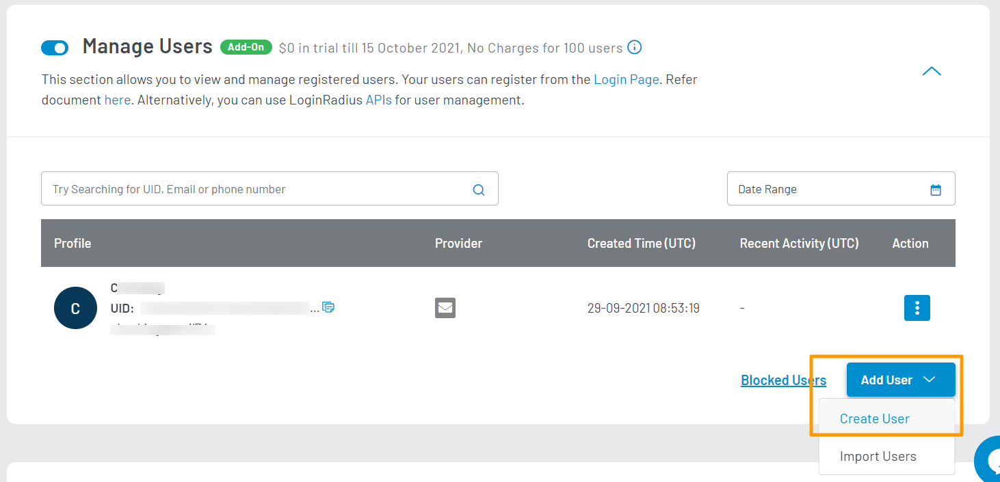
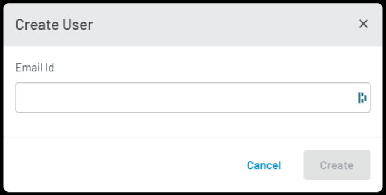

You can add new users to your application without having them go through the typical registration process.

1. To add a new user, click the **Add User** button available at the bottom right of the screen. From the dropdown, click **Create User** as highlighted in the screen below:

   

   The confirmation pop-up will appear.

2. Enter the required details in each respective field and click the **Create** button to create the new user.

   

