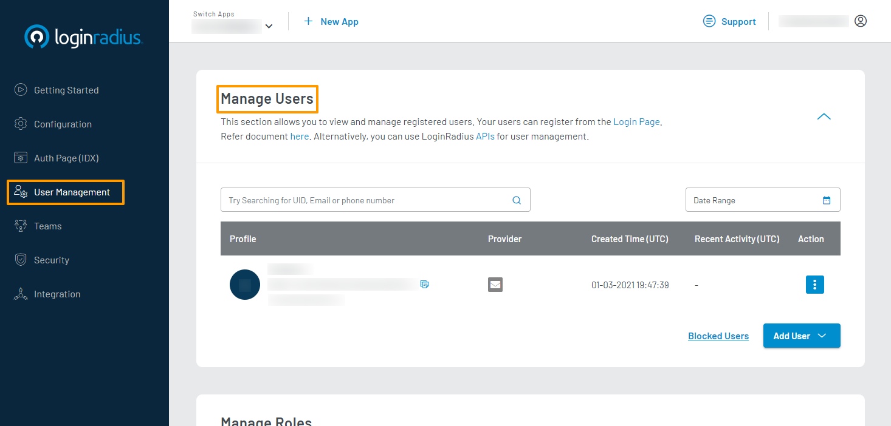
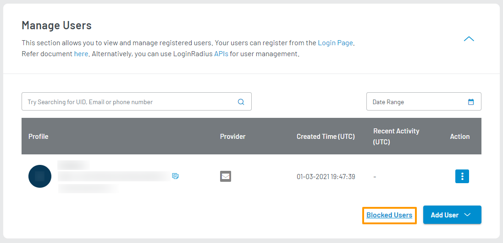
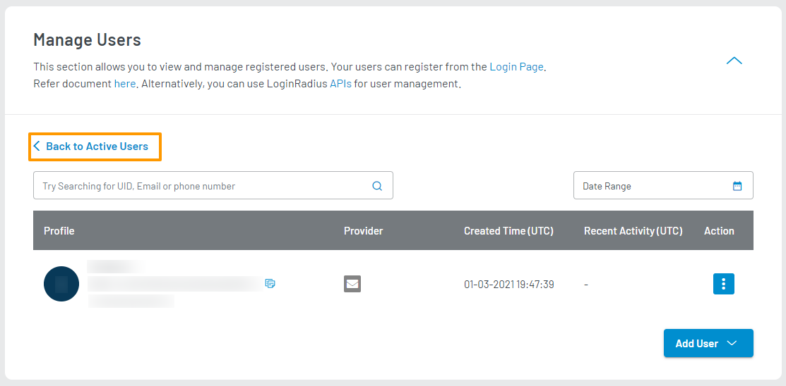
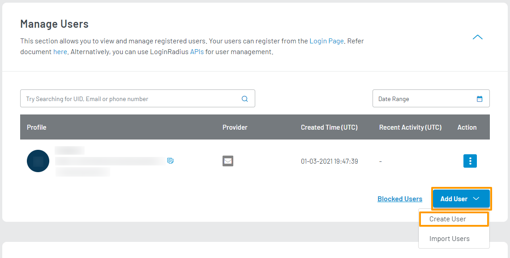
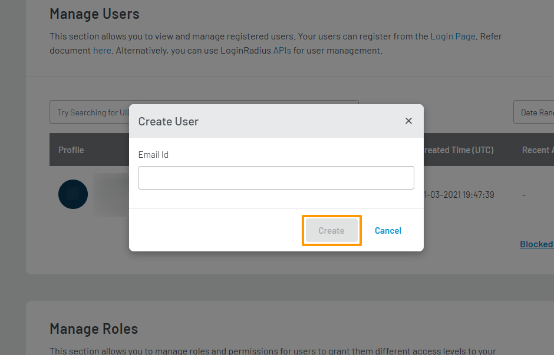
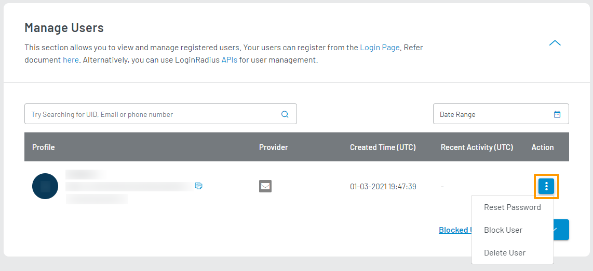
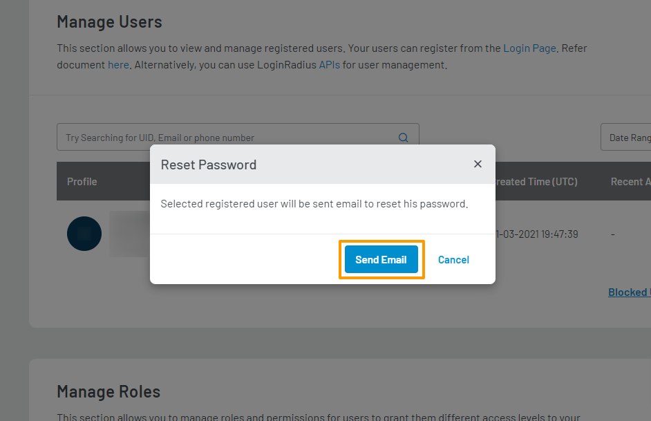
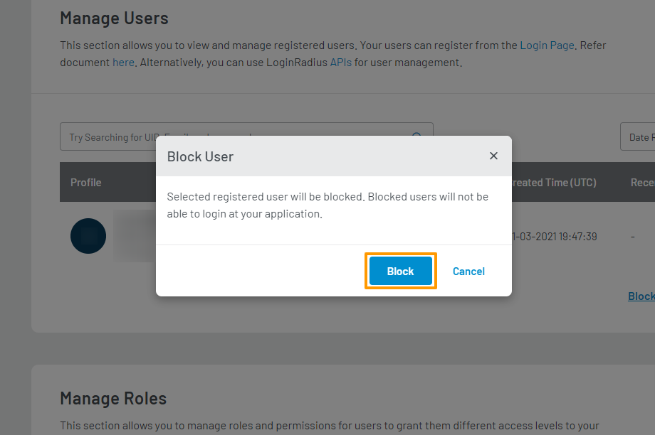
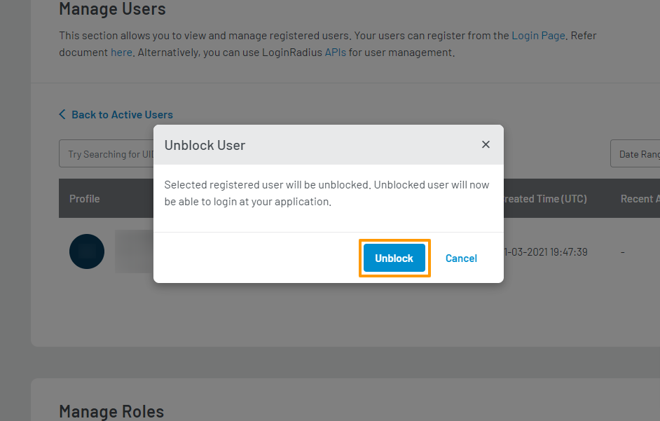
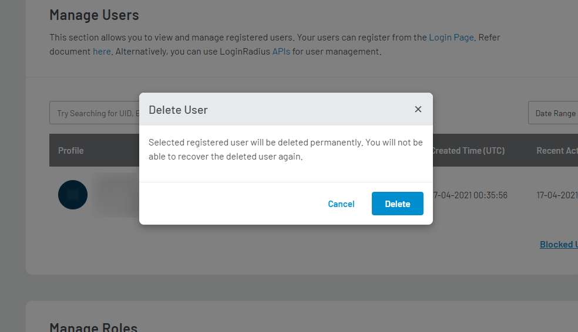

# Manage Users

This guide explains how to manage your registered users using the LoginRadius Dashboard.

## Access Manage Users Section

1. Log in to your [LoginRadius Dashboard](https://dashboard.loginradius.com/dashboard) account. From the left navigation panel, click **User Management** and then navigate to the **Manage Users** section.

2. Click the down caret, and the **Manage Users** screen will appear:

  

  In your active user table, you will find the following details for each registered active user:

  * **Profile**: The basic data that identifies your registered user: Name, UID, Email, and Phone (if available).

  * **Provider**: How your user's account has been created: Login Method (Email or Phone), or Social Provider (Facebook, Google, etc.)

  * **Created Time (UTC)**: The date and time of your user's account creation.

  * **Recent Activity (UTC)**: The date and time of your user's most recent activity recorded on your application.

  * **Action**: The options that you can perform on your user. You can reset their password, block their account, or delete their account. For more details, refer to the [Supported Actions](#supported-actions) section of this document.

## View Blocked Users

You can check your blocked users by accessing the **Blocked Users** table. To access this table, click the **Blocked Users** link available at the bottom right of the screen:

  

The **Blocked Users** table will show as below:

  

You can perform actions similar to your default active users table. However, the actions available are restricted to **Unblock User** and **Delete User**.

You can navigate back to your active users table by clicking the **Back to Active Users** link as highlighted on the above screen.

## Search for Users

You can search for users by UID, Email, or Phone Number in combination with Date Range.

To search for a user using UID, Email, or Phone Number, enter the respective value in the textbox  and click the **Search** icon, as highlighted on the below screen:

  

To search for a user based on their registration date range, click the **Date Range** box and select a duration using the provided date picker, as highlighted on the below screen:

  

> This Date Range is applied over a user's registration date.

## Add Users

You can add new users to your application without having them go through the typical registration process.

1. To add a new user, click the **Add User** button available at the bottom right of the screen. From the dropdown, click **Create User** as highlighted in the screen below:

  

  The confirmation pop-up will appear.

2. Enter the required details in each respective field and click the **Create** button to create the new user.

  

## Import Users

You can mass import user data from another application/service/database into your application using CSV files.

Refer to the [Migrate User Data](/guide/migrate-user-data) document for more information.

## Supported Actions

> Note: You must have a **Developer Premium** plan subscription to access these actions in the LoginRadius Dashboard. You can otherwise utilize our APIs to manage your users.

To access available actions for a registered user, find the user record of the target user and click the vertical ellipsis button (three dots) contained in the **Action** column of your user table:

  

These are the supported actions you can perform on each registered user:

* **Reset Password**

  Triggers the reset password flow for your user. Clicking **Reset Password** will show a confirmation pop-up as displayed below:

  

  Click the **Send Email** button in the pop-up to send a password reset email to your selected customer.

* **Block User**

  Blocks your user. A blocked user cannot log in to your application. Clicking **Block User** will show a confirmation pop-up as displayed below:

  

  Click the **Block** button in the pop-up to block your selected customer.

* **Unblock User**

  > Note: This action is only available in the [Blocked Users](#view-blocked-users) table.

  Unblocks your user. Once unblocked, your user will be able to log in to your application. Clicking **Unblock User** will show a confirmation pop-up as displayed below:

  

  Click the **Unblock** button in the pop-up to unblock your selected customer.

* **Delete User**

  Deletes your user permanently from your application. A deleted user cannot be recovered again. Clicking **Delete User** will show a confirmation pop-up as displayed below:

  

  Click the **Delete** button in the pop-up to delete your selected customer.

  [Go Back to Home Page](/)
