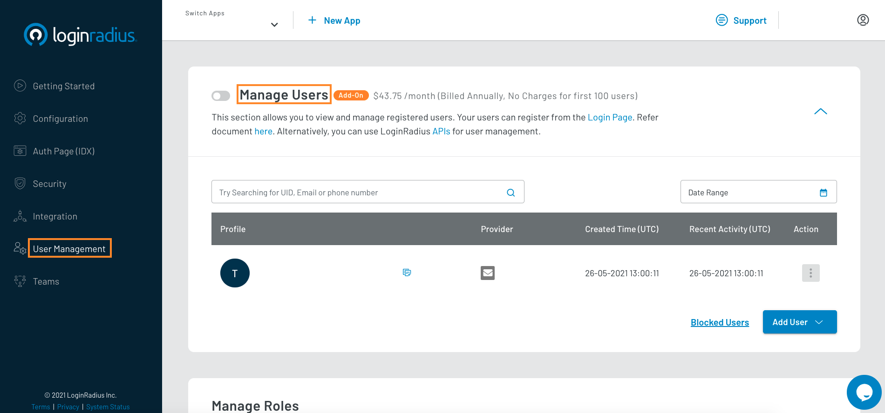
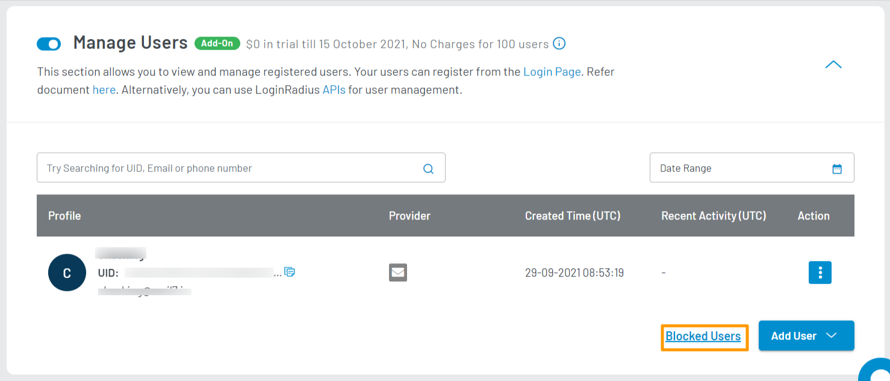
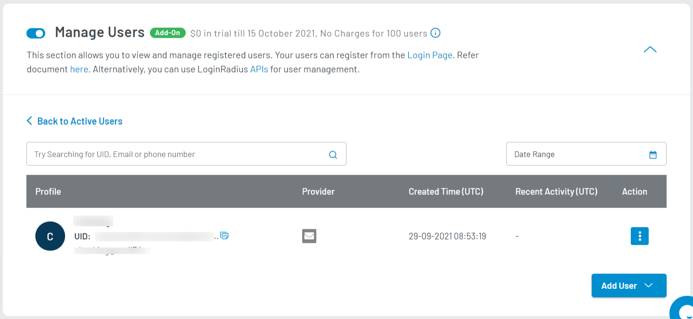
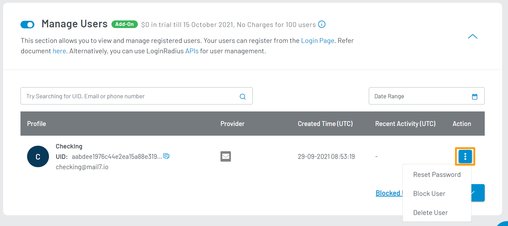
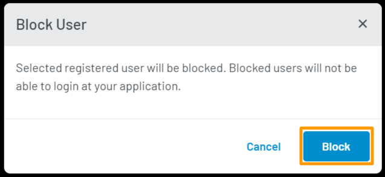
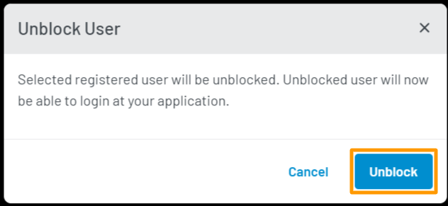

import { Tab, TabContainer } from "../../../src/components/tab.jsx"
import Search from "./search"
import Reset from "./reset"
import Delete from "./delete"
import Add from "./add"

Premium

# Manage Users

This guide explains how to manage your registered users using the LoginRadius Dashboard.

>**Note:**The first 100 users' management is free, thereafter a flat fee is applicable.

## Access Manage Users Section

1. Log in to your <a href="https://dashboard.loginradius.com/dashboard" target="_blank">LoginRadius Dashboard</a> account. Select your app, then from the left navigation panel, click **User Management** and then navigate to the **Manage Users** section.

2. Click the down caret, and the **Manage Users** screen will appear:

  

3. Click the toggle button next to **Manage User** and the following pop-up will appear:  

   

4. Click the **Enable** button to enable the user management options. You will be prompted to add payment details, if not already provided.  

  In your active user table, you will find the following details for each registered active user:

  * **Profile**: The basic data that identifies your registered user: Name, UID, Email, and Phone (if available).

  * **Provider**: How your user's account has been created: Login Method (Email or Phone), or Social Provider (Facebook, Google, etc.)

  * **Created Time (UTC)**: The date and time of your user's account creation.

  * **Recent Activity (UTC)**: The date and time of your user's most recent activity recorded on your application.

  * **Action**: The options that you can perform on your user. You can reset their password, block their account, or delete their account. For more details, refer to the [Supported Actions](#supported-actions) section of this document.

## View Blocked Users

You can check your blocked users by accessing the **Blocked Users** table. To access this table, click the **Blocked Users** link available at the bottom right of the screen:

  

The **Blocked Users** table will show as below:

  

You can perform actions similar to your default active users table. However, the actions available are restricted to **Unblock User** and **Delete User**.

You can navigate back to your active users table by clicking the **Back to Active Users** link as highlighted on the above screen.

## Search for Users

<Search />

## Add Users

<Add />

## Import Users

You can mass import user data from another application/service/database into your application using CSV files.

Refer to the [Migrate User Data](/guide/migrate-user-data) document for more information.

## Supported Actions

To access available actions for a registered user, find the user record of the target user and click the vertical ellipsis button (three dots) contained in the **Action** column of your user table:

  

These are the supported actions you can perform on each registered user:

* **Reset Password**

<Reset />

* **Block User**

  Blocks your user. A blocked user cannot log in to your application. Clicking **Block User** will show a confirmation pop-up as displayed below:

  

  Click the **Block** button in the pop-up to block your selected customer.

* **Unblock User**

  > Note: This action is only available in the [Blocked Users](#view-blocked-users) table.

  Unblocks your user. Once unblocked, your user will be able to log in to your application. Clicking **Unblock User** will show a confirmation pop-up as displayed below:

  

  Click the **Unblock** button in the pop-up to unblock your selected customer.

* **Delete Users**

<Delete />

  [Go Back to Home Page](/)
