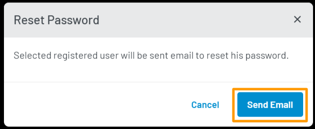

Triggers the reset password flow for your user. Clicking **Reset Password** will show a confirmation pop-up as displayed below:

  

  Click the **Send Email** button in the pop-up to send a password reset email to your selected customer.