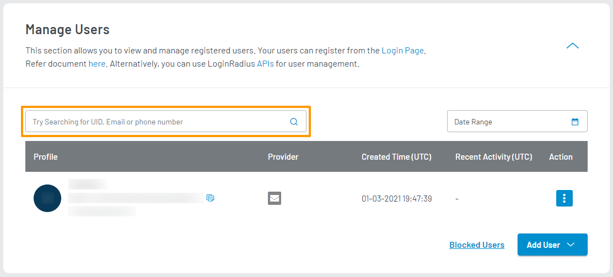
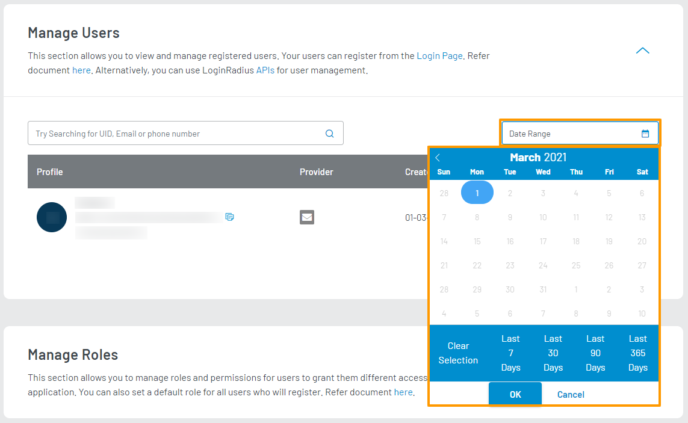

### Using Dashboard

You can search for users by UID, Email, or Phone Number in combination with Date Range.

To search for a user using UID, Email, or Phone Number, enter the respective value in the textbox  and click the **Search** icon, as highlighted on the below screen:

  

To search for a user based on their registration date range, click the **Date Range** box and select a duration using the provided date picker, as highlighted on the below screen:

  

> This Date Range is applied over a user's registration date.