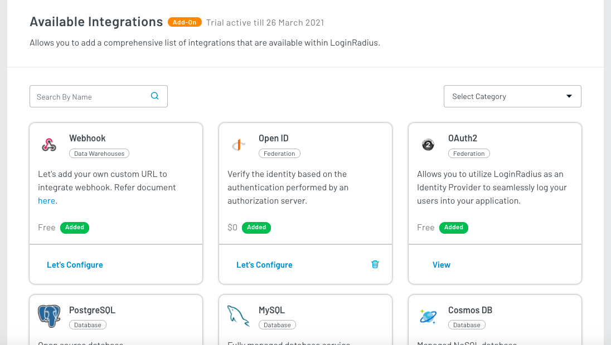
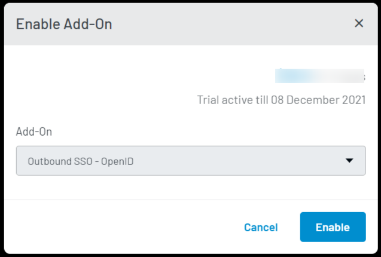
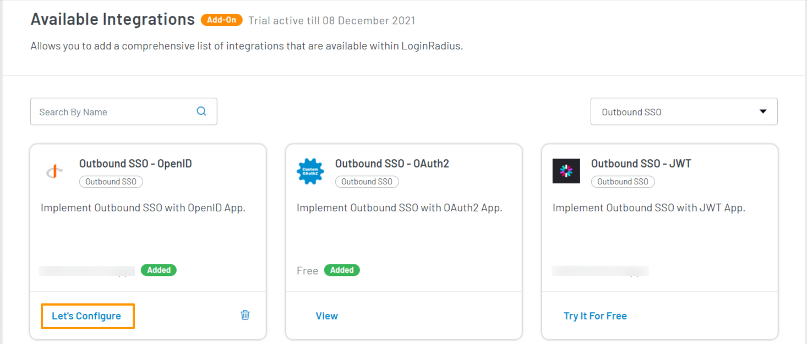
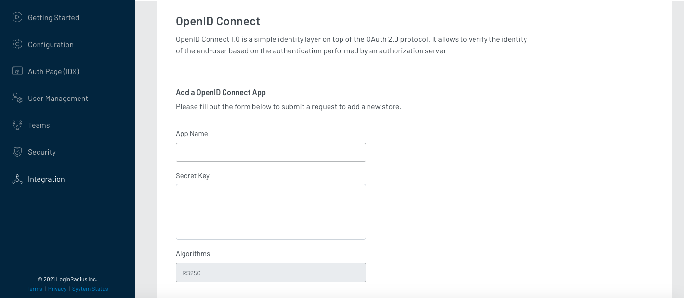

<span class="devloper-premium plan-tag">Developer Pro</span>
<span class="devloper-premium plan-tag">Add on</span>

# Outbound SSO OpenID Connect

OpenID Connect or (OIDC) is an authentication layer on top of the OAuth 2.0 framework that is standardized by the OpenID Foundation. LoginRadius provides a way to integrate your OpenID Connect client with our APIs by following the standards specified in the <a href="https://openid.net/specs/openid-authentication-2_0.html" target="_blank">OpenID Connect specs</a>. These specs cover the various requirements and standardized process that OpenID Connect encompasses.

This <a href="https://betterprogramming.pub/the-complete-guide-to-oauth-2-0-and-openid-connect-protocols-35ebc1cbc11a" target="_blank">guide</a> will show you OAuth 2.0 and Open ID connect working in action.

## OpenID Configurations in LoginRadius Dashboard

1. Log in to your <a href="https://dashboard.loginradius.com/" target="_blank">LoginRadius Dashboard</a> account, select your app and navigate to **Integration**, the following screen will appear:

   

2. Click **Add** button for adding a new OpenID app. The following configuration options will appear:

   

3. Either search for **OpenID** in search bar or go to the **Select Category** dropdown and select **Outbound SSO** category. Locate **Outbound SSO-OpenID** and click the **Try It For Free** link. The following pop-up will appear:

   

4. Click the **Enable** button. The OpenID app is now available in the **Available Integrations**.

   

5. Click the **Let's Configure** option under **OpenID** box. The following screen will appear:

   

6. Enter or select the following to configure the OpenID app:

   - **App Name:** Enter the name for your OpenID Connect App.

   - **Secret Key:** You will need to generate an OpenID Connect Secret using RS256 and add it here. You can get the secret key by running the following command on your terminal:

     ```
     openssl genrsa -out key.pem 2048

     ```

     Additionally, you can use the following command to generate the **Public key** from the private key that will be used to verify generated JWT id_token.

     ```
     openssl rsa -in key.pem -outform PEM -pubout -out public.pem

     ```

   - **Algorithm:** The algorithm you would like to use for OpenID Connect (RS256 is currently the only algorithm supported).

   - **Data Mapping:** Enter your desired fields and how they map out the left column is how they will show up in the OIDC. The right column is the field name in the LoginRadius profile, keep in mind that for some of the profile fields you will need to use dot notation to access them.

7. Click the **Save** button.

The Outbound SSO-OpenID app is now configured.

>**Note:** To know more about how LoginRadius supports various OIDC Flows, refer to <a href="https://www.loginradius.com/docs/developer/concepts/oidc" target="_blank">this document</a>.

[Go Back to Home Page](/)