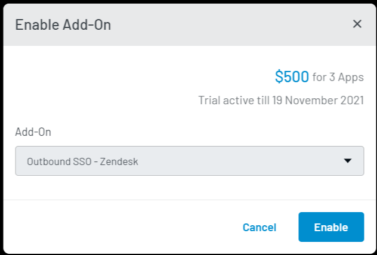

Developer Pro
Add on

# Outbound SSO - Zendesk	
This document provides instructions to set up an outbound SSO with Zendesk. As a result, it will allow your consumers to log in to your Zendesk Application with your application account using SSO. 

## Zendesk Configuration
1. Login to your <a href="https://www.zendesk.com/login/" target="_blank">Zendesk</a> account.

2. Click the **Admin** option from the left navigation pane as highlighted in the screen below:

   

   The admin settings screen will appear.

3. Click the **Try settings in Admin Centre** link as highlighted in the screen below:

   

   The **Zendesk Admin Center** will open in a new tab.

4. Click **Account** from the left navigation pane and then **Single sign-on** as highlighted in the following screen:

   

5. Click the **Configure** button given next to the **JSON Web Token** option. The following screen will appear:

   

6. Select the **Enabled** option, enter the **Remote Login URL**. The following is an example of remote login URL:

   `https://cloud-api.loginradius.com/sso/jwt/redirect/token?apiKey=<APIKEY>&jwtApp=<loginradius freshdesk sso app name>&return_url=<zendesk url>`

   **Example URL:** `https://cloud-api.loginradius.com/sso/jwt/redirect/token?apiKey=#####3f6-####-40b8-8e28-########12c82&jwtApp=zendeskOBApp&return_url=https%3A%2F%2Fnvmail7.zendesk.com%2Faccess%2Fjwt`

   * API Key: The [LoginRadius app’s API Key](https://www.loginradius.com/docs/developer/faq/#how-to-retrieve-api-key-and-secret). 
   * JWT App: The JWT app name as mentioned in [LoginRadius Dashboard](#loginradius-dashboard-configuration).
   * Return URL: The URL where you want to redirect the user after successful login.

7. Copy the Secret Key from the **Shared secret** field and store it with you. 

8. Click the **Save** button to save the configuration.

9. Click **Account** from the left navigation pane and then **Team member authentication**:

   

10. Select **External authentication** and then **Single sign-on** option from the Team member authentication screen.

11. Click the **Save** button to save the configuration.

## LoginRadius Dashboard Configuration
This section covers the required configurations that you need to perform in the LoginRadius Dashboard for Outbound SSO - Zendesk Login.

1. Log in to your <a href="https://dashboard.loginradius.com/" target="_blank">LoginRadius Dashboard</a> account, select your app and navigate to **Configuration > Auth Configuration > Registration Schema**.

2. Enable the **First Name** field and configure it **mandatory**. Then click the **Save** button.

   > **Note:** Refer to <a href="https://www.loginradius.com/docs/developer/guide/custom-registration" target="blank"> this document </a> to know more about managing registration schema.

3. Select
<a href="https://dashboard.loginradius.com/integration" target="_blank">Integration</a> from the left naviation panel and the following screen will appear:

   

4. Click the **Add** button for adding a Zendesk app. The following configuration options will appear:

   

5. Either search for Zendesk in the search bar or go to the **Select Category** dropdown and select **Outbound SSO**. Locate **Outbound SSO - Zendesk** and click the **Try It For Free**.

   The following pop-up will appear:

   

6. Click the **Enable** button from the above pop-up.

7. Now, click the **Let’s Configure** under **Outbound SSO - Zendesk**. The following screen will appear:

   

8. You need to provide or select the following values to configure the JWT App.
   * **App Name**: Enter the app name. The `zendeskOB` prepends to the added name automatically.

   * **Secret Key**: Enter the Secret Key you saved while configuring [Zendesk](#zendesk-configuration). 

   * **Query String Parameter**: The query parameter name in which LoginRadius sends JWT during JWT SSO flow. After authentication, the redirect URL will contain a JWT under this parameter name. The redirect URL will look like this: `<redirecturi>?<query string parameter>=JWTtoken`

   * **Enter Key and Profile Key**: Specify the key-value pair of LoginRadius profile data points that you want to receive in the JWT payload.

     Enter any value for the key column( left column), these values will be used as keys for claims in the payload.

     Select the desired LoginRadius profile field name in the profile key (right column). The values for these fields from the consumer’s profile in LoginRadius will be returned to the JWT payload.

     > **Note**: It is required to map **Email** and **Name** fields in LoginRadius Dashboard. You can map them as displayed in the screen below:
     > 

     Similarly, by clicking the **Add Row** button, and you can map multiple attributes.

9. Click the **Save** button.

You have successfully configured Zendesk using Outbound SSO. Open the login url `https://cloud-api.loginradius.com/sso/jwt/redirect/token?apiKey=<APIKEY>&jwtApp=<loginradius freshdesk sso app name>&return_url=<zendesk url>`, it will redirect you to LoginRadius <a href="https://www.loginradius.com/docs/developer/concepts/idx" target="blank">Auth Page(IDX)</a>. Here, you can login with your Zendesk Account details. 

 