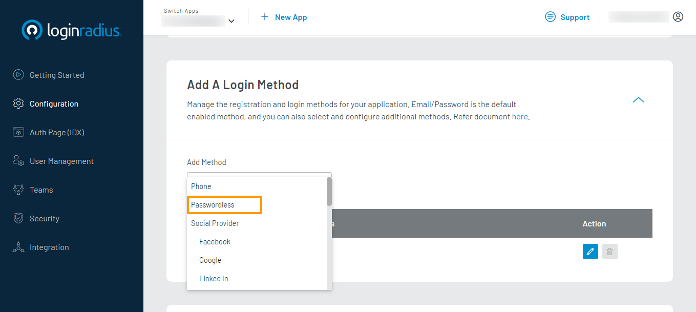

- Select your app, then from the left navigation panel, click **Configuration** and then navigate to the **Login Methods** section.

  

- Click the **Add Method** dropdown and select the **Passwordless** login method.

   

  