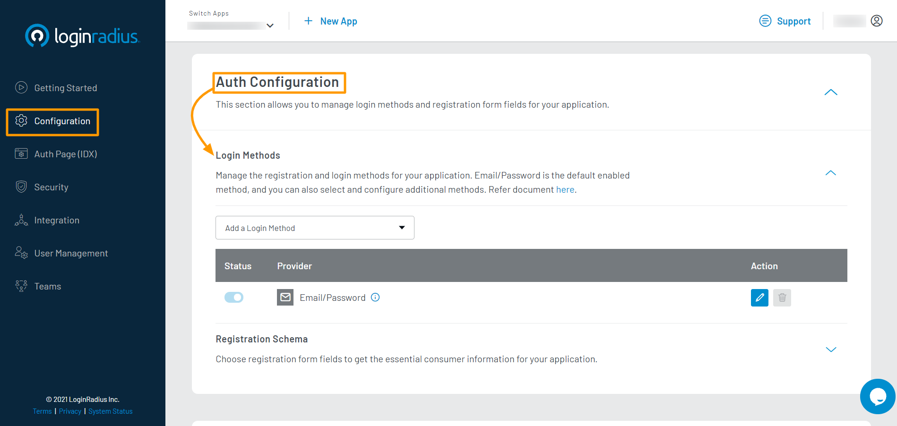

1. Login to your <a href="https://dashboard.loginradius.com/dashboard" target="_blank">LoginRadius Dashboard</a> account. Select your app and navigate to **<a href="https://dashboard.loginradius.com/configuration" target="_blank">Configuration > Auth Configuration</a>**.

2. Click the down arrow and select the **Login Methods** option. The following screen will appear:

   
   
3. Click the **Add a Login Method** dropdown and select the **Passwordless** login method.

   
