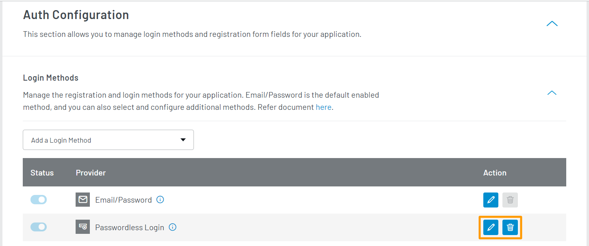
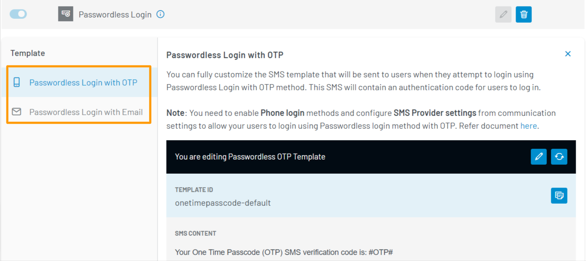
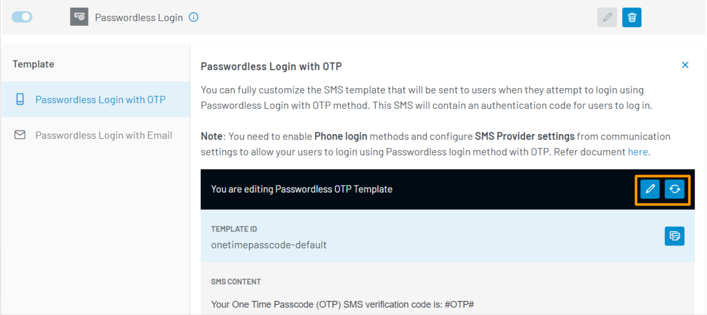
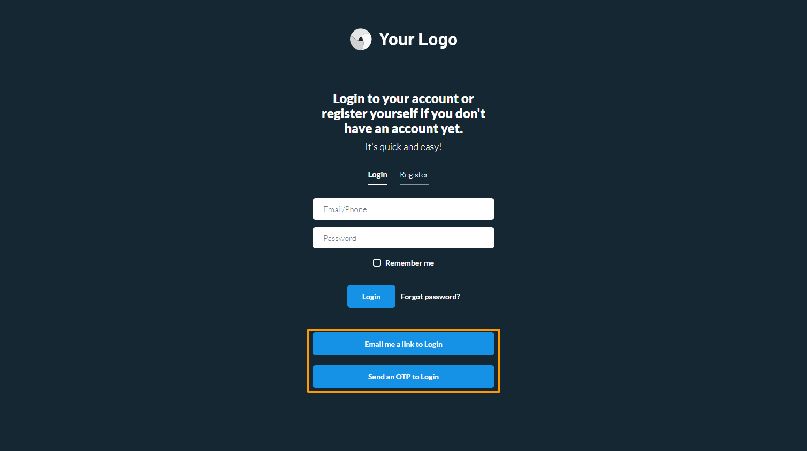

# Manage Passwordless Login

The LoginRadius Identity Platform provides the Passwordless Login method to enable your consumers to log in without providing a password. Upon initiating a Passwordless Login, an OTP/link is sent to your consumer's registered phone number or email address. When the OTP/link is verified, the consumer will be logged into their account.

This guide explains how to configure the Passwordless Login for your consumers.

> **Note**: Your consumer will still need to register by providing a password. After registering, the consumer will have the option to log in without a password.

You can implement the Passwordless Login method in two following ways:

- **With OTP via SMS**: A verification OTP is sent to the consumer's registered phone number. The consumer will be issued an access token upon verifying this OTP.

- **With Link via Email**: A link is sent to the consumer's registered email address. The consumer will be issued an access token upon navigating to the provided link.

> **Note**: If both Passwordless Login and <a href="https://www.loginradius.com/docs/developer/guide/mfa" target="_blank">Two Factor Authentication (2FA)</a> are implemented for your application, your consumer will not be prompted for 2FA when they choose to authenticate using the Passwordless login method.

> **Note**: If both Passwordless Login and <a href="https://www.loginradius.com/docs/developer/guide/mfa" target="_blank">Two Factor Authentication (2FA)</a> are implemented for your application, the **Passwordless Login** will not work for your consumers.

## Configuration

### Step 1: Choose Login Method

Log in to your <a href="https://dashboard.loginradius.com/dashboard" target="_blank">LoginRadius Dashboard</a> account.

import { Tab, TabContainer } from "../../../src/components/tab.jsx"
import PwdLessCLI from "./cli"
import PwdLessDash from "./dashboard"

<TabContainer
  tabheaders={["Using Dashboard", "Using CLI"]}
  tabs={[
    <Tab>
      <PwdLessDash />
    </Tab>,
    <Tab>
      <PwdLessCLI />
    </Tab>,
  ]}
/>

### Step 2: Configure Passwordless Login Templates

1. Similar to the <a href="https://www.loginradius.com/docs/developer/guide/emailpassword-login/" target="_blank">Email/Password Login</a> and <a href="https://www.loginradius.com/docs/developer/guide/phone-login" target="_blank">Phone Login</a> methods, you can perform the following actions:

   - Edit templates associated with this login method.
   - Delete the login method from your application.

   These actions are available in the action bar highlighted in the image below:

   

2. To edit the templates used for the Passwordless Login method, click the **Edit** icon given in the action bar highlighted in the previous step. Each template corresponds to one of the two ways that the Passwordless Login method can be implemented.

   

3. With a Passwordless Login template type selected, you can perform the following actions:

   - Edit template content.
   - Reset the template to its default content.

   These actions are available in the action bar highlighted in the image below:

   

4. When editing the **Passwordless Login with OTP** template, you can update the following:

   - **SMS CONTENT**: The plain text template. You can use [Placeholder](#placeholder-tags) tags in the SMS Content Body.

5. When editing the **Passwordless Login with Email** template, you can update the following:

   - **SUBJECT**: The subject line of the template.
   - **HTML BODY**: The HTML version of the template. This content will appear in clients that support HTML content in emails. You can use [Placeholder](#placeholder-tags) tags in the HTML Body.
   - **TEXT BODY**: The plain text version of the template. This content will appear in clients that support only plain text content in emails. You can use [Placeholder](#placeholder-tags) tags in the Text Body.

6. To save your changes, click the **Save** button.

> In your templates, you can make use of predefined [Placeholder](#placeholder-tags) tags to define where LoginRadius data will appear in your email or SMS.

### Step 3: Check Auth Page (IDX)

To verify that the Passwordless Login method has been enabled, open your **Auth Page (IDX)** `https://<your-app-name>.hub.loginradius.com/auth.aspx`. The IDX page can also be opened using the `lr demo` command in CLI. You should see the following login options available:

> Note: The **Phone Login** method must be enabled for the **Send an OTP to Login** option to be available.

## Placeholder Tags

These tags are used to define where LoginRadius retrieved data will appear in your email or SMS.

- **#Name#**: The consumer's name as defined in your registration form.
- **#OTP#**: The OTP received in an SMS for verification purposes.
- **#OTPExpiry#**: The expiration time of the OTP in seconds.
- **#Email#**: The consumer's email address used to register their account.
- **#FirstName#**: The consumer's first name as defined in your registration form.
- **#LastName#**: The consumer's last name as defined in your registration form.

## References

- <a
    href="https://www.loginradius.com/docs/developer/guide/custom-registration"
    target="_blank"
  >
    Customize Registration Form Fields
  </a>

[Go Back to Home Page](/)
