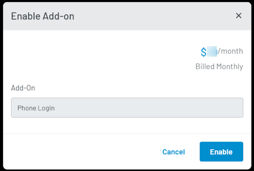

- Select your app, then from the left navigation panel, click **Configuration** and then navigate to the **Login Methods** section.

  

- Click the **Add Method** dropdown and select the **Phone Login** method.

   

  The following pop-up will appear:

   

- Click the **Enable** button to activate the **Phone Login** feature. You will be prompted to add payment details, if not already provided.  

   
