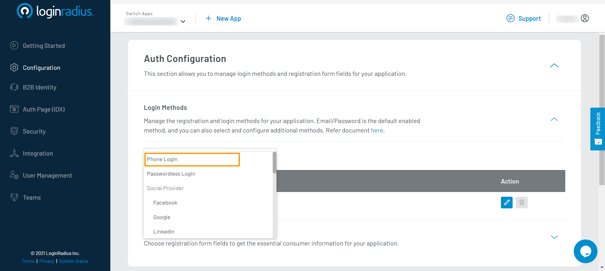
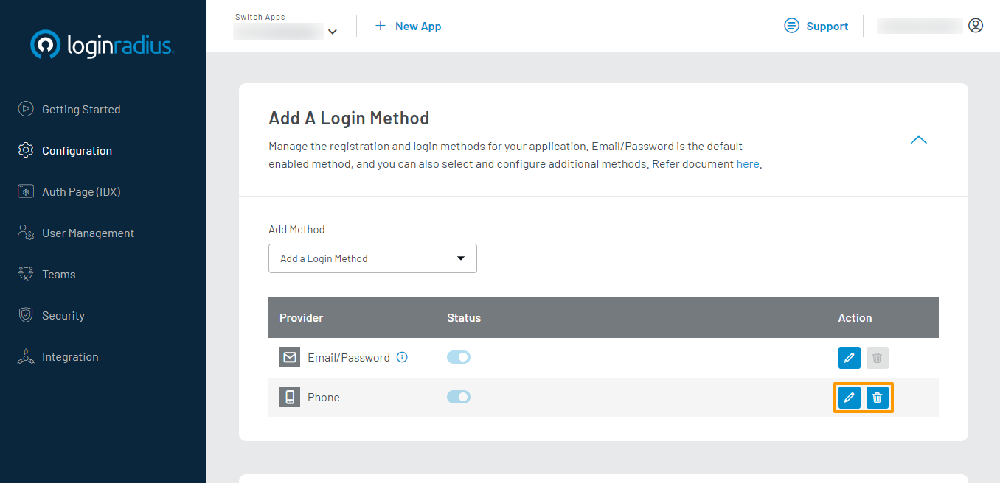
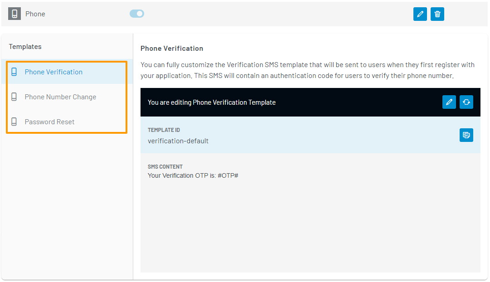
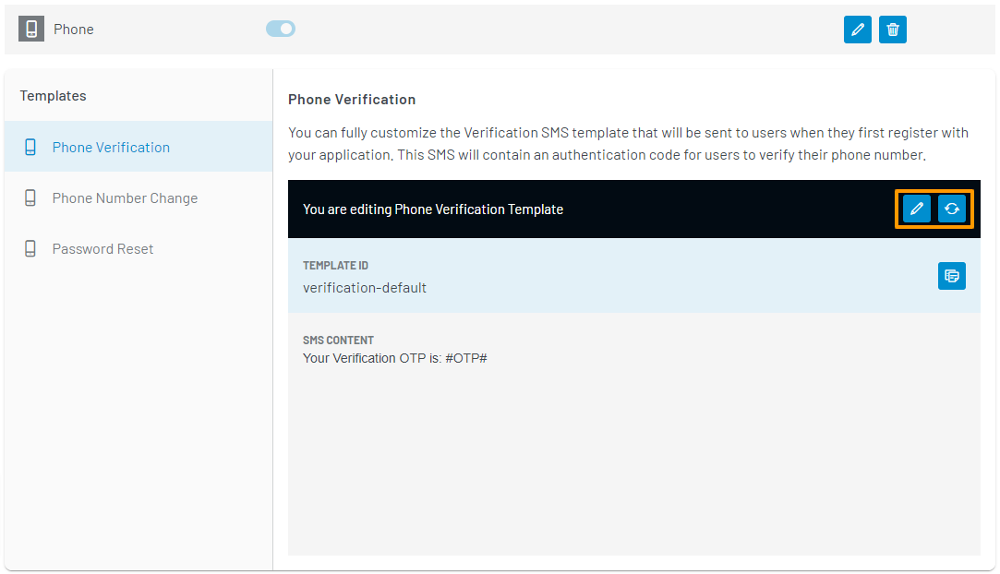

# Manage Phone Login

The LoginRadius Identity Platform provides the Phone Login method to enable your consumer to register and log in using their phone number. After registration, your consumer must verify their phone number via a one-time password (OTP) before logging in.

> Note: The Passwordless Login method provides your consumers with the ability to **Login with OTP**. Your consumers will be able to enter their phone number to receive an OTP which they can use to log in without a password. The Phone Login method must also be enabled for this feature to work. For more details, refer to the [Manage Passwordless Login](../passwordless-login/index.md) document.

## Configuration

### Step 1: Choose Login Method

1. Log in to your [LoginRadius Dashboard](https://dashboard.loginradius.com/dashboard) account. From the left navigation panel, click **Configuration** and then navigate to the **Add A Login Method** section.

2. To enable the Phone Login method for your application, click the **Add Method** dropdown, and select the **Phone** login method.

> Note: You will need to be subscribed to the Developer Premium plan to enable this login method.

When the login method is successfully enabled, you will see it listed in your table of login methods.

### Step 2: Configure Phone Login Templates

1. Similarly to the Email/Password Login and Passwordless Login methods, you can perform the following actions:

* Edit templates associated with this login method.

* Delete the login method from your application.

These actions are available in the action bar highlighted in the image below:

2. To edit the templates used for the Phone Login method, click the **Edit** icon given in the action bar highlighted in the previous step.

When certain events related to the Phone Login method occur, LoginRadius will send an SMS to your consumer. The following are the types of SMS templates that will be used, along with the event that will send it:

* **Phone Verification**: The Phone Verification SMS is sent to your consumer when they first register on your application. This SMS contains an OTP that will need to be verified to confirm their phone number.

* **Phone Number Change**: The Phone Number Change SMS is sent to your consumer when they attempt to change their account's phone number. This SMS contains an OTP that will need to be verified to confirm their new phone number.

* **Password Reset**: The Password Reset SMS is sent to your consumer when they attempt to reset their account's password. This SMS contains an OTP that will need to be verified before your consumer can reset their password.

3. With a Phone Login template type selected, you can perform the following actions:

* Edit template content.
* Reset the template to its default content.

These actions are available in the action bar highlighted in the image below:

4. When editing a template, you can update the following:

* **SMS CONTENT**: The plain text template.

In your templates, you can make use of predefined [Placeholder](#placeholder-tags) tags to define where LoginRadius data will appear in your SMS.

To save your changes, click the **Save** button.

### Step 3: Check Auth Page (IDX)

To verify that the Phone Login method has been enabled, open your **Auth Page (IDX)** `https://<your-app-name>.hub.loginradius.com/auth.aspx`. You should see the following login field available:

## Placeholder Tags

These tags are used to define where LoginRadius retrieved data will appear in your SMS.

* **#Name#**: The consumer's name as defined in your registration form.
* **#OTP#**: The OTP received in an SMS for verification purposes.
* **#OTPExpiry#**: The expiration time of the OTP in seconds.
* **#Email#**: The consumer's email address used to register their account.
* **#FirstName#**: The consumer's first name as defined in your registration form.
* **#LastName#**: The consumer's last name as defined in your registration form.
