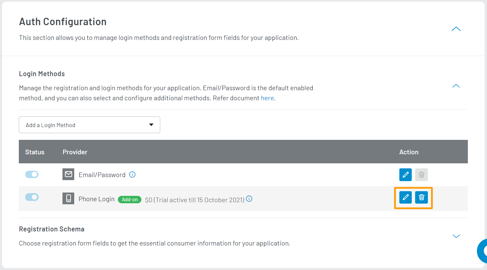
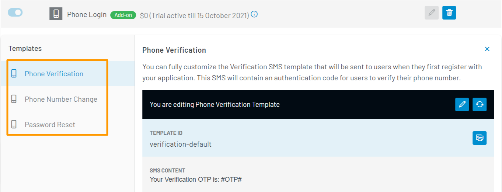
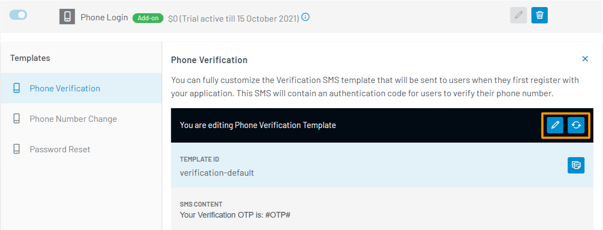
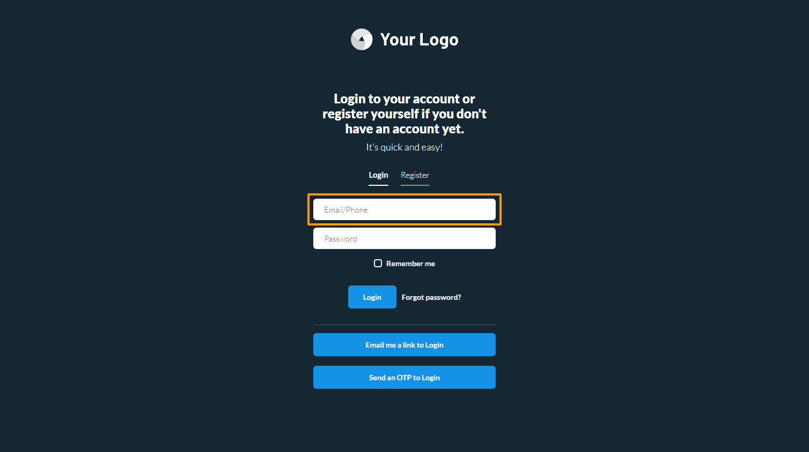
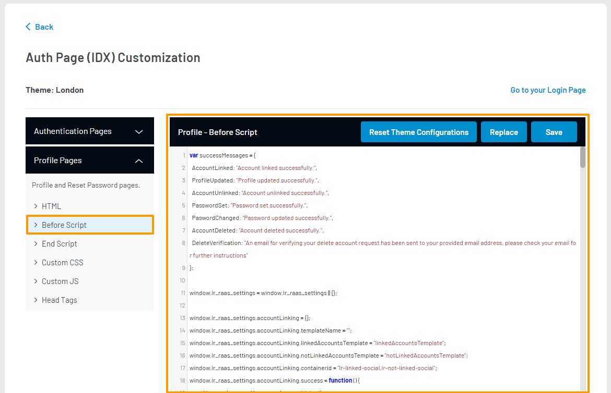
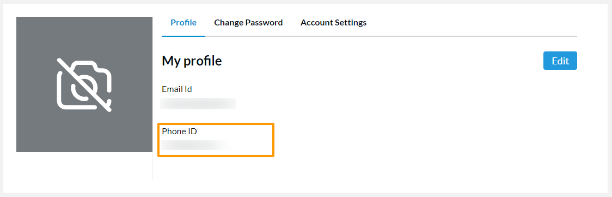
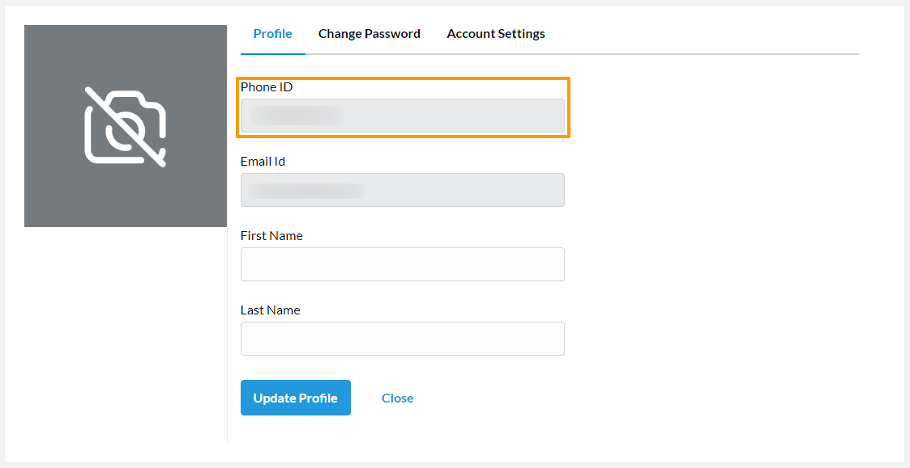

<span class="devloper-premium plan-tag">Premium</span>

# Manage Phone Login

The LoginRadius Identity Platform provides the Phone Login method to enable your consumer to register and log in using their phone number. After registration, your consumer must verify their phone number via a one-time password (OTP) before logging in.

During login, the consumer will need to provide both the Phone Number and Password. This guide explains how to configure Phone Login for your consumers.

> **Note**: The **Passwordless Login** method provides your consumers with the ability to **Login with OTP**. Your consumers will be able to enter their phone number to receive an OTP, which they can use to log in without a password.
>
> The **Phone Login** method must also be enabled for this feature to work. For more details, refer to the <a href="https://www.loginradius.com/docs/developer/guide/passwordless-login" target="_blank">Manage Passwordless Docs</a> document.

## Configuration

### Step 1: Choose Login Method

Log in to your <a href="https://dashboard.loginradius.com/dashboard" target="_blank">LoginRadius Dashboard</a> account.

import { Tab, TabContainer } from "../../../src/components/tab.jsx"
import PhoneCLI from "./cli"
import PhoneDash from "./dashboard"

<TabContainer
  tabheaders={["Using Dashboard", "Using CLI"]}
  tabs={[
    <Tab>
      <PhoneDash />
    </Tab>,
    <Tab>
      <PhoneCLI />
    </Tab>,
  ]}
/>

When the login method is successfully enabled, you will see it listed in your login methods table.

### Step 2: Configure Phone Login Templates

1. Similarly to the <a href="https://www.loginradius.com/docs/developer/guide/emailpassword-login" target="_blank">Email/Password Login</a> and <a href="https://www.loginradius.com/docs/developer/guide/passwordless-login" target="_blank">Passwordless Login</a> methods, you can perform the following actions:

   - Edit templates associated with this login method.

   - Delete the login method from your application.

   These actions are available in the action bar highlighted in the image below:

   

2. To edit the templates used for the Phone Login method, click the **Edit** icon given in the action bar highlighted in the previous step.

   When certain events related to the Phone Login method occur, LoginRadius will send an SMS to your consumer. The following are the types of SMS templates that will be used, along with the event that will send it:

   

   - **Phone Verification**: The Phone Verification SMS is sent to your consumer when they first register on your application. This SMS contains an OTP that will need to be verified to confirm their phone number.

   - **Phone Number Change**: The Phone Number Change SMS is sent to your consumer when they attempt to change their account's phone number. This SMS contains an OTP that will need to be verified to confirm their new phone number.

   - **Password Reset**: The Password Reset SMS is sent to your consumer when they attempt to reset their account's password. This SMS contains an OTP that will need to be verified before your consumer can reset their password.

3. With a Phone Login template type selected, you can perform the following actions:

   - Edit template content.
   - Reset the template to its default content.

   These actions are available in the action bar highlighted in the image below:

   

4. When editing a template, you can update the following:

   - **SMS CONTENT**: The plain text template.

5. To save your changes, click the **Save** button.

> **Note**: In your templates, you can use predefined [Placeholder](#placeholder-tags) tags to define where LoginRadius data will appear in your SMS.

### Step 3: Check Auth Page (IDX)

To verify that the Phone Login method has been enabled, open your **Auth Page (IDX)** `https://<your-app-name>.hub.loginradius.com/auth.aspx`. The IDX page can also be opened using the `lr demo` command in CLI. You should see the following login field available:



## Adding Phone ID to Auth Page (IDX) Profile Page

The login page of your Auth Page (IDX) handles the Phone ID input fields automatically. However, if you'd like your consumer's Phone ID to appear in the profile page editor, you'll have to manually make some modifications in your Auth Page (IDX)'s Advanced Editor.

1. Navigate to your profile page's before-script file editor. For more details regarding how to activate, or access your Advanced Editor, refer to the guide document <a href="https://www.loginradius.com/docs/developer/guide/auth-page-advanced-editor" target="_blank">here</a>.

   

2. Look for the line that declares the array `registrationFormSchema` for the LoginRadius JavaScript library. Add the following object into the array:

   `{ "type": "string", "name": "phoneid", "display": "Phone ID", "rules": "", "options": null, "permission": "r" }`

3. Look inside the callback function for the LoginRadius hook event `renderProfileEditorHook`, specifically at the `viewerSchema` for loop:

```javascript
for (var i = 0; i < viewerSchema.length; i++) {
  if (viewerSchema[i].name == "emailid") {
    $("#profile-editor-container").prepend(
      '<div class="loginradius--form-element-content "><label for="loginradius-profileeditor">' +
        viewerSchema[i].display +
        '</label><input type="text" name="" id="" class="loginradius-string" disabled value="' +
        viewerSchema[i].value +
        '"></div>'
    )
    renderedHtml += LRObject.util.hashTmpl(
      "profileViewTemplate",
      viewerSchema[i]
    )
  } else {
    renderedHtml += LRObject.util.hashTmpl(
      "profileViewTemplate",
      viewerSchema[i]
    )
  }
}
```

4. Replace the code block with the following:

```javascript
for (var i = 0; i < viewerSchema.length; i++) {
  if (
    viewerSchema[i].name == "emailid" ||
    (viewerSchema[i].name == "phoneid" && viewerSchema[i].value)
  ) {
    $("#profile-editor-container").prepend(
      '<div class="loginradius--form-element-content "><label for="loginradius-profileeditor">' +
        viewerSchema[i].display +
        '</label><input type="text" name="" id="" class="loginradius-string" disabled value="' +
        viewerSchema[i].value +
        '"></div>'
    )
  }

  renderedHtml += LRObject.util.hashTmpl("profileViewTemplate", viewerSchema[i])
}
```

5. Save your changes and verify by checking your profile page:

   

   

## Placeholder Tags

These tags are used to define where LoginRadius retrieved data will appear in your SMS.

- **#Name#**: The consumer's name as defined in your registration form.
- **#OTP#**: The OTP received in an SMS for verification purposes.
- **#OTPExpiry#**: The expiration time of the OTP in seconds.
- **#Email#**: The consumer's email address used to register their account.
- **#FirstName#**: The consumer's first name as defined in your registration form.
- **#LastName#**: The consumer's last name as defined in your registration form.

## References

- <a
    href="https://www.loginradius.com/docs/developer/guide/custom-registration"
    target="_blank"
  >
    Customize Registration Form Fields
  </a>

[Go Back to Home Page](/)
