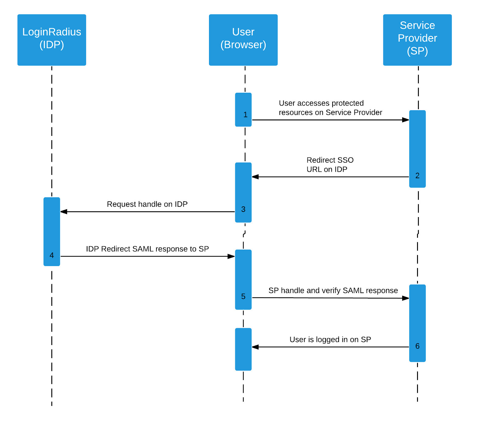
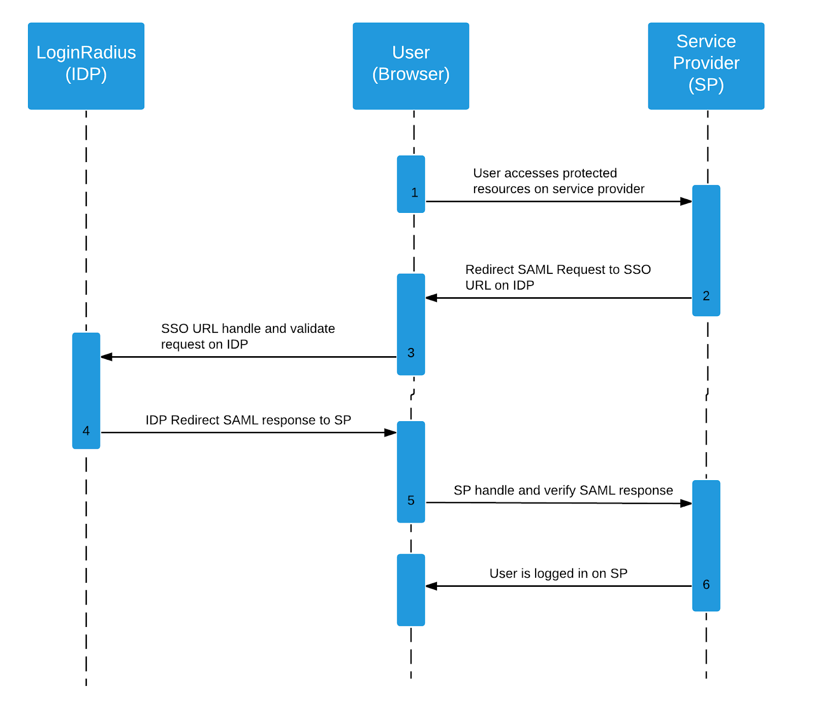
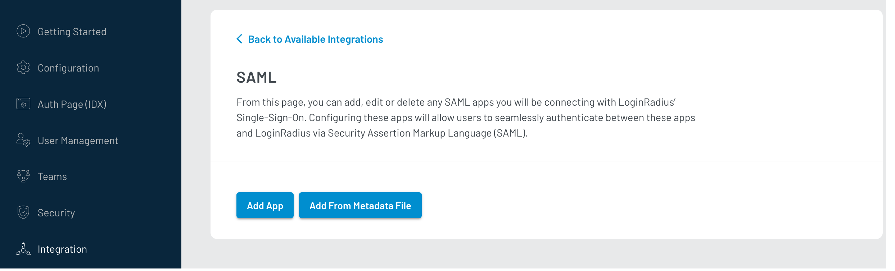
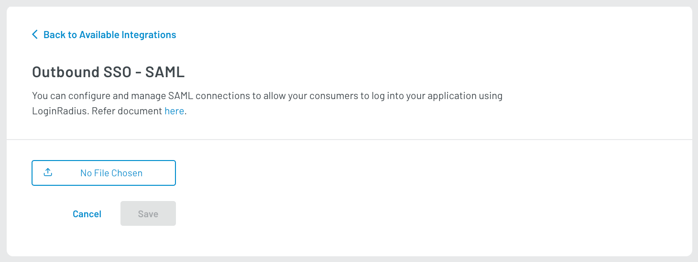
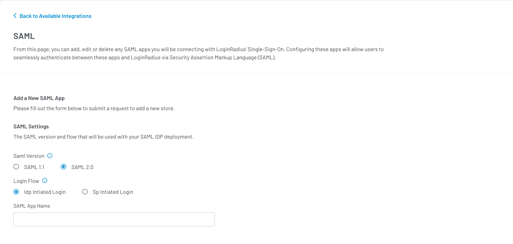
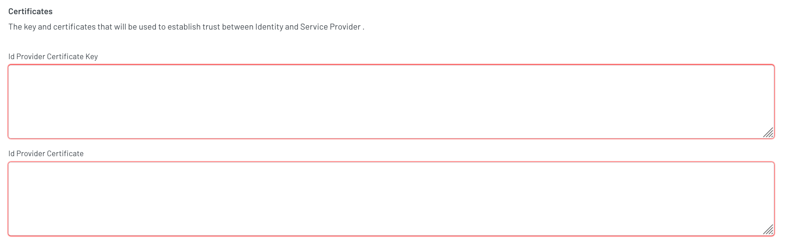
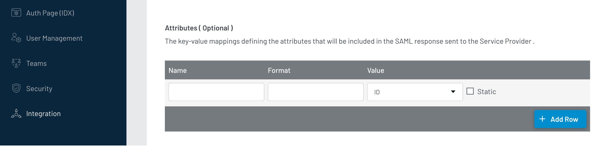
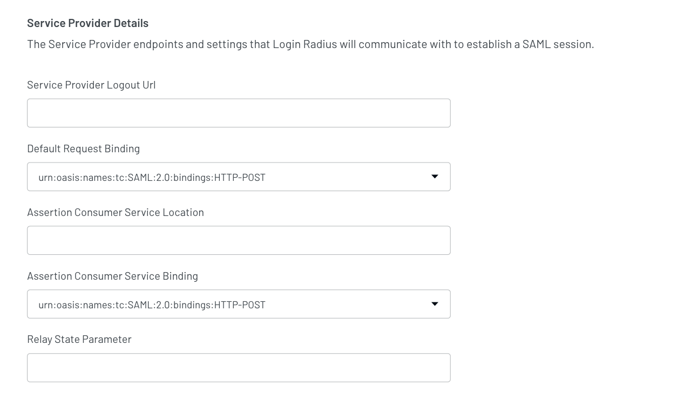
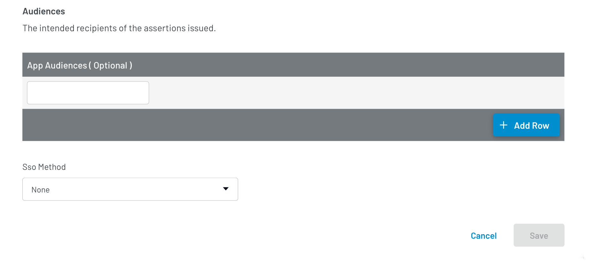

# Connect SAML App 

Security Assertion Markup Language (SAML) is an open-source framework for exchanging authentication and authorization data between an identity provider and a service provider where:

*   An identity provider (IdP) authenticates a consumer and provides a SAML Assertion to service providers.
*   A service provider (SP) verifies the Assertion and provides access to the consumer.

> **Note:** To know about SAML, its component, and benefits, refer to the [sections below](#saml).

## LoginRadius as Identity Provider

LoginRadius supports both SAML 1.1 and SAML 2.0 flows. LoginRadius Dashboard lets you do SAML configurations by allowing you to customize the assertions, keys, and endpoints to match any SAML provider requirements.

The following are some key points providing better clarity about LoginRadius acting as an Identity provider:

1.  LoginRadius acts as an identity provider (IDP), which means that LoginRadius can authorize your app, and your app will act as a service provider (SP).

2.  LoginRadius supports both [Identity Provider Initiated Login](#identity-provider-initiated-login) and [Service Provider Initiated](#service-provider-initiated-login) login flows.

3.  LoginRadius supports Single Logout (SLO).

4.  LoginRadius does not support HTTP Artifact.

### Identity Provider Initiated Login

For the IDP initiated login, a consumer is logged on to the LoginRadius site and attempts to access a protected SP resource. LoginRadius redirects the consumer to LoginRadius SAML IDP initiated URL. The SAML IDP initiated URL automatically posts a SAML response to the SP. Then SP verifies the response. The login URL for this process is:

`https://cloud-api.loginradius.com/sso/saml/loginService?apiKey=<LoginRadiusApiKey>&appName=<SAMLAppName>`

The following sequence diagram summarizes the steps while proceeding with IDP Initiated Login:



### Service Provider Initiated Login

In the Service Provider initiated login, a consumer attempts to access a protected resource directly on an SP Website without logging on. The SP sends an authentication SAML request as a string query parameter in the HTTP GET or HTTP POST parameter (after it has been deflated, base64 encoded, and URL encoded) depending on the binding configuration to the SP initiated LoginRadius URL.

The following sequence diagram summarizes the steps while proceeding with SP Initiated Login:



A SAML request will look like this :

```
    <samlp:AuthnRequest 
        ID="_3f603af1-c3be-4463-b25f-7e2b0701d690" 
        Version="2.0" 
        IssueInstant="2019-08-30T17:03:52.179Z" 
        xmlns:samlp="urn:oasis:names:tc:SAML:2.0:protocol">
        <Issuer 
            xmlns="urn:oasis:names:tc:SAML:2.0:assertion">urn:federation:MicrosoftOnline
        </Issuer>
        <samlp:NameIDPolicy 
            Format="urn:oasis:names:tc:SAML:2.0:nameid-format:persistent"/>
    </samlp:AuthnRequest>

```


The **IDP** validates the contents of the Request and prompts the consumer to provide login credentials. If the consumer is authenticated successfully, the IDP sends a SAML response via **HTTP POST*** to **Service Provider Assertion Consumer Service URL**.

A SAML response will look like this:


```
    <samlp:Response 
        xmlns:samlp="urn:oasis:names:tc:SAML:2.0:protocol" 
        xmlns:saml="urn:oasis:names:tc:SAML:2.0:assertion" 
        ID="_4650c174-7063-426a-b259-ad7ffdd9f633" 
        Version="2.0" 
        IssueInstant="2020-01-06T05:22:20.769Z" 
        Destination="https://login.microsoftonline.com/login.srf" 
        InResponseTo="_3f603af1-c3be-4463-b25f-7e2b0701d690">
        <saml:Issuer>https://<Your LR SITE>.hub.loginradius.com/</saml:Issuer>
        <samlp:Status>
            <samlp:StatusCode 
                Value="urn:oasis:names:tc:SAML:2.0:status:Success"/>
        </samlp:Status>
        <saml:Assertion 
            xmlns:xsi="http://www.w3.org/2001/XMLSchema-instance" 
            xmlns:xs="http://www.w3.org/2001/XMLSchema" 
            xmlns:saml="urn:oasis:names:tc:SAML:2.0:assertion" 
            ID="_edf670ea-a82f-4872-ba00-71a00acc5c39" 
            Version="2.0" 
            IssueInstant="2020-01-06T05:22:20.769Z">
            <saml:Issuer>https://<Your LR SITE>.hub.loginradius.com/</saml:Issuer>
            <ds:Signature 
                xmlns:ds="http://www.w3.org/2000/09/xmldsig#">
                <ds:SignedInfo>
                    <ds:CanonicalizationMethod 
                        Algorithm="http://www.w3.org/2001/10/xml-exc-c14n#"/>
                    <ds:SignatureMethod 
                        Algorithm="http://www.w3.org/2001/04/xmldsig-more#rsa-sha256"/>
                    <ds:Reference 
                        URI="#_edf670ea-a82f-4872-ba00-71a00acc5c39">
                        <ds:Transforms>
                            <ds:Transform 
                                Algorithm="http://www.w3.org/2000/09/xmldsig#enveloped-signature"/>
                            <ds:Transform 
                                Algorithm="http://www.w3.org/2001/10/xml-exc-c14n#"/>
                        </ds:Transforms>
                        <ds:DigestMethod 
                            Algorithm="http://www.w3.org/2001/04/xmlenc#sha256"/>
                        <ds:DigestValue>MALQA9d3QWPBzpba4cZq8CbdITwOIU+
                            CzIPGesJz6Jk=
                        </ds:DigestValue>
                    </ds:Reference>
                </ds:SignedInfo>
                <ds:SignatureValue>D5py5Z6wOR+QtrjqsdJyXMYqV9yJD7uMXrr74pKaRHRbO7KSIuBnYQLwsJ2SlKh1p...
                </ds:SignatureValue>
                <ds:KeyInfo>
                    <ds:X509Data>
                        <ds:X509Certificate>MIIDLDCCAhSgAwIBAgIJALwtdp+dP0F0MA0GCSqGSIb3DQEBCwUA...</ds:X509Certificate>
                    </ds:X509Data>
                </ds:KeyInfo>
            </ds:Signature>
            <saml:Subject>
                <saml:NameID 
                    Format="urn:oasis:names:tc:SAML:1.1:nameid-format:unspecified">aa51c695b7b24ae3836a9222db3892ca
                </saml:NameID>
                <saml:SubjectConfirmation 
                    Method="urn:oasis:names:tc:SAML:2.0:cm:bearer">
                    <saml:SubjectConfirmationData 
                        NotOnOrAfter="2020-01-06T06:12:20.769Z" 
                        Recipient="https://login.microsoftonline.com/login.srf" 
                        InResponseTo="_3f603af1-c3be-4463-b25f-7e2b0701d690"/>
                </saml:SubjectConfirmation>
            </saml:Subject>
            <saml:Conditions 
                NotBefore="2020-01-06T05:22:20.769Z" 
                NotOnOrAfter="2020-01-06T06:12:20.769Z">
                <saml:AudienceRestriction>
                    <saml:Audience>urn:federation:MicrosoftOnline</saml:Audience>
                </saml:AudienceRestriction>
            </saml:Conditions>
            <saml:AuthnStatement 
                AuthnInstant="2020-01-06T05:22:20.769Z" 
                SessionIndex="4717eb31-52bc-40d3-8f48-dfc623a1dd4c">
                <saml:AuthnContext>
                    <saml:AuthnContextClassRef>urn:oasis:names:tc:SAML:2.0:ac:classes:unspecified</saml:AuthnContextClassRef>
                </saml:AuthnContext>
            </saml:AuthnStatement>
            <saml:AttributeStatement>
                <saml:Attribute 
                    Name="user.userprincipalname" 
                    NameFormat="urn:oasis:names:tc:SAML:2.0:attrname-format:unspecified">
                    <saml:AttributeValue 
                        xmlns:xs="http://www.w3.org/2001/XMLSchema" 
                        xmlns:xsi="http://www.w3.org/2001/XMLSchema-instance" 
                        xsi:type="xs:string">sharepoint@loginradius.tk
                    </saml:AttributeValue>
                </saml:Attribute>
                <saml:Attribute 
                    Name="user.givenname" 
                    NameFormat="urn:oasis:names:tc:SAML:2.0:attrname-format:unspecified">
                    <saml:AttributeValue 
                        xmlns:xs="http://www.w3.org/2001/XMLSchema" 
                        xmlns:xsi="http://www.w3.org/2001/XMLSchema-instance" 
                        xsi:type="xs:string">jay
                    </saml:AttributeValue>
                </saml:Attribute>
                <saml:Attribute 
                    Name="user.surname" 
                    NameFormat="urn:oasis:names:tc:SAML:2.0:attrname-format:unspecified">
                    <saml:AttributeValue 
                        xmlns:xs="http://www.w3.org/2001/XMLSchema" 
                        xmlns:xsi="http://www.w3.org/2001/XMLSchema-instance" 
                        xsi:type="xs:string">agarwal
                    </saml:AttributeValue>
                </saml:Attribute>
            </saml:AttributeStatement>
        </saml:Assertion>
    </samlp:Response>
```


The following explains some critical fields of the SAML response:

1.  **InResponseTo** contains the value earlier sent as an ID in the SAML Request. The Service Provider matches this with the SAML request ID.

2.  **IssueInstant** NotBefore and NotOnOrAfter define a time interval for which the SAML Response is valid.

3.  The **issuer** in assertion contains the URI of SAML response issuer. The Service Provider uses this value to verify that the assertion is coming from the expected Identity Provider.

4.  **AudienceRestriction** in the assertion defines that this assertion is targeted for a specific Service Provider and cannot be used for any other Service Provider.

5.  The **subject** in the assertion identifies the authenticated principal(user).

6.  The **AttributeStatement** in the assertion contains attributes and their values for the specific user that comes as authenticate.

The Assertion or the whole SAML Response is signed with an XML Signature that protects the integrity of the Assertion (or response) and verifies that it has not been modified in transit. Upon receiving the SAML Response, the SP can verify its contents and structure, validate the signature, and subsequently treat the user as authenticated by initiating a web session.

### Single Logout (SLO)

You can request to be logged out of LoginRadius, which will cause your consumer to be logged out from all SSO sites. To enable the Single Logout feature, the service provider must support the SAML Single Logout protocol. The various logon sessions are not terminated if the SP does not support this protocol. Additionally, the user will not receive the appropriate notification of this failure. The logout URL for this request is

`https://cloud-api.loginradius.com/sso/saml/logoutService?apiKey=<LoginRadiusApiKey>&appName=<SAMLAppName>`


## Setup SAML SSO in Loginradius Dashboard

This document goes over how you can enable Single-sign-on in Loginradius Dashboard using the SAML supported app. Your SAML app will act as an IDP and LoginRadius as SP.

### Step 1: Configure SAML App

Each authentication system is unique and might require different configuration settings. Please use the following values for configuring LoginRadius as a service provider in your application to enable SAML flow.

#### Login and Enable SSO

1.  Login in to your SAML supported app.

2.  Enable and configure Single-sign-on method SAML.

#### Configure LoginRadius as a Service Provider

Configure LoginRadius as a Service Provider in your application with the following values:

1.   Enter [https://lr.hub.loginradius.com](https://lr.hub.loginradius.com) in Start URL.

2.   Enter [https://lr.hub.loginradius.com/](https://lr.hub.loginradius.com/) in Entity Id.

3.   Enter [https://lr.hub.loginradius.com/saml/serviceprovider/AdfsACS.aspx](https://lr.hub.loginradius.com/saml/serviceprovider/AdfsACS.aspx) in ACS URL.

4.   Select Name Id format: **urn:oasis:names:tc:SAML:1.1:nameid-format:unspecified.**

#### Download Metadata

Download the metadata for SAML configuration.

### Step 2: Configure LoginRadius Dashboard

#### Access SAML

1.  Log in to your LoginRadius Dashboard.

2.  From the left Navigation panel, click the **Integration** section and click **Add** in **Configured Integration** section

3.  Search and select **SAML**.

#### Add SAML App

Add SAML app by clicking **Add App** or **Add From Metadata File**



If the **Add From Metadata File** option is selected, then add the metadata file of the SAML file to connect with SSO.



The below steps are if the **Add App** option is selected.

#### Configure SAML App Details

1. Select SAML version, Loginflow(SP or IDP), and add the SAML App name.

   

2. Enter LoginRadius' Certificate and Key in **ID PROVIDER CERTIFICATE** and **SERVICE PROVIDER CERTIFICATE KEY**.

   

   **ID Provider Certificate**: Certificate of SAML supported app working as identity Provider in this case.

   > **Note:** Certificate and Key can be generated using online tools, for example - with Bits and Digest Algorithm 2056, SHA256 respectively.

3. Add the key-value pairs in the **Attibutes** section(optional).

   

4. Select the Name Id format from the Dropdown.

    Default is **urn:oasis:names:tc:SAML:1.1:nameid-format:unspecified**

5. Enter the URLs of the page that users will be redirected to for authentication in **Login URl** and **After Logout URL** 

    

6. Enter the Service Provider endpoints and settings that LoginRadius will communicate with to establish a SAML session in the **Service Provider Details** section.

    In **Assertion Consumer Service Location**, enter the **IdP-Initiated Login URL**, which you will get from the SAML supported app dashboard or metadata file.
    
    
    
7. In the **Audiences** section, add the intended recipients of the assertions issued.(optional)

    

8. Select the SSO method from the dropdown list.

    The other methods are: 

    * **HTTP Post**

    * **HTTP Artifact**

9. Once all the required fields are completed, **scroll down** and click **Save**.

> **Note:**
> * Please see [ADFS](/docs/api/v2/admin-console/team-management/sso-connectors/adfs-setup-in-admin-console), [Azure AD](/docs/api/v2/admin-console/team-management/setup-azure-ad), salesforce for specific examples for implementing SSO in Loginraius Dashboard using SAML.
> * The consumer should have an account with the same email address in your SAML application as well as in LoginRadius before using your SAML application to login to the LoginRadius Dashboard.

## SAML

SAML is an XML-based markup language for creating, requesting, and exchanging security assertions between applications. SAML enables web-based, cross-domain single sign-on (SSO), which helps reduce the administrative overhead of distributing multiple authentication tokens to the user.

### Advantages of SAML

Before going into the in-depth detail of SAML, let's first see the advantages or benefits that SAML provides.

1. **Standardization:** SAML is a standard format that allows seamless exchange of information between systems, independent of implementation, platform-specific architecture, and implementation.

2. **Platform neutrality:** SAML abstracts the security framework away from platform architecture and particular vendor implementations. Making security more independent of application logic is an important tenet of Service-Oriented Architecture.

3. **Loose coupling of directories:** SAML does not require user information to be maintained and synchronized between directories.

4. **Better UI experience:** SAML enables single sign-on by allowing users to authenticate at an identity provider and then access service providers without additional authentication. In addition, identity federation (linking of multiple identities) with SAML allows a better-customized user experience at each service while promoting privacy.

5. **Reduced complexity:** Using SAML to 'reuse' a single act of authentication (such as logging in with a username and password) multiple times across multiple services can reduce the cost of maintaining account information. This burden is transferred to the identity provider.

6. **Centralized Risk Management:** In SAML, the responsibility for proper management of identities lies with the identity provider. This is more manageable and desirable rather than handling multiple service provider systems.

### SAML Components

SAML framework consists of three sets of components: 

* [assertions](#assertions)
* [protocols](#protocols)
* [bindings](#bindings)

#### Assertions

A SAML assertion is a package of data produced by a SAML authority. Alternatively, you can say that a SAML Assertion is the XML document containing the user authorization that the identity provider sends to the service provider.

SAML specifies three types of assertions:

1.  **Authentication Assertion:** It indicates that the user has been authenticated, and it includes the time and method of authentication.
2.  **Attribute Assertion:** It is a characteristic or trait of a user that describes the user. It is a name: value pair. An attribute assertion conveys user information from Cloud Identity to the service provider.
3.  **Authorization Decision Assertion:** It indicates whether a request to access a resource by the subject has been approved or declined.

#### Protocols

SAML protocols describe how certain SAML elements (including assertions) are packaged within request and response elements, and give the processing rules that SAML entities must follow when producing or consuming these elements.

SAML defines several request/response protocols. The protocol is encoded in an XML schema as a set of request-response pairs. The protocols are defined as follows:

1.  **Assertion Query and Request Protocol:** It defines a set of queries by which existing SAML assertions may be obtained. The query can be based on a reference, subject, or statement type.

2.  **Authentication Request Protocol:** It defines a message that causes a response to be returned containing one or more assertions. The flow begins at the service provider who issues an explicit authentication request to the identity provider. A Service Provider issues the response with the Identity Provider returning the message to enable the Web SSO workflow.

3.  **Artifact Protocol:** It provides a mechanism to obtain a previously created assertion by providing a reference. The reference is called an artifact. Thus, a SAML protocol can refer to an assertion by an artifact, and when a service provider obtains the artifact, it can use the artifact Protocol to obtain the actual assertion using this protocol.

4.  **Name Identifier Management Protocol:** It provides mechanisms to change the name of a user's value or format. The issuer of the request can be either the Service Provider or the Identity Provider. This protocol also provides a mechanism to terminate an association of a name between an Identity Provider and Service Provider.

5.  **Single Logout Protocol:** It defines a request that allows the simultaneous log out of all sessions associated with a user. The logout can be directly initiated by the Principal or due to a session timeout.

6.  **Name Identifier Mapping Protocol:** It provides a mechanism to enable account linking. Refer to the subsequent sections on the Federation.

#### Bindings

SAML bindings describe how a SAML message must be mapped on non-SAML messaging formats and communication protocols. For example, SAML requests can be bound to interactions using different application protocols, including:

*   Simple Object Access Protocol (SOAP)
*   Hypertext Transfer Protocol
*   Simple Mail Transfer Protocol
*   File Transfer Protocol, BizTalk
*   Electronic Business XML (ebXML)

Below are some examples of Bindings that are supported by SAML.

1.  **SAML SOAP Binding:** It defines how SAML protocol messages are transported within SOAP1.1 messages. In addition, it also defines how the SOAP messages are transported over HTTP.

2.  **Reverse SOAP (PAOS) Binding:** It defines a multi-stage SOAP/HTTP message exchange that permits an HTTP client to be a SOAP responder. Used in the Enhanced Client and Proxy Profile and particularly designed to support WAP gateways.

3.  **HTTP Redirect Binding:** It defines how SAML protocol messages can be transported using HTTP redirect messages (i.e., 302 status code responses).

4.  **HTTP POST Binding:** It defines how SAML protocol messages can be transported within the base64-encoded content of an HTML form control.

5.  **HTTP Artifact Binding:** It defines how a reference to a SAML request or response (i.e., an artifact) is transported by HTTP. It defines two mechanisms, either an HTML form control or a query string in the URL.


[Go Back to Home Page](/)


