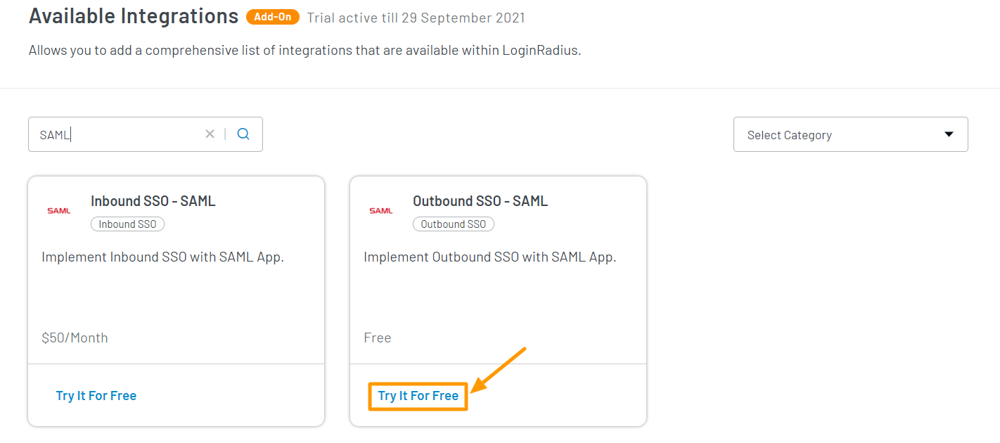
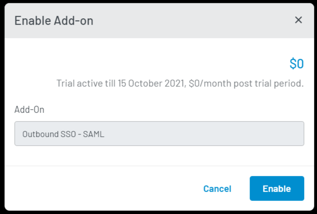

<span class="devloper-premium plan-tag">Developer Pro</span>
<span class="devloper-premium plan-tag">Add on</span>

# Outbound SSO SAML  

Security Assertion Markup Language (SAML) is an open-source framework for exchanging authentication and authorization data between an identity provider and a service provider where:

*   An identity provider (IdP) authenticates a consumer and provides a SAML Assertion to service providers.
*   A service provider (SP) verifies the Assertion and provides access to the consumer.

## LoginRadius as Identity Provider

LoginRadius supports both SAML 1.1 and SAML 2.0 flows. LoginRadius Dashboard lets you do SAML configurations by allowing you to customize the assertions, keys, and endpoints to match any SAML provider requirements.

The following are some key points providing better clarity about LoginRadius acting as an Identity provider:

1.  LoginRadius acts as an identity provider (IDP), which means that LoginRadius can authorize your app, and your app will act as a service provider (SP).

2.  LoginRadius supports both [Identity Provider Initiated Login](#identity-provider-initiated-login) and [Service Provider Initiated](#service-provider-initiated-login) login flows.

3.  LoginRadius supports Single Logout (SLO).

4.  LoginRadius does not support HTTP Artifact.

### Identity Provider Initiated Login

For the IDP initiated login, a consumer is logged on to the LoginRadius site and attempts to access a protected SP resource. LoginRadius redirects the consumer to LoginRadius SAML IDP initiated URL. The SAML IDP initiated URL automatically posts a SAML response to the SP. Then SP verifies the response. The login URL for this process is:

`https://cloud-api.loginradius.com/sso/saml/loginService?apiKey=<LoginRadiusApiKey>&appName=<SAMLAppName>`

The following sequence diagram summarizes the steps while proceeding with IDP Initiated Login:


### Service Provider Initiated Login

In the Service Provider initiated login, a consumer attempts to access a protected resource directly on an SP Website without logging on. The SP sends an authentication SAML request as a string query parameter in the HTTP GET or HTTP POST parameter (after it has been deflated, base64 encoded, and URL encoded) depending on the binding configuration to the SP initiated LoginRadius URL.

The following sequence diagram summarizes the steps while proceeding with SP Initiated Login:


A SAML request will look like this :

```
    <samlp:AuthnRequest 
        ID="_3f603af1-c3be-4463-b25f-7e2b0701d690" 
        Version="2.0" 
        IssueInstant="2019-08-30T17:03:52.179Z" 
        xmlns:samlp="urn:oasis:names:tc:SAML:2.0:protocol">
        <Issuer 
            xmlns="urn:oasis:names:tc:SAML:2.0:assertion">urn:federation:MicrosoftOnline
        </Issuer>
        <samlp:NameIDPolicy 
            Format="urn:oasis:names:tc:SAML:2.0:nameid-format:persistent"/>
    </samlp:AuthnRequest>

```


The **IDP** validates the contents of the Request and prompts the consumer to provide login credentials. If the consumer is authenticated successfully, the IDP sends a SAML response via **HTTP POST*** to **Service Provider Assertion Consumer Service URL**.

A SAML response will look like this:


```
    <samlp:Response 
        xmlns:samlp="urn:oasis:names:tc:SAML:2.0:protocol" 
        xmlns:saml="urn:oasis:names:tc:SAML:2.0:assertion" 
        ID="_4650c174-7063-426a-b259-ad7ffdd9f633" 
        Version="2.0" 
        IssueInstant="2020-01-06T05:22:20.769Z" 
        Destination="https://login.microsoftonline.com/login.srf" 
        InResponseTo="_3f603af1-c3be-4463-b25f-7e2b0701d690">
        <saml:Issuer>https://<Your LR SITE>.hub.loginradius.com/</saml:Issuer>
        <samlp:Status>
            <samlp:StatusCode 
                Value="urn:oasis:names:tc:SAML:2.0:status:Success"/>
        </samlp:Status>
        <saml:Assertion 
            xmlns:xsi="http://www.w3.org/2001/XMLSchema-instance" 
            xmlns:xs="http://www.w3.org/2001/XMLSchema" 
            xmlns:saml="urn:oasis:names:tc:SAML:2.0:assertion" 
            ID="_edf670ea-a82f-4872-ba00-71a00acc5c39" 
            Version="2.0" 
            IssueInstant="2020-01-06T05:22:20.769Z">
            <saml:Issuer>https://<Your LR SITE>.hub.loginradius.com/</saml:Issuer>
            <ds:Signature 
                xmlns:ds="http://www.w3.org/2000/09/xmldsig#">
                <ds:SignedInfo>
                    <ds:CanonicalizationMethod 
                        Algorithm="http://www.w3.org/2001/10/xml-exc-c14n#"/>
                    <ds:SignatureMethod 
                        Algorithm="http://www.w3.org/2001/04/xmldsig-more#rsa-sha256"/>
                    <ds:Reference 
                        URI="#_edf670ea-a82f-4872-ba00-71a00acc5c39">
                        <ds:Transforms>
                            <ds:Transform 
                                Algorithm="http://www.w3.org/2000/09/xmldsig#enveloped-signature"/>
                            <ds:Transform 
                                Algorithm="http://www.w3.org/2001/10/xml-exc-c14n#"/>
                        </ds:Transforms>
                        <ds:DigestMethod 
                            Algorithm="http://www.w3.org/2001/04/xmlenc#sha256"/>
                        <ds:DigestValue>MALQA9d3QWPBzpba4cZq8CbdITwOIU+
                            CzIPGesJz6Jk=
                        </ds:DigestValue>
                    </ds:Reference>
                </ds:SignedInfo>
                <ds:SignatureValue>D5py5Z6wOR+QtrjqsdJyXMYqV9yJD7uMXrr74pKaRHRbO7KSIuBnYQLwsJ2SlKh1p...
                </ds:SignatureValue>
                <ds:KeyInfo>
                    <ds:X509Data>
                        <ds:X509Certificate>MIIDLDCCAhSgAwIBAgIJALwtdp+dP0F0MA0GCSqGSIb3DQEBCwUA...</ds:X509Certificate>
                    </ds:X509Data>
                </ds:KeyInfo>
            </ds:Signature>
            <saml:Subject>
                <saml:NameID 
                    Format="urn:oasis:names:tc:SAML:1.1:nameid-format:unspecified">aa51c695b7b24ae3836a9222db3892ca
                </saml:NameID>
                <saml:SubjectConfirmation 
                    Method="urn:oasis:names:tc:SAML:2.0:cm:bearer">
                    <saml:SubjectConfirmationData 
                        NotOnOrAfter="2020-01-06T06:12:20.769Z" 
                        Recipient="https://login.microsoftonline.com/login.srf" 
                        InResponseTo="_3f603af1-c3be-4463-b25f-7e2b0701d690"/>
                </saml:SubjectConfirmation>
            </saml:Subject>
            <saml:Conditions 
                NotBefore="2020-01-06T05:22:20.769Z" 
                NotOnOrAfter="2020-01-06T06:12:20.769Z">
                <saml:AudienceRestriction>
                    <saml:Audience>urn:federation:MicrosoftOnline</saml:Audience>
                </saml:AudienceRestriction>
            </saml:Conditions>
            <saml:AuthnStatement 
                AuthnInstant="2020-01-06T05:22:20.769Z" 
                SessionIndex="4717eb31-52bc-40d3-8f48-dfc623a1dd4c">
                <saml:AuthnContext>
                    <saml:AuthnContextClassRef>urn:oasis:names:tc:SAML:2.0:ac:classes:unspecified</saml:AuthnContextClassRef>
                </saml:AuthnContext>
            </saml:AuthnStatement>
            <saml:AttributeStatement>
                <saml:Attribute 
                    Name="user.userprincipalname" 
                    NameFormat="urn:oasis:names:tc:SAML:2.0:attrname-format:unspecified">
                    <saml:AttributeValue 
                        xmlns:xs="http://www.w3.org/2001/XMLSchema" 
                        xmlns:xsi="http://www.w3.org/2001/XMLSchema-instance" 
                        xsi:type="xs:string">sharepoint@loginradius.tk
                    </saml:AttributeValue>
                </saml:Attribute>
                <saml:Attribute 
                    Name="user.givenname" 
                    NameFormat="urn:oasis:names:tc:SAML:2.0:attrname-format:unspecified">
                    <saml:AttributeValue 
                        xmlns:xs="http://www.w3.org/2001/XMLSchema" 
                        xmlns:xsi="http://www.w3.org/2001/XMLSchema-instance" 
                        xsi:type="xs:string">jay
                    </saml:AttributeValue>
                </saml:Attribute>
                <saml:Attribute 
                    Name="user.surname" 
                    NameFormat="urn:oasis:names:tc:SAML:2.0:attrname-format:unspecified">
                    <saml:AttributeValue 
                        xmlns:xs="http://www.w3.org/2001/XMLSchema" 
                        xmlns:xsi="http://www.w3.org/2001/XMLSchema-instance" 
                        xsi:type="xs:string">agarwal
                    </saml:AttributeValue>
                </saml:Attribute>
            </saml:AttributeStatement>
        </saml:Assertion>
    </samlp:Response>
```


The following explains some critical fields of the SAML response:

1.  **InResponseTo** contains the value earlier sent as an ID in the SAML Request. The Service Provider matches this with the SAML request ID.

2.  **IssueInstant** NotBefore and NotOnOrAfter define a time interval for which the SAML Response is valid.

3.  The **issuer** in assertion contains the URI of SAML response issuer. The Service Provider uses this value to verify that the assertion is coming from the expected Identity Provider.

4.  **AudienceRestriction** in the assertion defines that this assertion is targeted for a specific Service Provider and cannot be used for any other Service Provider.

5.  The **subject** in the assertion identifies the authenticated principal(user).

6.  The **AttributeStatement** in the assertion contains attributes and their values for the specific user that comes as authenticate.

The Assertion or the whole SAML Response is signed with an XML Signature that protects the integrity of the Assertion (or response) and verifies that it has not been modified in transit. Upon receiving the SAML Response, the SP can verify its contents and structure, validate the signature, and subsequently treat the user as authenticated by initiating a web session.

### Single Logout (SLO)

You can request to be logged out of LoginRadius, which will cause your consumer to be logged out from all SSO sites. To enable the Single Logout feature, the service provider must support the SAML Single Logout protocol. The various logon sessions are not terminated if the SP does not support this protocol. Additionally, the user will not receive the appropriate notification of this failure. The logout URL for this request is

`https://cloud-api.loginradius.com/sso/saml/logoutService?apiKey=<LoginRadiusApiKey>&appName=<SAMLAppName>`


## Outbound SSO SAML

This document goes over how you can enable Outbound Single Sign-on in Loginradius Dashboard using the SAML supported app. Your SAML app will act as an IDP and LoginRadius as SP.

### Step 1: Configure SAML App in Identity Provider

Each authentication system is unique and might require different configuration settings. Please use the following values for configuring LoginRadius as a service provider in your application to enable SAML flow.

#### Login and Enable SSO

1.  Login in to your SAML supported app.

2.  Enable and configure Single Sign-on method SAML.

#### Configure LoginRadius as a Service Provider

Configure LoginRadius as a Service Provider in your application with the following values:

1.   Enter <a href="https://lr.hub.loginradius.com" target="_blank">https://lr.hub.loginradius.com</a> in Start URL.

2.   Enter <a href="https://lr.hub.loginradius.com/">https://lr.hub.loginradius.com/</a> in Entity Id.

3.   Enter <a href="https://lr.hub.loginradius.com/saml/serviceprovider/AdfsACS.aspx" target="_blank">https://lr.hub.loginradius.com/saml/serviceprovider/AdfsACS.aspx</a> in ACS URL.

4.   Select Name Id format: **urn:oasis:names:tc:SAML:1.1:nameid-format:unspecified.**

#### Download Metadata

Download the metadata for SAML configuration.

### Step 2: Configure SAML App in LoginRadius Dashboard (SP)

#### Configure SAML App 

1. Log in to your <a href="https://dashboard.loginradius.com/" target="_blank">LoginRadius Dashboard</a>.

2. Select your app, then from the left Navigation panel, click the **Integration** section and click **Add** in **Configured Integration** section

3. Search **SAML** in the searchbar.

4. Click **Try It For Free** button in SAML Widget that has appeared:
   
   
   The following pop-up will appear:
   
   
   
5. Click **Enable** button from above pop-up and then click the **Let’s Configure** option that appeared on **Outbound SSO - SAML** tile.
   The following screen will appear:
   
   
6. Click **Add App** or **Add From Metadata File** to add SAML App.

   If the **Add From Metadata File** option is selected, then add the metadata file of the SAML file to connect with SSO.

   

   The below steps are if the **Add App** option is selected.

#### Configure SAML App Details

1. Select SAML version, Loginflow(SP or IDP), and add the SAML App name.

   

2. Enter LoginRadius' Certificate and Key in **ID PROVIDER CERTIFICATE** and **SERVICE PROVIDER CERTIFICATE KEY**.

   

    **ID Provider Certificate**: Certificate of SAML supported app working as identity Provider in this case.

   **Generate LoginRadius' Certificate and Key**
   Self-signed certificate and key can be generated by one of the following ways:

   * Using online tools, for example, with Bits and Digest Algorithm 2056, SHA256, respectively.

   * Using the following OpenSSL commands (currently, LoginRadius is only supporting the PKCS1 private key format):

     * Generate the ID Provider Certificate key from the following command:
       ```
       openssl genrsa -out private.key 2048
       ```

     * View the private key from the last step:
       ```
       vi private.key (for Linux OS)
       ```

     * Generate certificate form the private key:
       ``` 
       openssl req -new -x509 -key private.key -out 
       certificate.cert -days 365 -subj /CN=<loginradius-app-name>.hub.loginradius.com
       ```

     * View certificate from the last step:
       ```
       vi certificate.cert (for Linux OS)
       ```
    
    >Note: To view the ID Provider Certificate key and ID Provider Certificate for Windows OS, go to the folder where you are running the command, and the key will generate in the private.key and certificate.cert file within the same folder.

   Copy the values of LoginRadius' certificate and key with headers and paste in the Id Provider Certificate and Id Provider Certificate fields, respectively.

   
3. Add the key-value pairs in the **Attibutes** section(optional).

   

4. Select the Name Id format from the Dropdown.

    Default is **urn:oasis:names:tc:SAML:1.1:nameid-format:unspecified**

5. Enter the URLs of the page that users will be redirected to for authentication in **Login URl** and **After Logout URL** 

    

6. Enter the Service Provider endpoints and settings that LoginRadius will communicate with to establish a SAML session in the **Service Provider Details** section.

    In **Assertion Consumer Service Location**, enter the **IdP-Initiated Login URL**, which you will get from the SAML supported app dashboard or metadata file.
    
    
    
7. In the **Audiences** section, add the intended recipients of the assertions issued.(optional)

    

8. Select the SSO method from the dropdown list.

    The other methods are: 

    * **HTTP Post**

    * **HTTP Artifact**

9. Once all the required fields are completed, **scroll down** and click **Save**.

> **Note:** The consumer should have an account with the same email address in your SAML application as well as in LoginRadius before using your SAML application to log in to the <a href="https://dashboard.loginradius.com/" target="_blank">LoginRadius Dashboard</a>.


[Go Back to Home Page](/)
